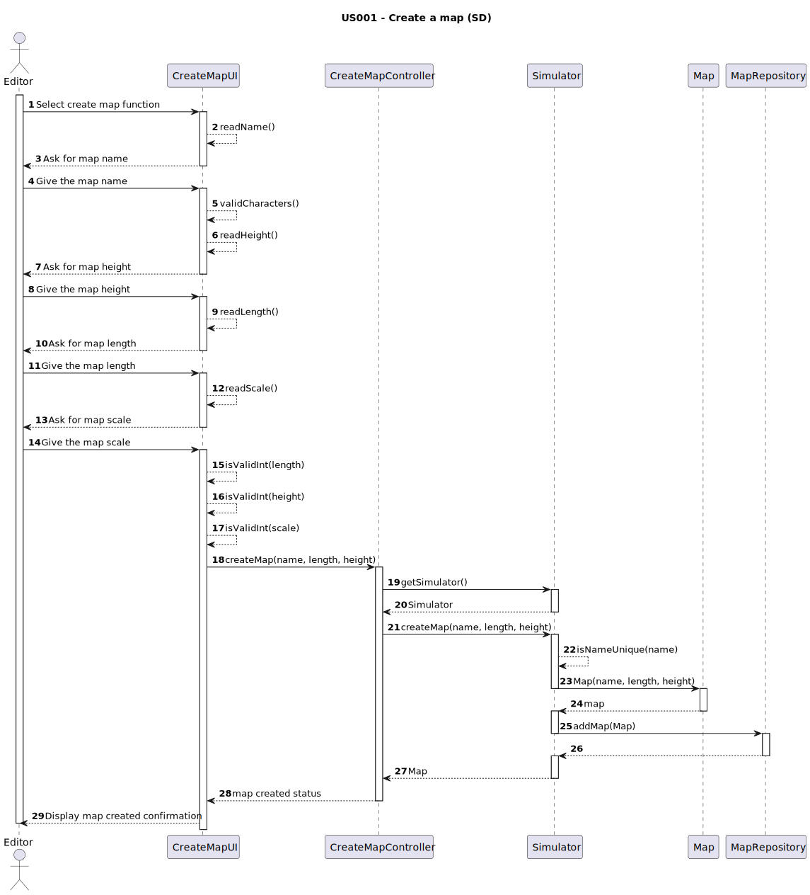
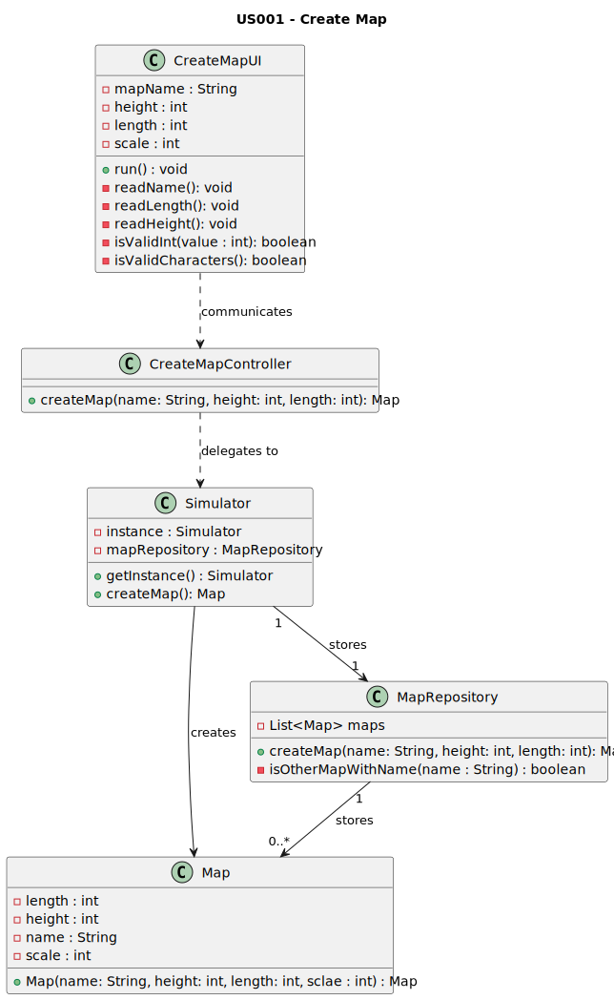

# US001 - As an editor, I want to create a map with a specific size and a specific name

## 3. Design

### 3.1. Rationale

**The rationale grounds on the SSD interactions and the identified input/output data.**

| Interaction ID                             | Question: Which class is responsible for... | Answer                | Justification (with patterns) |
|:-------------------------------------------|:--------------------------------------------|:----------------------|:------------------------------|
| Step 1: Receiving all the inputs from user | receiving all the user's inputs?            | `CreateMapUI`         | Pure Fabrication              | 
|                                            | read and save the map name?                 | `CreateMapUI`         | Pure Fabrication              | 
|                                            | read and save  the map dimension?           | `CreateMapUI`         | Pure Fabrication              | 
|                                            | read and save  the map scale?               | `CreateMapUI`         | Pure Fabrication              | 
| Step 2: simple validation of inputs        | simple validating the inputs?               | `CreateMapUI`         | Pure Fabrication              |
| Step 3: get the Simulator                  | get the Simulator?                          | `CreateMapController` | Controller              |
| Step 5: Verify mapName is unique           | verifying that  mapName is unique?          | `Simulator`           | Creator, InformationExpert |
| Step 6: creating the map                   | creating the map?                           | `Simulator`           | Creator, InformationExpert |
| Step 7: get the map repository             | get the map repository?                     | `Simulator`           | Creator, InformationExpert |
| Step 8: Save map                           | saving the map?                             | `MapRepository`       | InformationExpert, PureFabrication             |
| Step 9: Confirmation message               | the delivery of the confirmation message?   | `CreateMapUI`         | Pure Fabrication              |              

### Systematization ##

According to the taken rationale, the conceptual classes promoted to software classes are:

* Map

Other software classes (i.e. Pure Fabrication) identified:

* Simulator
* CreateMapUI
* CreateMapController

## 3.2. Sequence Diagram (SD)

## 3.3. Class Diagram (CD)

