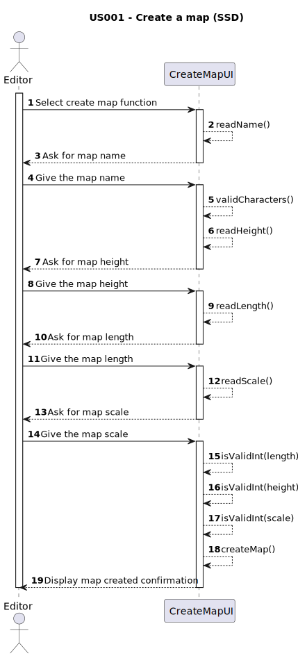

# US001 - As an editor, I want to create a map with a specific size and a specific name.

## 1. Requirements Engineering

### 1.1. User Story Description
In order to simulate a different background, the user entered as editor and want to  create a new map with an name and a custom size.

### 1.2. Customer Specifications and Clarifications

#### From the client clarifications
> **Q:** Do i add what the minimum size of the playable map should be(2x2) as a criteria for creating a map?
>
> **A:** A warning should be displayed after the user try to create a small map(less than 10x10), he needs to be able to create it either way, but there should be a message of confirmation

### 1.3. Acceptance Criteria

- AC1: Check if the name of the map has only allowed characters.
- AC2: The inputed values for the map dimensions and scale must be positive integers.
- AC3: A map should be created.
- AC4: The maps should have a scale that states the size of cell map in
  kms
- AC5: There should not be created a map with the same name as another already created

### 1.4. Found out Dependencies
No dependencies

### 1.5 Input and Output Data
Inputs:
- Dimensions : Two Integers
- Name : String
- Scale : Integer

Outputs:
- Created map

### 1.6. System Sequence Diagram (SSD)

### 1.7 Other Relevant Remarks

No other relevant remarks.
