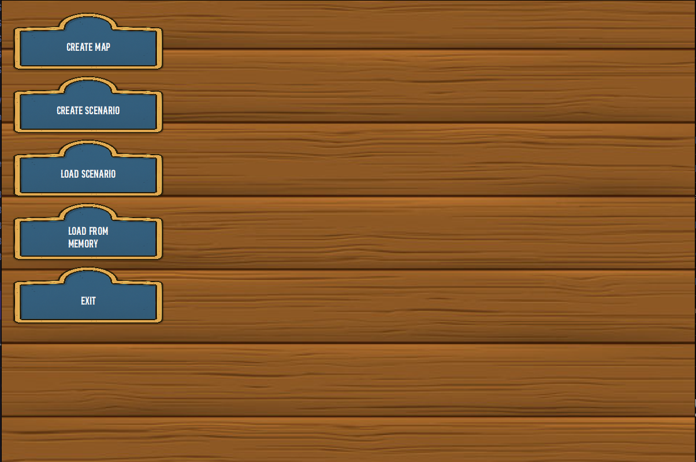
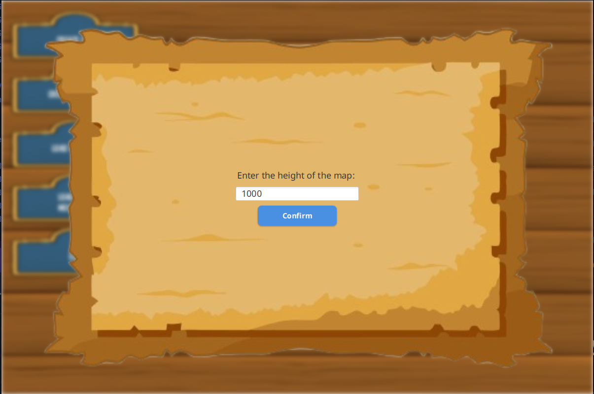
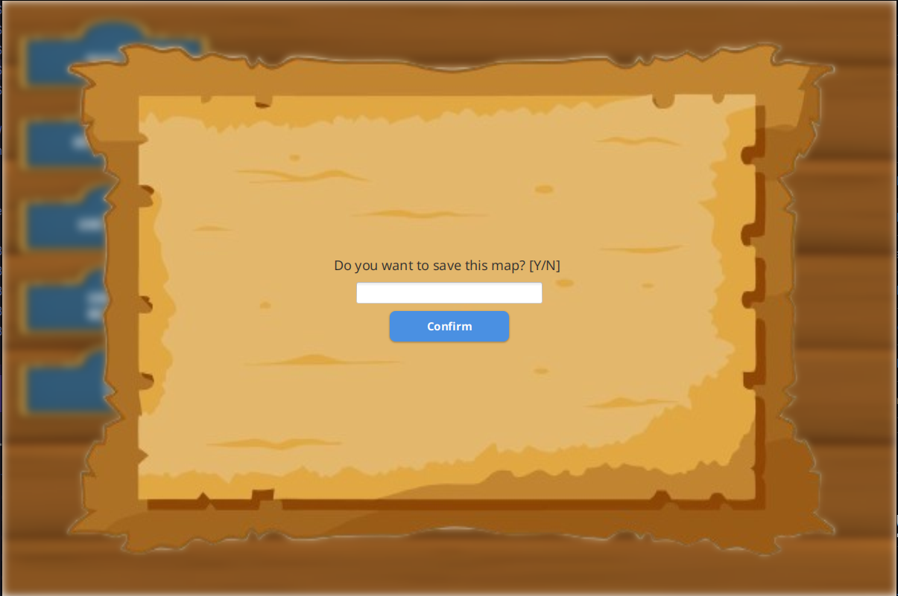
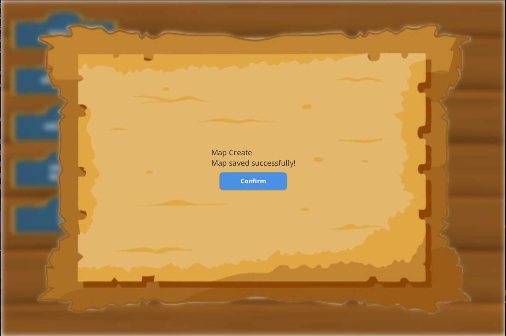

# US001 - As an editor, I want to Create a Map. 

## 4. Tests

#### **Test 1:** Ensure that a map cannot be created with the same name as another one.
Remarks: AC5 - There should not be created a map with the same name as another already created

```java
@Test
void testCreateMapSameName() {
    // Arrange
    Simulator s = Simulator.getInstance();
    String name = "mapSameName";

    // Act
    Map returned1 = s.createMap(name, 10, 10, 10);
    try {
        Map returned2 = s.createMap(name, 10, 10, 10);
    }
    catch(IllegalArgumentException e) {

    // Assert
        assert true;
        return ;
    }
    assert false;
}
```

```java
    @Test
    void testCreateMapDifferentName() {
        // Arrange
        Simulator s = Simulator.getInstance();
        String name = "mapDifferentName";
        String name2 = "mapDifferentName2";

        // Act
        Map returned1 = s.createMap(name, 10, 10, 10);
        try {
            Map returned2 = s.createMap(name2, 10, 10, 10);
        }
        catch(IllegalArgumentException e) {

            // Assert
            assert false;
            return ;
        }
        assert true;
    }
```

#### *Test 2:** Check that the return from the map creation is actually from Map class .
Remarks: - AC3: A map should be created.

```java
    @Test
void testCreateMap() {
  // Arrange
  Simulator s = Simulator.getInstance();
  String name = "mapName";

  // Act
  Map returned = s.createMap(name, 10, 10, 10);

  // Assert
  assertInstanceOf(Map.class, returned);
}
```

#### *Test 3:** Check that gets are working properly. 

	@Test
        int length = 10;
        Map map = new Map("TestMap", length, -20, 10))

		assertEquals(map.getLength, length)
	}

Obs: Same to all the other getters of the class


_It is also recommended to organize this content by subsections._


Remarks:

The acceptance criteria  that are not being checked in the test shown are the simple validations being checked when 
they are received by the UI.

- AC1: Check if the name of the map has only allowed characters.
- AC2: The inputed values for the map dimensions and scale must be positive integers.
- AC4: The maps should have a scale that states the size of cell map in
  kms

## 5. Construction (Implementation)

#### UI
```java 
    private void readHeight() {
    AuthenticationApp.setMessage("Enter the height of the map: ");

    ReadStringInput.requestUserInputString(userInput -> {
        try {
            height = Integer.parseInt(userInput);
            if (!isValidInt(height))
                Utils.displayReturnEditor("Height must be a positive integer.");

            readLength();
        } catch (NumberFormatException | IOException e) {

            try {
                Utils.displayReturnEditor("Invalid number.");
            } catch (IOException e1) {
                e1.printStackTrace();
            }
        }
    });
}
```

```java 
    private void readLength() {
    AuthenticationApp.setMessage("Enter the length of the map: ");

    ReadStringInput.requestUserInputString(userInput -> {
        try {
            length = Integer.parseInt(userInput);
            if (!isValidInt(length))
                Utils.displayReturnEditor("Length must be a positive integer.");
            readScale();
        } catch (NumberFormatException | IOException e) {

            try {
                Utils.displayReturnEditor("Invalid number.");
            } catch (Exception e2) {
                e2.printStackTrace();
            }
        }
    });
}
```

```java 
    private void readScale() {
    AuthenticationApp.setMessage("Enter the scale of the map (km per block): ");

    ReadStringInput.requestUserInputString(userInput -> {
        try {
            scale = Integer.parseInt(userInput);
            if (!isValidInt(scale))
                Utils.displayReturnEditor("Scale must be a positive integer.");

            validateAndSubmit();  // final step
        } catch (NumberFormatException | IOException e) {

            try {
                Utils.displayReturnEditor("Invalid number.");
            } catch (IOException e1) {
                e1.printStackTrace();
            }
        }
    });
}
```

```java
   private void validateAndSubmit()    {
        returnedFromCreation = (controller.createMap(mapName, height, length, scale));

        if (returnedFromCreation == null){
            try {
                Utils.displayReturnEditor("Could not create the map. Bad arguments were entered!");
            } catch (IOException e1) {
                e1.printStackTrace();
            }
        }
        else {
            AuthenticationApp.setMessage("Do you want to save this map? [Y/N] ");
            ReadStringInput.requestUserInputString(userInput -> {
                try {
                    saveAnswer = userInput.trim().toUpperCase();
                    returnedFromCreation += controller.saveMap(saveAnswer, mapName);
                    Utils.displayReturnEditor(returnedFromCreation);
                } catch (Exception e) {
                    e.printStackTrace();
                }
            });
        }
}
```

#### Controller

```java
    public String createMap(String name, int width, int height, int scale) {
        String s = "";
        if (isNameUnique(name)) {
            try {
                if (width <= 0 || height <= 0 || scale <= 0) {
                    return null;
                }
                simulator.createMap(name, width, height, scale);
                if (height < 10)
                    s += "The wanted height is less than 10, this can impact in the reality of the simulation!\n";
                if (width < 10)
                    s += "The wanted length is less than 10, this can impact in the reality of the simulation!\n";
                s += "Map Create\n";

                return (s);
            } catch (IllegalArgumentException e) {
                e.printStackTrace();
                return null;
            }
        }
        return null;
    }
```

#### Map

```java
    public Map createMap(String name, int height, int length, int scale) throws IllegalArgumentException{
        if(isNameUnique(name)){
            throw new IllegalArgumentException("Name already exists");
        }
        Map newMap = new Map(name, height, length, scale);
        mapRepository.getAllMaps().add(newMap);
        return newMap;
    }
```

```java
    private boolean isNameUnique(String mapName) {
        if (mapRepository.getMap(mapName) != null)
            return false;
        return true;
    }
```


## 6. Integration and Demo 

_In this section, it is suggested to describe the efforts made to integrate this functionality with the other features of the system._

### Demo:










## 7. Observations

_In this section, it is suggested to present a critical perspective on the developed work, pointing, for example, to other alternatives and or future related work._