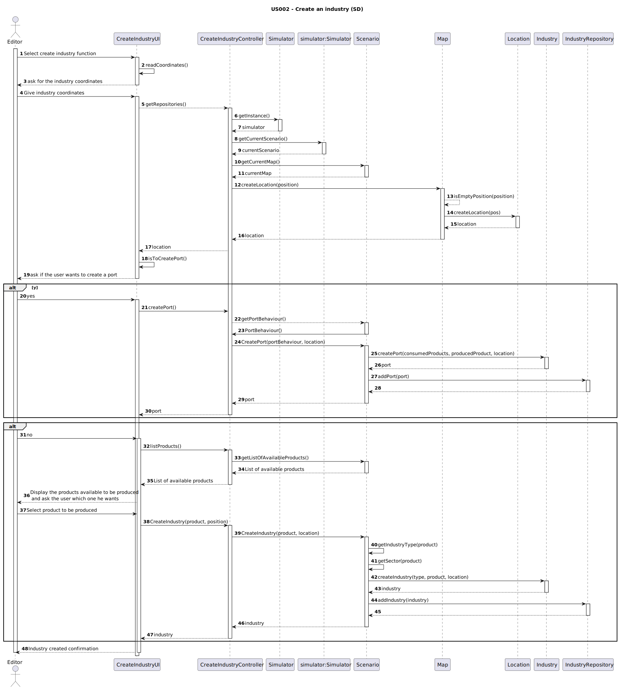

# US002 - As a user editor, I want to add an specific type of industry to a XY position in the map.

## 3. Design

### 3.1. Rationale

**The rationale grounds on the SSD interactions and the identified input/output data.**

| Interaction ID                                 | Question: Which class is responsible for...         | Answer                     | Justification (with patterns) |
|:-----------------------------------------------|:----------------------------------------------------|:---------------------------|:------------------------------|
| Step 1: ask for coordinates                    | 	ask for the industries coordinates?                | `CreateIndustryUI`         | Pure Fabrication              |
| Step 2: go to location creation                | 	going to location creation?                        | `CreateIndustryController` | Controller              |
|                                                | get the Simulator?                                  | `CreateIndustryContorller` | Controller              |
|                                                | 	get the currentScenario?                           | `Simulator`                | Creator, InformationExpert    |
|                                                | 	get the current Map?                               | `Scenario`                 | Creator, InformationExpert    |
| Step 3: create location                        | 	creating location?                                 | `Map`                      | Creator, InformationExpert    |
| Step 4: ask if the user wants to build a port  | 	ask the user if he wants to build a port?          | `CreateIndustryUI`         | Pure Fabrication              |
| Step 5a: get port behaviour                    | 	getting port behaviour?                            | `Scenario`                 | Creator, InformationExpert             |
| Step 6a: go to port creation                   | 	going to port creation?                            | `CreateIndustryController` | Controller              |
| Step 8a: create port                           | 	creating the port?                                 | `Scenario`                 | Creator, InformationExpert              |
| Step 9a: store the industry                    | 	storing the industry?                              | `IndustryRepository`       | InformationExpert, Pure Fabrication     |
| Step 10a: Confirmation message                 | 	delivering the confirmation message?               | `CreateIndustryUI`         | Pure Fabrication              |
|                                                | 	                                                   |                            |                               |
| Step 5b: Get the list of products              | 	Getting the list of products?                      | `Scenario`                 | Creator, InformationExpert    |
| Step 6b: Display the list of available product | 	Show the list of available product?                | `CreateIndustryUI`         | PureFabrication               |
| Step 7b: Receive the wanted product index      | 	Receiving the wanted product index?                | `CreateIndustryUI`         | PureFabrication               |
| Step 8b: get the industry type                 | 	get which is the type of industry to be created?   | `Scenario`                 | Creator, InformationExpert    |
| Step 9b: get the industry sector               | 	get which is the sector of industry to be created? | `Scenario`                 | Creator, InformationExpert    |
| Step 10b: create industry                      | 	creating the industry?                             | `Scenario`                 | Creator, InformationExpert    |
| Step 11b: store the industry                   | 	storing the industry?                              | `IndustryRepository`       | InformationExpert, Pure Fabrication              |
| Step 12b: Display the industry creation status | 	displaying create industry status?                 | `CreateIndustryUI`         | PureFabrication               |

### Systematization ##

According to the taken rationale, the conceptual classes promoted to software classes are:

* Location
* Scenario
* Industry
* PortBehaviour
* Product

Other software classes (i.e. Pure Fabrication) identified:

* CreateIndustryUI  
* CreateIndustryController

## 3.2. Sequence Diagram (SD)

_In this section, it is suggested to present an UML dynamic view representing the sequence of interactions between software objects that allows to fulfill the requirements._

## 3.3. Class Diagram (CD)

_In this section, it is suggested to present an UML static view representing the main related software classes that are involved in fulfilling the requirements as well as their relations, attributes and methods._

