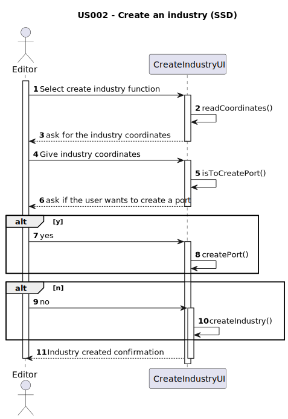

# US002 - As a user editor, I want to add an specific type of industry to a XY position in the map.

## 1. Requirements Engineering

### 1.1. User Story Description
As a user editor, wanting to populate the map I want to add an specific type of industry that produces a specific product to a XY position in the map.

### 1.2. Customer Specifications and Clarifications

### From the specifications document:

> The industry that is not in the range of any station isn't active

> The price of each products will be given

#### From the client clarifications
> **Q:** Does the scenario influence the price of certain products?
>
>  **A:** The price of product will vary according to the scenario that will be given(should be implemented later), because of the increase/decrease of demand.

### 1.3. Acceptance Criteria
- AC1: Check if the position in the map is empty.
- AC2: Check if the product made by the industry fits the timestamp(historical pretext) of the map.
- AC3: Check if the position is inside map
- AC4: An industry must be created.

### 1.4. Found out Dependencies

- Scenario
- Product
- Location
- Position

### 1.5 Input and Output Data
Inputs:
- Industry's position: Location
- Industry's sector: String
- Industry's product: String

Outputs:
- Created industry

### 1.6. System Sequence Diagram (SSD)

### 1.7 Other Relevant Remarks

No other relevant remarks.
