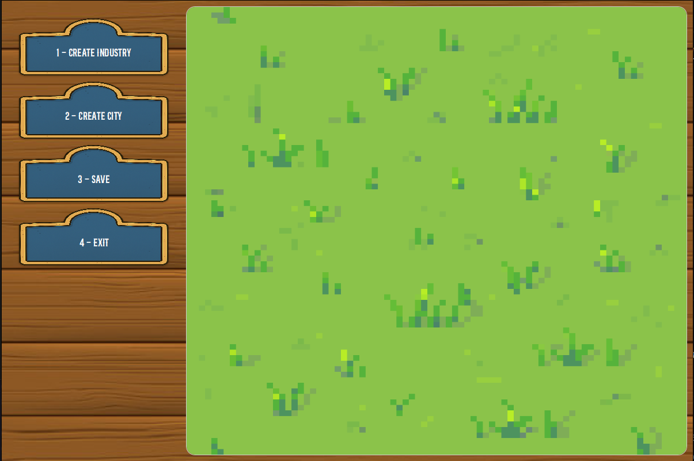

# U002 - As an editor, I want to create an Industry

## 4. Tests
 
#### **Test 1:** An industry must be created. 
- AC4: An industry must be created.

##### --> Port

```java
  @Test (creatingPort_Valid_Args)
void testPortIndustry() {
    // Arrange
    TimeRestrictions timeRestrictions = new TimeRestrictions(1920, 1925);
    Simulator simulator = Simulator.getInstance();
    List<ProductType> productTypes = new ArrayList<>();
    productTypes.add(ProductType.CAR);
    ProductType exportedProduct = ProductType.STEEL;
    PortBehaviour portBehaviour = new PortBehaviour(productTypes, exportedProduct);
    simulator.createScenario("TestScenario", simulator.createMap("Mp", 100, 100, 10), timeRestrictions, null, null, portBehaviour, null);
    Scenario scenario = simulator.getScenarioRepository().setActiveScenario("TestScenario");
    Repository repo = Repository.getInstance(scenario);

    // Act

    Industry i = repo.getCurrentScenario().createPort(scenario.getPortBehaviour(), repo.getCurrentMap().createLocation(new Position(13, 15)));
    // Assert

    assertInstanceOf(Port.class, i);
}
```

```java
@Test
void testPortIndustryNullBehaviour() {
    // Arrange
    TimeRestrictions timeRestrictions = new TimeRestrictions(1920, 1925);
    Simulator simulator = Simulator.getInstance();
    List<ProductType> productTypes = new ArrayList<>();
    productTypes.add(ProductType.CAR);
    ProductType exportedProduct = ProductType.STEEL;
    PortBehaviour portBehaviour = new PortBehaviour(productTypes, exportedProduct);
    simulator.createScenario("TestScenario", simulator.createMap("Mp2", 100, 100, 10), timeRestrictions, null, null, portBehaviour, null);
    Scenario scenario = simulator.getScenarioRepository().setActiveScenario("TestScenario");
    Repository repo = Repository.getInstance(scenario);

    try {

        // Act
        Industry i = repo.getCurrentScenario().createPort(null, repo.getCurrentMap().createLocation(new Position(13, 18)));
    }catch (Exception e) {

        // Assert
        assert true;
        return;
    }
    assert false;
}
```

##### --> PrimaryIndustry
```java
@Test
    void testPrimaryIndustry() {
        // Arrange

        TimeRestrictions timeRestrictions = new TimeRestrictions(1920, 1925);
        Simulator simulator = Simulator.getInstance();
        simulator.createScenario("TestScenario", simulator.createMap("Mp", 100, 100, 10), timeRestrictions, null, null, null, null);
        Scenario scenario = simulator.getScenarioRepository().setActiveScenario("TestScenario");
        Repository repo = Repository.getInstance(scenario);

        // Act

        Industry i = repo.getCurrentScenario().createIndustry(new Product(ProductType.WOOL), repo.getCurrentMap().createLocation(new Position(13, 15)));
        // Assert

        assertInstanceOf(PrimaryIndustry.class, i);
    }
```

```java
@Test
    void testPrimaryIndustryWrongProductType() {
        // Arrange
        TimeRestrictions timeRestrictions = new TimeRestrictions(1920, 1925);
        Simulator simulator = Simulator.getInstance();
        simulator.createScenario("TestScenario", simulator.createMap("Mp2", 100, 100, 10), timeRestrictions, null, null, null, null);
        Scenario scenario = simulator.getScenarioRepository().setActiveScenario("TestScenario");
        Repository repo = Repository.getInstance(scenario);

        // Act
        Industry i = repo.getCurrentScenario().createIndustry(new Product(ProductType.CAR), repo.getCurrentMap().createLocation(new Position(14, 15)));

        // Assert
        assertInstanceOf(TransformingIndustry.class, i);
    }
```

##### --> TransformingSector

```java
@Test
    void testTransformIndustry() {
        // Arrange

        TimeRestrictions timeRestrictions = new TimeRestrictions(1920, 1925);
        Simulator simulator = Simulator.getInstance();
        simulator.createScenario("TestScenario", simulator.createMap("Mp", 100, 100, 10), timeRestrictions, null, null, null, null);
        Scenario scenario = simulator.getScenarioRepository().setActiveScenario("TestScenario");
        Repository repo = Repository.getInstance(scenario);

        // Act

        Industry i = repo.getCurrentScenario().createIndustry(new Product(ProductType.CAR), repo.getCurrentMap().createLocation(new Position(13, 15)));
        // Assert

        assertInstanceOf(TransformingIndustry.class, i);
    }
```
            
```java 
    @Test
    void testTransformIndustryWrongProductType() {
        // Arrange
        TimeRestrictions timeRestrictions = new TimeRestrictions(1920, 1925);
        Simulator simulator = Simulator.getInstance();
        simulator.createScenario("TestScenario", simulator.createMap("Mp", 100, 100, 10), timeRestrictions, null, null, null, null);
        Scenario scenario = simulator.getScenarioRepository().setActiveScenario("TestScenario");
        Repository repo = Repository.getInstance(scenario);

        // Act
        Industry i = repo.getCurrentScenario().createIndustry(new Product(ProductType.WOOL), repo.getCurrentMap().createLocation(new Position(14, 15)));

        // Assert
        assertInstanceOf(PrimaryIndustry.class, i);
    }
```


Remarks:
The acceptance criteria that are not being checked in the test shown are validations that are made by other 
classes with that responsibility:
- AC1: Check if the position in the map is empty. (Location)
- AC3: Check if the position is inside map. (Position)

## 5. Construction (Implementation)

#### UI

```java
    private void readX(){
        AuthenticationApp.setMessage("Enter the x coordinate: ");

        ReadStringInput.requestUserInputString(userInput -> {
            x = Integer.parseInt(userInput);
            readY();
        });
    }
```

```java
    private void readY(){
        AuthenticationApp.setMessage("Enter the y coordinate: ");

        ReadStringInput.requestUserInputString(userInput -> {
            y = Integer.parseInt(userInput);
            isToCreatePort();
        });
    }
```

```java
    private void isToCreatePort() {
        AuthenticationApp.setMessage("Do you want to create a port? (y/n): ");

        ReadStringInput.requestUserInputString(userInput -> {
            String isToCreatePort = userInput;

            if (isToCreatePort.equals("y")){
                try {
                    if (controller.createPort(x,y) != null)
                            Utils.displayReturnMapEditor("Successfully created Industry!!");
                } catch (IllegalArgumentException | IOException e){
                    try {
                        Utils.displayReturnMapEditor("Could not createIndustry!" + e.getMessage());
                    } catch (IOException i){
                        i.printStackTrace();
                    }
                }
            }
            else
                readProduct();

        });
    }
```

```java
    private void readProduct() {
        AuthenticationApp.setMessage("Enter product index: ");
        AuthenticationApp.setList(controller.getProductList());

        ReadListInput.requestUserInputList(userInput -> {
            try {
                if (controller.createIndustry(controller.getWhichProduct(userInput), x, y) != null)
                    Utils.displayReturnMapEditor("Successfully created Industry!!");

            } catch (IOException | IllegalArgumentException e) {
                try {
                    Utils.displayReturnMapEditor("Could not create Industry!!" + e.getMessage());
                } catch (IOException e1) {
                    e.printStackTrace();
                }
            }
        });
    }
```

#### Controller

```java
 public Industry createIndustry(int productIndex, int x, int y) throws IllegalArgumentException {
        Industry industry = null;

        ProductType product = ProductType.values()[productIndex];
        System.out.println(productIndex);
        industry = repo.getCurrentScenario().createIndustry(new Product(product), repo.getCurrentMap().createLocation(new Position(x, y)));
        return (industry);
    }
```

```java
    public Industry createPort(int x, int y) throws IllegalArgumentException {
        Industry port = null;

        PortBehaviour portBehaviour = repo.getCurrentScenario().getPortBehaviour();
        port = repo.getCurrentScenario().createPort(portBehaviour, repo.getCurrentMap().createLocation(new Position(x, y)));
        return (port);
    }
```

```java
    public String getProductList() {
        return repo.getIndustryRepository().getListOfProducts();
    }
```


#### Scenario

```java
public Industry createIndustry(Product product, Location location) {
    Industry i = null;
    IndustrySector sector = type.getSector();
    IndustryType type = industryRepository.getIndustryType(product.getProductType());

        if (sector == IndustrySector.PRIMARY)
            i = new PrimaryIndustry(product, type, location, product.getProductType().timeToProduce, 1000);
        else if (sector == IndustrySector.TRANSFORMING)
            i = new TransformingIndustry(product, type, location, product.getProductType().timeToProduce, 1000);

    if (i != null)
        industryRepository.getIndustries().add(i);
    return i;
}
```

```java
public Industry createPort(PortBehaviour behaviour, Location location) {
    List<ProductType> imP = behaviour.getImportedProducts();
    ProductType exP = behaviour.getExportedProduct();

    Port p = new Port(new Product(exP), imP, location, exP.timeToProduce, 1000);
    industryRepository.getAllIndustries().add(p);

    return p;
}
```

## 6. Integration and Demo 

_In this section, it is suggested to describe the efforts made to integrate this functionality with the other features of the system._

### Demo:




## 7. Observations

_In this section, it is suggested to present a critical perspective on the developed work, pointing, for example, to other alternatives and or future related work._

In future works suggest to change the industry to have a more wide range, dividing even more the classes,
changing the relations, promoting what now is in a enum to classes. 

For example: 

Inudstry -> PrimaryIndustry -> WoolFarm/GrainsFarm/BeansFarm/IronMine/CoalMine/BauxiteMine...

Inudstry -> TransformingIndustry -> SteelMill/Bakery/Automobile
