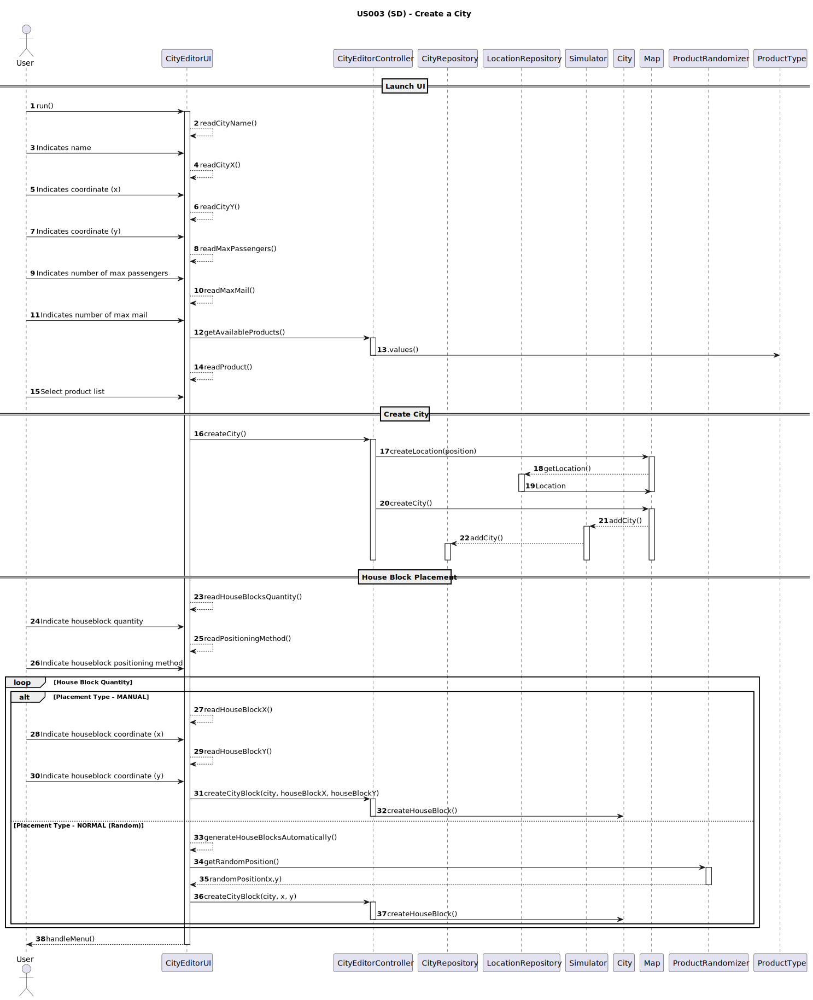
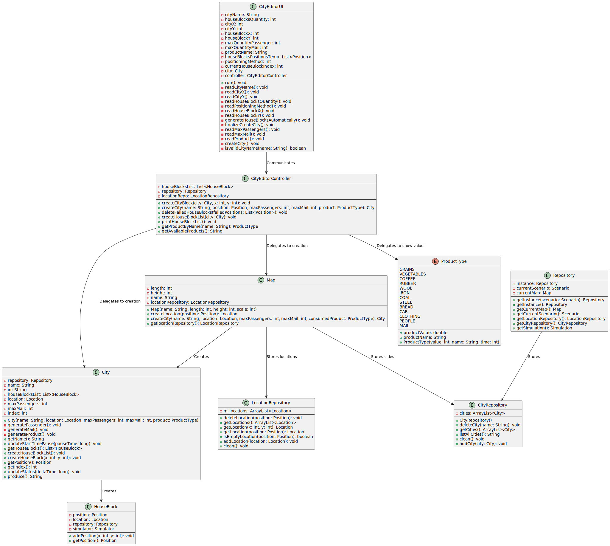

# **US003 - As an Editor, I want to add a city in a position XY of the selected map, with a name and a positive number of house blocks.**

## 3. Design

### 3.1. Rationale

| Interaction ID | Question: Which class is responsible for... | Answer               | Justification (with patterns) |
|----------------|:--------------------------------------------|:---------------------|:------------------------------|
| 1              | Start city creation                         | CityEditorUI         | **Pure Fabrication**          |
| 2              | Request for city's name                     | CityEditorUI         | **Pure Fabrication**          |
| 3              | Validate city name                          | CityEditorUI         | **Pure Fabrication**          |
| 4              | Ask for city coordinates                    | CityEditorUI         | **Pure Fabrication**          |
| 5              | Ask for max passengers                      | CityEditorUI         | **Pure Fabrication**          |
| 6              | Validate max passengers                     | CityEditorUI         | **Pure Fabrication**          |
| 7              | Ask for max mail                            | CityEditorUI         | **Pure Fabrication**          |
| 8              | Validate max mail                           | CityEditorUI         | **Pure Fabrication**          |
| 9              | Ask for product to be consumed              | CityEditorUI         | **Pure Fabrication**          |
| 10             | Delegates who validates products            | CityEditorController | **Controller**                |
| 11             | Validate product to be consumed             | ProductType          | **Information Expert**        |
| 12             | Validate and instantiate city coordinates   | Map                  | **Information Expert**        |
| 13             | Instantiate city                            | Map                  | **Creator**                   |
| 14             | Store city instances                        | CityRepository       | **Pure Fabrication**          |
| 15             | Request for house blocks' quantity          | CityEditorUI         | **Pure Fabrication**          |
| 16             | Validate house blocks' quantity             | CityEditorUI         | **Pure Fabrication**          |
| 17             | Ask for house blocks' placement type        | CityEditorUI         | **Pure Fabrication**          |
| 18   a)        | Manual position placement input             | CityEditorUI         | **Pure Fabrication**          |
| 19   a)        | Validate the house blocks position          | LocationRepository   | **Information Expert**        |
| 18   b)        | Automatic position placement input          | CityEditorUI         | **Pure Fabrication**          |
| 19   b)        | Sort normal distribution                    | PositionRandomizer   | **Creator**                   |
| 20             | Delegate who instantiates house blocks      | CityEditorController | **Controller**                |
| 21             | Instantiate house blocks                    | City                 | **Creator**                   |
| 22             | Delegate who instantiates city              | CityEditorController | **Controller**                |
| 23             | Indicate success or failure                 | CityEditorUI         | **Pure Fabrication**          |

### Systematization

According to the taken rationale, the conceptual classes promoted to software classes are:

* City
* Map
* ProductRandomizer
* ProductType

Other software classes (i.e. Pure Fabrication) identified:

* CityEditorUI  
* CityEditorController
* CityRepository
* LocationRepository

## 3.2. Sequence Diagram (SD)

## 3.3. Class Diagram (CD)

