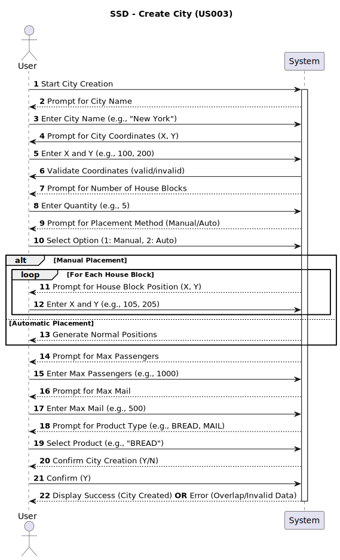

# **US003 - As an Editor, I want to add a city in a position XY of the selected map, with a name and a positive number of house blocks.**

## **1. Requirements Engineering**

### **1.1. User Story Description**
- The user, when interacting as an editor, must be able to create a city, give its name following the given acceptance criteria, choose its size by setting a number of house blocks, and specify the position where the city must be situated. In this simulation context, cities generate and consume passengers and mail, but they also consume final products.

### **1.2. Customer Specifications and Clarifications**

#### From the client clarifications

> - **Question:** How do city space marks work?
>
> - **Answer:** The cities can have more than one space mark in order to fit their size.

> - **Question:** How do we decide how the city grows?**
>
> - **Answer:**  The city can be declared block by block, or in the "random" way, in this way it is going to be handled to the teams the algorithm to be used to allocate them.

> - **Question:** How do cities relate to industries? Are they dependable on one another?
>
> - **Answer:** Cities and industries are completely undependable things, they don't need each other to exist in the map

### **1.3. Acceptance Criteria**
**AC1:** A city name cannot have special characters or digits.

**AC2:** The house blocks can be assigned manually or automatically (randomly around the city tag position).

**AC3:** A city's position (XY coordinates) must be within the valid bounds of the selected map.

**AC4:** The number of house blocks must be a positive integer greater than zero, ensuring a functional city layout.

**AC5:** Garantee that the city is added to a given map.

### **1.4. Found Dependencies**
- [US001 - As an editor, I want to create a map with a specific size and a specific name](../US001), in order to have a city you must garantee that the map exists.

### **1.5. Input and Output Data**
#### **Inputted Data:**
- City's name (String)
- Size (Integer)
- Position (Two Integers)
- Number of HouseBlocks (Integer)
- Type of houseblock placement (Integer) [Automatic / Manual]

[MANUAL HOUSEBLOCK PLACEMENT]
- Position (Two Integers)

- Max passengers (Integer)
- Max mail (Integer)
- Product to be consumed (String)

#### **Output:**
- City
- Success or error message

### **1.6. System Sequence Diagram (SSD)**

### **1.7. Other Relevant Remarks**
- No other relevant remarks, at the moment.
