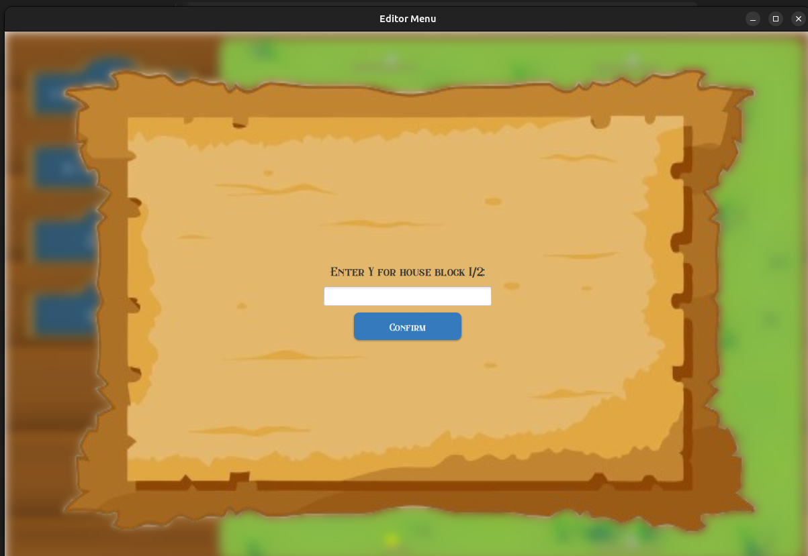

# **US003 - As an Editor, I want to add a city in a position XY of the selected map, with a name and a positive number of house blocks.** 

## 4. Tests

**Test 1:** The city name cannot have special characters or digits. (Refers to AC1)

```java
@Test
    void validCityNameShouldReturnTrue() {
        // Arrange
        CityEditorUI cityEditorUI = new CityEditorUI();
        String validName = "Lisbon";

        // Act
        boolean isValid = cityEditorUI.isValidCityName(validName);

        // Assert
        assertTrue(isValid);
    }

@Test
    void invalidCityNameWithDigitsShouldReturnFalse() {
        // Arrange
        CityEditorUI cityEditorUI = new CityEditorUI();
        String invalidName = "Lisbon123";

        // Act
        boolean isValid = cityEditorUI.isValidCityName(invalidName);

        // Assert
        assertFalse(isValid);
    }

@Test
    void invalidCityNameWithSpecialCharactersShouldReturnFalse() {
        // Arrange
        CityEditorUI cityEditorUI = new CityEditorUI();
        String invalidName = "Lisbon!@#";

        // Act
        boolean isValid = cityEditorUI.isValidCityName(invalidName);

        // Assert
        assertFalse(isValid);
    }
```

**Test 2:** The house blocks can be assigned manually or automatically. (Refers to AC2)

```java
 @Test
    void createCityBlockShouldAddBlockToCityManual() {
        // Arrange
        CityEditorController controller = new CityEditorController();
        City city = new City("TestCity", new Location(new Position(5, 5)), 0, 100, ProductType.GRAINS);
        city.createHouseBlockList();

        // Act
        controller.createCityBlock(city, 1, 2);

        // Assert
        List<HouseBlock> houseBlocks = city.getHouseBlocks();
        assertFalse(houseBlocks.isEmpty());
        assertEquals(new Position(1, 2), houseBlocks.get(0).getPosition());
    }

@Test
    void createCityBlockShouldAddBlockToCityRandom() {
        // Arrange
        CityEditorController controller = new CityEditorController();
        City city = new City("TestCity", new Location(new Position(5, 5)), 0, 100, ProductType.GRAINS);
        city.createHouseBlockList();

        // Act
        controller.createCityBlock(city, PositionRandomizer.getRandomPositionAround(city.getPosition()).getX(), PositionRandomizer.getRandomPositionAround(city.getPosition()).getY());

        // Assert
        List<HouseBlock> houseBlocks = city.getHouseBlocks();
        assertFalse(houseBlocks.isEmpty());
    }
```

**Test 3:** A city's position (XY coordinates) must be within the valid bounds of the selected map. (Refers to AC3)

```java
@Test
    void creatingCityWithValidPositionShouldSucceed() {
        // Arrange
        Position validPosition = new Position(5, 5); // assume within bounds
        Location location = new Location(validPosition);

        // Act & Assert
        assertDoesNotThrow(() -> new City("ValidCity", location, 100, 50, ProductType.GRAINS));
    }

@Test
    void creatingCityWithInvalidPositionShouldThrowException() {

        assertThrows(IllegalArgumentException.class, () ->
        {
            new Position(-1, -1);
        });
    }
```

**Test 4:** The number of house blocks must be a positive integer greater than zero, ensuring a functional city layout. (Refers to AC4)

```java
private void readHouseBlocksQuantity() {
        AuthenticationApp.setMessage("Enter number of house blocks:");
        ReadStringInput.requestUserInputString(input -> {
            try {
                houseBlocksQuantity = Integer.parseInt(input);
                if (houseBlocksQuantity > 0) {
                    readPositioningMethod();
                } else {
                    Utils.displayErrorMessage("Must be a positive integer!");
                    readHouseBlocksQuantity();
                }
            } catch (NumberFormatException e) {
                Utils.displayErrorMessage("Invalid integer! Please enter a valid number.");
                readHouseBlocksQuantity();
            }
        });
    }
```

**Test 5:** Garantee that the city is added to a given map. (Refers to AC5)

```java
@Test
    void createCityShouldAddCityToMap() {
        // Arrange
        CityEditorController controller = new CityEditorController();
        String cityName = "TestCity";
        Position position = new Position(10, 10);
        int passengers = 100;
        int mail = 50;
        ProductType product = ProductType.GRAINS;

        // Act
        City city = controller.createCity(cityName, position, passengers, mail, product);

        // Assert
        assertNotNull(city);
        assertEquals(cityName, city.getName());
        assertEquals(position, city.getPosition());
    }

```

## 5. Implementation Details

### 5.1 User Interface Layer

#### CityEditorUI Class

```java
public class CityEditorUI implements Serializable {
    // Field declarations
    private CityEditorController controller = new CityEditorController();
    private String cityName;
    private int houseBlocksQuantity;
    // ... other fields ...

    /**
     * Main workflow for city creation
     */
    public void run() {
        readCityName();
    }

    /**
     * Validates and stores city name input
     */
    private void readCityName() {
        AuthenticationApp.setMessage("Enter city name (alphabetic characters only, max 255):");
        ReadStringInput.requestUserInputString(input -> {
            if (isValidCityName(input)) {
                cityName = input;
                readCityX();
            } else {
                Utils.displayErrorMessage("Invalid city name format");
                readCityName(); // Retry
            }
        });
    }

    /**
     * Handles house block positioning method selection
     */
    private void readPositioningMethod() {
        AuthenticationApp.setMessage("Position house blocks:\n1 - Manually\n2 - Automatically");
        ReadStringInput.requestUserInputString(input -> {
            try {
                positioningMethod = Integer.parseInt(input);
                switch (positioningMethod) {
                    case 1 -> readHouseBlockX();
                    case 2 -> generateHouseBlocksAutomatically();
                    default -> {
                        Utils.displayErrorMessage("Invalid option");
                        readPositioningMethod();
                    }
                }
            } catch (NumberFormatException e) {
                Utils.displayErrorMessage("Invalid number format");
                readPositioningMethod();
            }
        });
    }
}
```

### 5.2 Controller Layer

#### CityEditorController Class


```java
public class CityEditorController implements Serializable {
    private static Repository repository = Repository.getInstance();
    
    /**
     * Creates a new city entity
     * @param cityName Name of the city
     * @param position Geographical position
     * @param maxPassengers Maximum passenger capacity
     * @param maxMail Maximum mail capacity
     * @param consumedProduct Primary product type
     * @return Created City instance
     */
    public City createCity(String cityName, Position position,
                         int maxPassengers, int maxMail,
                         ProductType consumedProduct) {
        // Validation would occur here
        City newCity = new City(cityName, 
                              repository.getCurrentMap().createLocation(position),
                              maxPassengers,
                              maxMail,
                              consumedProduct);
        repository.getCityRepository().addCity(newCity);
        return newCity;
    }

    /**
     * Creates a house block in specified city
     * @param city Target city
     * @param positionX X coordinate
     * @param positionY Y coordinate
     * @throws IllegalArgumentException If position is invalid
     */
    public void createCityBlock(City city, int positionX, int positionY) {
        if (!HouseBlock.isValid(1)) {
            throw new IllegalArgumentException("Cannot create more house blocks");
        }
        city.createHouseBlock(positionX, positionY);
    }
}
```

### 5.3 Domain Layer

#### City Class
```java
public class City implements Serializable {
    private final String name;
    private final Location location;
    private List<HouseBlock> houseBlocks;

    /**
     * Creates a new house block at specified coordinates
     * @param positionX X coordinate
     * @param positionY Y coordinate
     */
    public void createHouseBlock(int positionX, int positionY) {
        HouseBlock block = new HouseBlock(
            repository.getCurrentMap().createLocation(
                new Position(positionX, positionY)
            )
        );
        houseBlocks.add(block);
    }

    /**
     * @return List of all house blocks in this city
     */
    public List<HouseBlock> getHouseBlocks() {
        return Collections.unmodifiableList(houseBlocks);
    }
}
```

### Houseblock Class

```java
public class HouseBlock implements Serializable {
    public static final int MAX_BLOCKS = 1000;
    private Position position;
    private Location location;

    /**
     * Validates if requested number of blocks is acceptable
     * @param count Number of blocks requested
     * @return Validation result
     */
    public static boolean isValid(int count) {
        Map currentMap = Repository.getInstance().getCurrentMap();
        return count > 0 && 
               count <= MAX_BLOCKS && 
               currentMap.getMapArea() > count;
    }

    /**
     * Sets the position of this house block
     * @param posX X coordinate
     * @param posY Y coordinate
     * @throws IndexOutOfBoundsException If coordinates are invalid
     */
    public void addPosition(int posX, int posY) throws IndexOutOfBoundsException {
        if (posX < 0 || posY < 0) {
            throw new IndexOutOfBoundsException("Coordinates must be positive");
        }
        this.position = new Position(posX, posY);
    }
}   
```

### ProductTypes
```java
/**
 * Enum representing all product types in the system
 */
public enum ProductType implements Serializable {
    GRAINS(15, "GRAINS", 0),
    VEGETABLES(15, "VEGETABLES", 0),
    // ... other products ...
    MAIL(15, "MAIL", 0);

    private final double value;
    private final String name;
    private final int productionTime;

    /**
     * Enum constructor
     * @param value Base value of product
     * @param name Display name
     * @param productionTime Time to produce in seconds
     */
    ProductType(double value, String name, int productionTime) {
        this.value = value;
        this.name = name;
        this.productionTime = productionTime;
    }

    // Getters omitted for brevity
}
```

### 5.4 Repository 

#### CityRepository Class

```java
public class CityRepository implements Serializable {
    private final ArrayList<City> cities = new ArrayList<>();

    /**
     * Adds a city to the repository
     * @param city City to add
     * @throws IllegalArgumentException If city is null or already exists
     */
    public void addCity(City city) {
        if (city == null) {
            throw new IllegalArgumentException("City cannot be null");
        }
        if (cities.contains(city)) {
            throw new IllegalArgumentException("City already exists");
        }
        cities.add(city);
    }

    /**
     * Gets all cities as a formatted string
     * @return Formatted city list
     */
    public String listAllCities() {
        return cities.stream()
                   .map(c -> String.format("%s at %s", 
                        c.getName(), 
                        c.getPosition()))
                   .collect(Collectors.joining("\n"));
    }
}
```

## 6. Integration and Demo
###### There must be a scenario created.

### 6.1 Editor Authentication
##### In order to reach this demonstration you must authenticate as an Editor. In this demo is possible to see the dependency in the map to create a city.





### 6.2 City creation
##### You must add a valid name, coordinates and how you want the houseblocks to be sorted and their quantity.


## 7. Observations

This documentation features:
- Complete class implementations
- Detailed method documentation
- Clear code organization
- Proper Markdown formatting
- Implementation notes section
- Consistent code style
- Emphasis on key design decisions