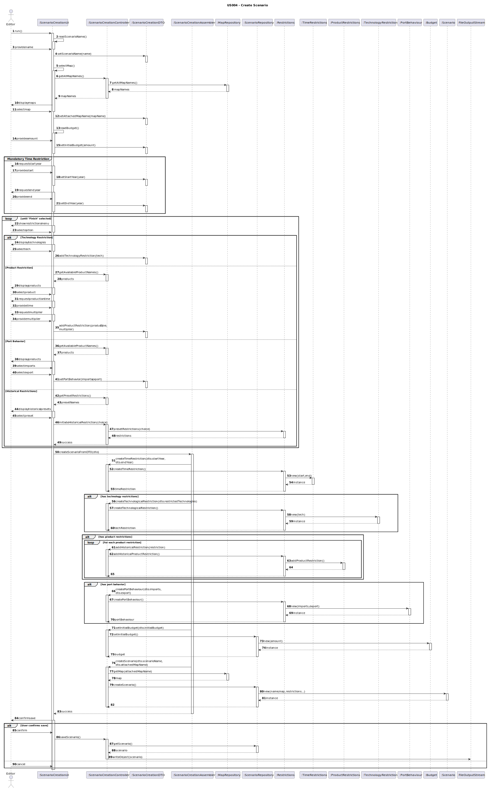
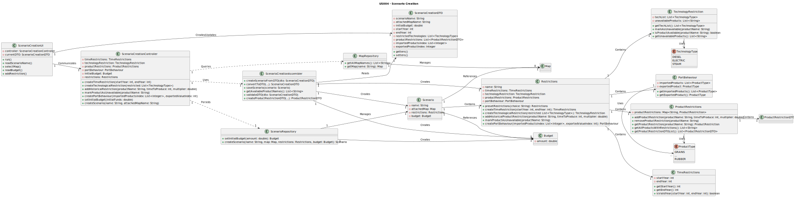

# US004 - As an Editor, I want to create a scenario for a selected map

## 3. Design

### 3.1. Rationale

**Interaction Responsibility Breakdown**

| Steps | Interaction Description              | Responsible Class           | Justification (Patterns)                                     |
|-------|--------------------------------------|-----------------------------|--------------------------------------------------------------|
| 1     | Start scenario creation              | `ScenarioCreationUI`        | **Pure Fabrication**                                         |
| 2     | Request scenario name                | `ScenarioCreationUI`        | **Pure Fabrication**                                         |
| 3     | Provide name                         | `ScenarioCreationUI`        | **Pure Fabrication**                                         |
| 4     | Display available maps               | `MapRepository`             | **Information Expert**                                       |
| 5     | Select map                           | `ScenarioCreationUI`        | **Pure Fabrication**                                         |
| 6     | Send information to the System       | `ScenarioCreationDTO`       | **DTO**                                                      |
| 7     | Request budget                       | `ScenarioCreationUI`        | **Pure Fabrication**                                         |
| 8     | Provide budget                       | `ScenarioCreationUI`        | **Pure Fabrication**                                         |
| 9     | Send information to the System       | `ScenarioCreationDTO`       | **DTO**                                                      |
| 10    | Display restrictions menu            | `ScenarioCreationUI`        | **Pure Fabrication**                                         |
| 11    | Select option                        | `ScenarioCreationDTO`       | **DTO**                                                      |
| 12    | Time restriction: Request years      | `ScenarioCreationUI`        | **Pure Fabrication**                                         |
| 13    | Provide start year                   | `ScenarioCreationUI`        | **Pure Fabrication**                                         |
| 14    | Send information to the System       | `ScenarioCreationDTO`       | **DTO**                                                      |
| 15    | Provide end year                     | `ScenarioCreationUI`        | **Pure Fabrication**                                         |
| 16    | Send information to the System       | `ScenarioCreationDTO`       | **DTO**                                                      |
| 17    | Product restriction: Display list    | `ProductRestrictions`       | **Information Expert**                                       |
| 18    | Select product                       | `ScenarioCreationUI`        | **DTO**                                                      |
| 19    | Request time/multiplier              | `ScenarioCreationUI`        | **Pure Fabrication**                                         |
| 20    | Provide parameters                   | `ScenarioCreationUI`        | **Pure Fabrication**                                         |
| 21    | Send information to the System       | `ScenarioCreationDTO`       | **DTO**                                                      |
| 22    | Mark unavailable                     | `TechnologyRestriction`     | **Information Expert**                                       |
| 23    | Send information to the System       | `ScenarioCreationDTO`       | **DTO**                                                      |
| 24    | Tech restriction: Display list       | `TechnologyType`            | **Information Expert**                                       |
| 25    | Select technologies                  | `ScenarioCreationUI`        | **Pure Fabrication**                                         |
| 26    | Port Behavior: Display imports       | `ProductType`               | **Information Expert**                                       |
| 27    | Select imports                       | `ScenarioCreationUI`        | **Pure Fabrication**                                         |
| 28    | Select export                        | `ScenarioCreationUI`        | **Pure Fabrication**                                         |
| 29    | Send information to the System       | `ScenarioCreationDTO`       | **DTO**                                                      |
| 30    | Historical Presets: Display          | `Restrictions`              | **Information Expert**                                       |
| 31    | Select preset                        | `ScenarioCreationUI`        | **DTO**                                                      |
| 32    | Apply preset                         | `Restrictions`              | **Creator**                                                  |
| 33    | Send information to the System       | `ScenarioCreationDTO`       | **DTO**                                                      |
| 34    | Confirm creation                     | `ScenarioCreationUI`        | **Pure Fabrication**                                         |
| 35    | Validate DTO                         | `ScenarioCreationAssembler` | **Assembler**                                                |
| 36    | Create domain objects                | `ScenarioCreationAssembler` | **Assembler**                                                |
| 37    | Create Budget                        | `Restrictions`              | **Information Expert** + **High Cohesion and Low Coupling**  |
| 38    | Create `Time Restrictions`           | `Restrictions`              | **Information Expert** + **High Cohesion and Low Coupling**  |
| 39    | Create `Technological Restrictions`  | `Restrictions`              | **Information Expert**  + **High Cohesion and Low Coupling** |
| 40    | Create `Product Restrictions`        | `Restrictions`              | **Information Expert** + **High Cohesion and Low Coupling**  |
| 41    | Create `Port Behaviour`              | `Restrictions`              | **Information Expert** + **High Cohesion and Low Coupling**  |
| 42    | Choose preset available              | `Restrictions`              | **Information Expert** + **High Cohesion and Low Coupling**  |
| 43    | Create `Budget`                      | `Restrictions`              | **Information Expert**  + **High Cohesion and Low Coupling** |
| 44    | Assemble information into the system | `ScenarioCreationAssembler` | **DTO**                                                      |
| 45    | Display success                      | `ScenarioCreationUI`        | **Pure Fabrication**                                         |

### 3.2. Systematization

**Conceptual Classes Promoted to Software Classes**
- `Scenario`
- `TimeRestrictions`
- `TechnologyRestriction`
- `ProductRestrictions`
- `PortBehaviour`
- `Restrictions`
- `ProductType`
- `TechnologyType`
- `Budget`
- `ScenarioCreationDTO`

**Pure Fabrications**
- `ScenarioCreationUI`
- `ScenarioCreationController`
- `ScenarioRepository`
- `MapRepository`
- `ScenarioCreationAssembler`
## 3.2. Sequence Diagram (SD)

## 3.3. Class Diagram (CD)

