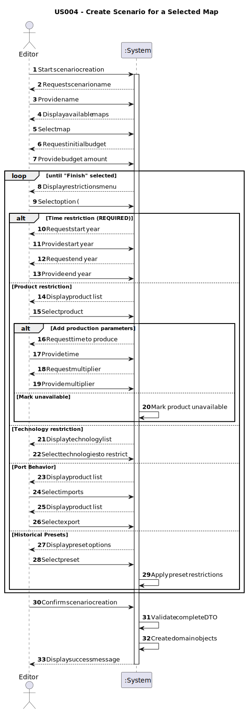

# US004 - As an Editor, I want to create a scenario for a selected map

## 1. Requirements Engineering

### 1.1. User Story Description

- The editor must be able to create a scenario, this scenario must be able to set some restrictions such has: Time Restrictions; Technological Restrictions; Historical Restrictions.

### 1.2. Customer Specifications and Clarifications 

#### From the client clarifications

> **Q:** How should scenarios work? How many and which should we have?
> 
> **A:** Scenarios are going to have a basic quantity do be implemented, and other than that ones, it will be up to the each group develop new ones as much as you can

### From the specifications document:

> #### Time restrictions: 
> - "Time restrictions define the time that the simulation takes place"
> - "The scenario can be fit between a space of time, for example from 1969 - 1973, if the electric train was invented in 1971, when the time of the simulation get to 1971, the electric train should be available > to be implemented, as well as the electric lines."

> #### Technological restrictions:
> - "Defines what technology can be used, such has electrict railways or locomotives"

> #### Historical restrictions:
> - "Create scenarios such has war; vaccination; schooling programs, etc..."
> - "Limits the type of train that can be used, the lines that can exist, the demand of products change depending in the type of historical moment."

### 1.3. Acceptance Criteria

**AC1:** Definition of the behaviour of ports, which cargoes they im-port/export and/or transform;

**AC2:** Definition of the available locomotion types (steam, diesel, and/or electric).

**AC3:** (Re)Definition of the factors that alter the generation (frequency) of generating industries

**AC4:** Ability to define and enforce historical restrictions, limiting the availability of specific trains, railway lines, and economic conditions based on the selected historical period.

**AC5:** Implementation of time-based progression, ensuring that technologies, industries, and infrastructure become available or restricted dynamically as the scenario progresses.

**AC6:** Garantee that the scenario exists and is attached to a given map.

### 1.4. Found out Dependencies

- [US001 - As an editor, I want to create a map with a specific size and a specific name](../US001), in order to exist a scenario we must make sure that the map is already loaded.

### 1.5 Input and Output Data

#### Selected Input:
- Map (Object)

##### Time Restrictions *[Required]*
- Start year (Integer)
- End year (Integer)

Technological Restrictions *[Optional]*
- Selected technology (List of objects)
- Selected products unavailable (List of objects)

Product Restrictions *[Optional]*
- Product multiplier (Float)
- Product time to produce (Integer)

Port behaviour *[Optional]*
- Imported products (List of objects)
- Exported products (List of objects)

Historical Restrictions *[Optional]*
- Selected historical preset (Object)

#### Typed Input:
- Scenario's name (String)
- Initial budget (Integer)

#### Output
- Scenario 

### 1.6. System Sequence Diagram (SSD)

### 1.7 Other Relevant Remarks

- There are no other relevant remarks
