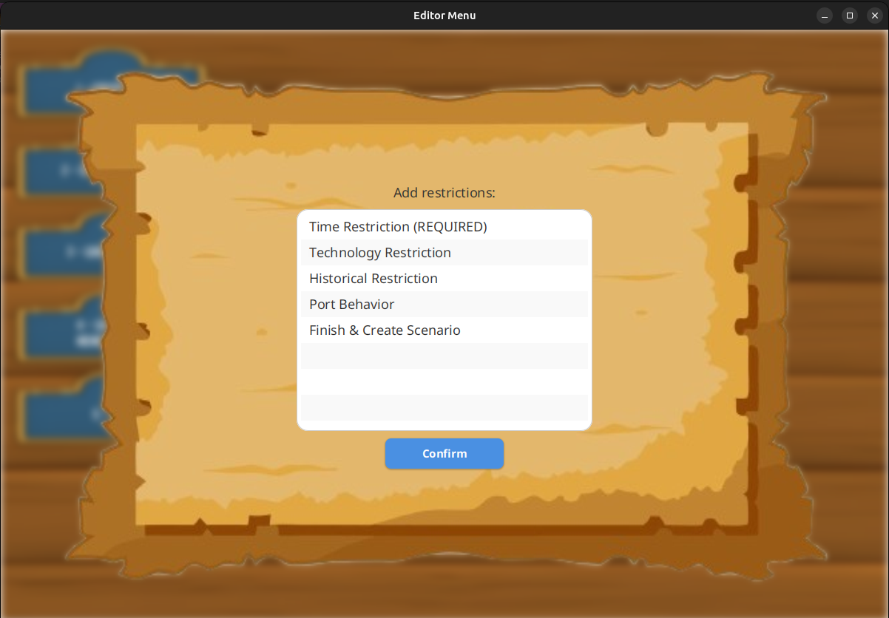
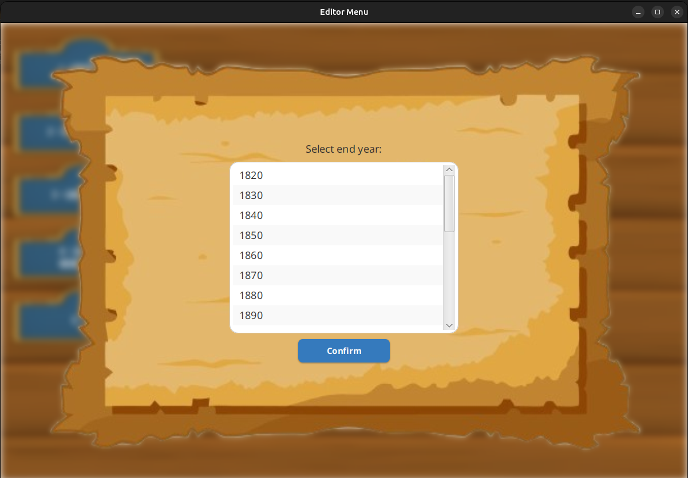
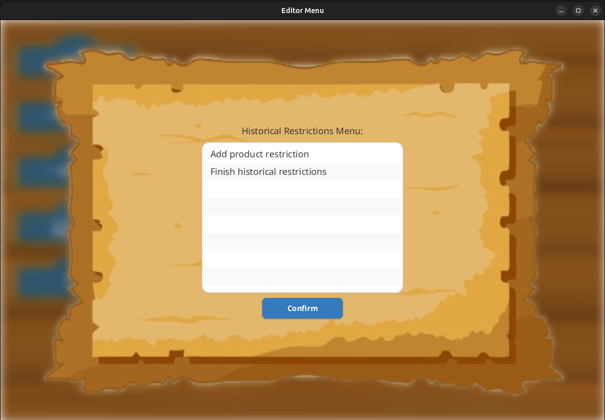
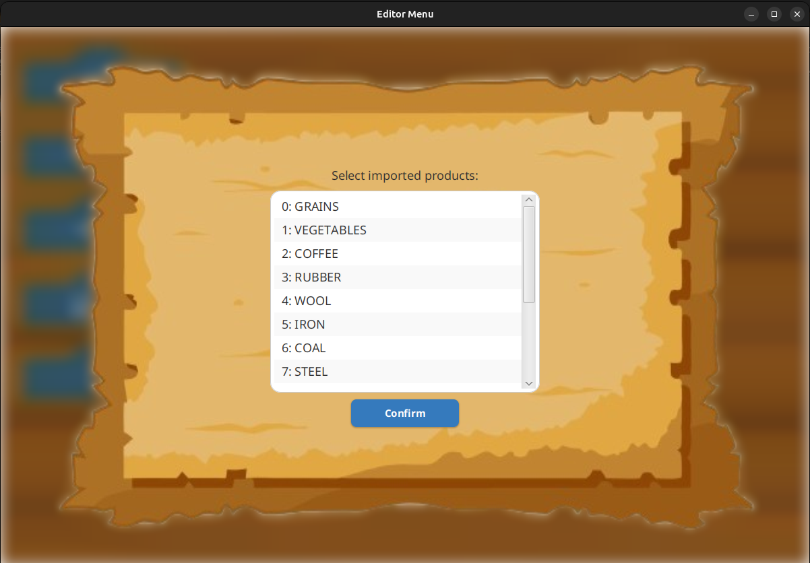

# US004 - As an Editor, I want to create a scenario for a selected map

## 4. Tests

**Test 1:** Definition of the behavior of ports, which cargoes they import/export and/or transform. (Refers to AC1)

```java
    @Test
    void createPortBehaviour() {
        // Arrange
        List<ProductType> imported = Arrays.asList(ProductType.STEEL, ProductType.MAIL);
        ProductType exported = ProductType.GRAINS;

        // Act
        PortBehaviour behaviour = new PortBehaviour(imported, exported);

        // Assert
        assertEquals(2, behaviour.getImportedProducts().size());
        assertEquals(exported, behaviour.getExportedProduct());
    }

    @Test
    void testCreatePortBehavior_ValidInput_Success() {
        // Arrange
        List<Integer> importedProducts = Arrays.asList(0, 1); // Indices for imported products
        int exportedProductIndex = 2; // Index for exported product

        // Act
        controller.createPortBehaviour(importedProducts, exportedProductIndex);

        // Assert
        assertNotNull(controller.getPortBehaviour());
        assertEquals(2, controller.getPortBehaviour().getImportedProducts().size());
        assertNotNull(controller.getPortBehaviour().getExportedProduct());
    }
```

**Test 2:** Definition of the available locomotion types (steam, diesel, and/or electric). (Refers to AC2)
```java 
@Test
    void createTechnologyRestrictionWithValidList() {
        // Arrange
        List<TechnologyType> techList = Arrays.asList(TechnologyType.DIESEL, TechnologyType.ELECTRIC);

        // Act
        TechnologyRestriction restriction = new TechnologyRestriction(techList);

        // Assert
        assertEquals(2, restriction.getTechList().size());
        assertTrue(restriction.getTechList().contains(TechnologyType.DIESEL));
    }

    @Test
    void createTechnologyRestrictionWithEmptyList() {
        // Arrange
        List<TechnologyType> techList = List.of();

        // Act
        TechnologyRestriction restriction = new TechnologyRestriction(techList);

        // Assert
        assertTrue(restriction.getTechList().isEmpty());
    }
```

**Test 3:** (Re)Definition of the factors that alter the generation (frequency) of generating industries. (Refers to AC3)

```java
 @Test
    void addProductRestriction_shouldAddNewRestriction() {
        // Arrange
        String productName = "TestProduct";
        int timeToProduce = 5;
        double multiplier = 1.5;

        // Act
        historicalRestrictions.addProductRestriction(productName, timeToProduce, multiplier);

        // Assert
        HistoricalRestrictions.ProductRestriction restriction =
                historicalRestrictions.getProductRestriction(productName);
        assertNotNull(restriction);
        assertEquals(timeToProduce, restriction.getTimeToProduce());
        assertEquals(multiplier, restriction.getMultiplier(), 0.001);
    }

    @Test
    void addProductRestriction_shouldOverrideExistingRestriction() {
        // Arrange
        String productName = "TestProduct";
        historicalRestrictions.addProductRestriction(productName, 5, 1.5);

        // Act
        historicalRestrictions.addProductRestriction(productName, 10, 2.0);

        // Assert
        HistoricalRestrictions.ProductRestriction restriction =
                historicalRestrictions.getProductRestriction(productName);
        assertEquals(10, restriction.getTimeToProduce());
        assertEquals(2.0, restriction.getMultiplier(), 0.001);
    }

    @Test
    void removeProductRestriction_shouldRemoveExistingRestriction() {
        // Arrange
        String productName = "TestProduct";
        historicalRestrictions.addProductRestriction(productName, 5, 1.5);

        // Act
        historicalRestrictions.removeProductRestriction(productName);

        // Assert
        assertNull(historicalRestrictions.getProductRestriction(productName));
    }
```

**Test 4:** Ability to define and enforce historical restrictions, limiting the availability of specific trains, railway lines, and economic conditions based on the selected historical period.
(Refers to AC4)
```java
 void createTechnologyRestrictionWithValidList() {
    // Arrange
    List<TechnologyType> techList = Arrays.asList(TechnologyType.DIESEL, TechnologyType.ELECTRIC);

    // Act
    TechnologyRestriction restriction = new TechnologyRestriction(techList);

    // Assert
    assertEquals(2, restriction.getTechList().size());
    assertTrue(restriction.getTechList().contains(TechnologyType.DIESEL));
}

@Test
void createTechnologyRestrictionWithEmptyList() {
    // Arrange
    List<TechnologyType> techList = List.of();

    // Act
    TechnologyRestriction restriction = new TechnologyRestriction(techList);

    // Assert
    assertTrue(restriction.getTechList().isEmpty());
}

@Test
void testCreateTechnologyRestriction_ValidInput_Success() {
    // Arrange
    List<TechnologyType> restrictedTechs = Arrays.asList(TechnologyType.STEAM, TechnologyType.DIESEL);

    // Act
    controller.createTechnologicalRestriction(restrictedTechs);

    // Assert
    assertNotNull(controller.getTechnologyRestriction());
    assertEquals(2, controller.getTechnologyRestriction().getTechList().size());
    assertTrue(controller.getTechnologyRestriction().getTechList().contains(TechnologyType.STEAM));
    assertTrue(controller.getTechnologyRestriction().getTechList().contains(TechnologyType.DIESEL));
}
```

**Test 5:** Implementation of time-based progression, ensuring that technologies, industries, and infrastructure become available or restricted dynamically as the scenario progresses. (Refers to AC5)
```java
 @Test
    void createValidTimeRestriction() {
        // Arrange
        int startYear = 1900;
        int endYear = 1950;

        // Act
        TimeRestrictions restriction = new TimeRestrictions(startYear, endYear);

        // Assert
        assertEquals(startYear, restriction.getStartYear());
        assertEquals(endYear, restriction.getEndYear());
    }

    @Test
    void createInvalidTimeRestrictionThrowsException() {
        // Arrange
        int startYear = 1950;
        int endYear = 1900;

        // Act & Assert
        assertThrows(IllegalArgumentException.class,
                () -> new TimeRestrictions(startYear, endYear));
    }

    @Test
    void negativeYearsThrowException() {
        // Arrange
        int startYear = -1;
        int endYear = 1900;

        // Act & Assert
        assertThrows(IllegalArgumentException.class,
                () -> new TimeRestrictions(startYear, endYear));
    }

    @Test
    void isValidYearReturnsTrueForValidRange() {
        // Arrange
        int startYear = 1900;
        int endYear = 1950;

        // Act & Assert
        assertTrue(new TimeRestrictions(0,0).isValidYear(startYear, endYear));
    }
```

**Test 6:** Garantee that the scenario exists and is attached to a given map. (Refers to AC6)

```java
 @Test
    void testCreateScenario_WithoutMap_ThrowsException() {
        // Arrange
        dto.setScenarioName("Invalid Scenario");
        dto.setAttachedMapName(null);
        dto.setStartYear(1900);
        dto.setEndYear(1950);
        dto.setInitialBudget(100000.0);

        // Act & Assert
        assertThrows(IllegalArgumentException.class, () ->
                assembler.createScenarioFromDTO(dto));
    }

    @Test
    void testValidateDTO_MissingRequiredFields_ThrowsException() {
        // Missing scenario name
        ScenarioCreationDTO invalidDto = new ScenarioCreationDTO();
        invalidDto.setAttachedMapName("Europe");
        invalidDto.setStartYear(1900);
        invalidDto.setEndYear(1950);
        invalidDto.setInitialBudget(100000.0);

        assertThrows(IllegalArgumentException.class, () ->
                assembler.validateDTO(invalidDto));

        // Missing map name
        invalidDto.setScenarioName("Test");
        invalidDto.setAttachedMapName(null);
        assertThrows(IllegalArgumentException.class, () ->
                assembler.validateDTO(invalidDto));

        // Missing years
        invalidDto.setAttachedMapName("Europe");
        invalidDto.setStartYear(null);
        assertThrows(IllegalArgumentException.class, () ->
                assembler.validateDTO(invalidDto));

        // Invalid budget
        invalidDto.setStartYear(1900);
        invalidDto.setInitialBudget(-100.0);
        assertThrows(IllegalArgumentException.class, () ->
                assembler.validateDTO(invalidDto));
    }

```

## 5. Construction (Implementation)

### 5.1 User Interface Layer
```java
package pt.ipp.isep.dei.us004;


import pt.ipp.isep.dei.repository.Simulator;
import pt.ipp.isep.dei.application.Authentication.App;
import pt.ipp.isep.dei.domain.ProductType;
import pt.ipp.isep.dei.domain.scenario.*;
import pt.ipp.isep.dei.utils.*;
import java.io.IOException;
import java.io.Serializable;
import java.util.*;
import java.util.stream.Collectors;

public class ScenarioCreationUI implements Serializable {
    private final ScenarioCreationController controller = new ScenarioCreationController();
    private final ScenarioCreationAssembler assembler = new ScenarioCreationAssembler(controller);
    private ScenarioCreationDTO scenarioDTO = new ScenarioCreationDTO();
    private boolean timeRestrictionSet = false;

    public void run() {
        readScenarioName();
    }

    private void readScenarioName() {
        App.setMessage("Enter scenario name:");
        ReadStringInput.requestUserInputString(input -> {
            scenarioDTO.setScenarioName(input);
            selectMap();
        });
    }

    private void selectMap() {
        List<String> mapNames = controller.getAllMapNames();
        if (mapNames.isEmpty()) {
            Utils.displayErrorMessage("No maps available! Create a map first.");
            returnToMenu();
            return;
        }

        App.setMessage("Select a map:");
        App.setList(String.join("\n", mapNames));
        ReadListInput.requestUserInputList(selected -> {
            scenarioDTO.setAttachedMapName(selected);
            readBudget();
        });
    }

    private void readBudget() {
        App.setMessage("Enter initial budget:");
        ReadStringInput.requestUserInputString(input -> {
            try {
                double budget = Double.parseDouble(input);
                if (budget < 0) {
                    throw new NumberFormatException("Budget cannot be negative");
                }
                scenarioDTO.setInitialBudget(budget);
                showRestrictionsMenu();
            } catch (NumberFormatException e) {
                Utils.displayErrorMessage("Invalid budget: " + e.getMessage());
                readBudget();
            }
        });
    }

    private void showRestrictionsMenu() {
        List<String> options = Arrays.asList(
                "Time Restriction (REQUIRED)",
                "Technology Restriction",
                "Historical Restriction",
                "Port Behavior",
                "Finish & Create Scenario"
        );

        App.setMessage("Add restrictions:");
        App.setList(String.join("\n", options));
        ReadListInput.requestUserInputList(choice -> {
            switch (options.indexOf(choice)) {
                case 0: createTimeRestriction(); break;
                case 1: createTechnologyRestriction(); break;
                case 2: createHistoricalRestriction(); break;
                case 3: createPortBehavior(); break;
                case 4: finishScenarioCreation(); break;
                default: showRestrictionsMenu();
            }
        });
    }

    private void createTimeRestriction() {
        List<String> yearOptions = new ArrayList<>();
        for (int year = 1800; year <= 2010; year += 5) {
            yearOptions.add(String.valueOf(year));
        }

        App.setMessage("Select start year:");
        App.setList(String.join("\n", yearOptions));
        ReadListInput.requestUserInputList(selected -> {
            try {
                int startYear = Integer.parseInt(selected);
                if (startYear < 1800) {
                    throw new IllegalArgumentException("Start year must be ≥1800");
                }
                scenarioDTO.setStartYear(startYear);
                selectEndYear(startYear);
            } catch (IllegalArgumentException e) {
                Utils.displayErrorMessage("Invalid year: " + e.getMessage());
                createTimeRestriction();
            }
        });
    }

    private void selectEndYear(int startYear) {
        List<String> yearOptions = new ArrayList<>();
        for (int year = startYear; year <= 2010; year += 10) {
            yearOptions.add(String.valueOf(year));
        }

        App.setMessage("Select end year:");
        App.setList(String.join("\n", yearOptions));
        ReadListInput.requestUserInputList(selected -> {
            try {
                int endYear = Integer.parseInt(selected);
                if (endYear < startYear) {
                    throw new IllegalArgumentException("End year must be ≥ start year");
                }
                scenarioDTO.setEndYear(endYear);
                timeRestrictionSet = true;
                showRestrictionsMenu();
            } catch (IllegalArgumentException e) {
                Utils.displayErrorMessage("Invalid year: " + e.getMessage());
                selectEndYear(startYear);
            }
        });
    }

    private void createTechnologyRestriction() {

        List<String> options = Arrays.asList(
                "Technologies to restrict",
                "Mark product as unavailable",
                "Finish technological restrictions"
        );

        App.setMessage("Technology Restrictions Menu:");
        App.setList(String.join("\n", options));
        ReadListInput.requestUserInputList(choice -> {
            switch (options.indexOf(choice)) {
                case 0: restrictTechnology(); break;
                case 1: selectProductForUnavailable(); break;
                case 2: showRestrictionsMenu(); break;
                default: createTechnologyRestriction();
            }
        });
    }

    public void restrictTechnology() {
        showTechnologyRestrictionMenu();
    }

    private void showTechnologyRestrictionMenu() {
        // Get all technology types (effectively final)
        final List<TechnologyType> allTechs = Arrays.asList(TechnologyType.values());

        // Get or create restricted technologies list (effectively final)
        final List<TechnologyType> restrictedTechs = Optional.ofNullable(scenarioDTO.getRestrictedTechnologies())
                .orElseGet(ArrayList::new);

        // Prepare menu options (derived from effectively final variables)
        List<String> menuOptions = allTechs.stream()
                .map(tech -> restrictedTechs.contains(tech)
                        ? "[RESTRICTED] " + tech.name()
                        : tech.name())
                .collect(Collectors.toList());

        menuOptions.add("FINISH SELECTION");

        // Show menu with current status
        App.setMessage(String.format(
                "Select technologies to restrict (Current restrictions: %d/%d):",
                restrictedTechs.size(),
                allTechs.size()
        ));
        App.setList(String.join("\n", menuOptions));

        ReadListInput.requestUserInputList(selected -> {
            if ("FINISH SELECTION".equals(selected)) {
                createTechnologyRestriction();
                return;
            }

            try {
                // Remove [RESTRICTED] prefix if present
                String cleanSelection = selected.replace("[RESTRICTED] ", "");
                TechnologyType selectedTech = TechnologyType.valueOf(cleanSelection);

                // Create new list for modifications (to avoid modifying effectively final variable)
                List<TechnologyType> newRestrictedTechs = new ArrayList<>(restrictedTechs);

                // Toggle restriction status
                if (newRestrictedTechs.contains(selectedTech)) {
                    newRestrictedTechs.remove(selectedTech);
                    Utils.displaySuccessMessage(selectedTech + " restriction removed");
                } else {
                    newRestrictedTechs.add(selectedTech);
                    Utils.displaySuccessMessage(selectedTech + " marked as restricted");
                }

                // Update DTO with new list
                scenarioDTO.setRestrictedTechnologies(newRestrictedTechs);

                // Refresh menu with updated state
                showTechnologyRestrictionMenu();
            } catch (IllegalArgumentException e) {
                Utils.displayErrorMessage("Invalid selection! Please try again.");
                showTechnologyRestrictionMenu();
            }
        });
    }

    private void selectProductForUnavailable() {
        showProductUnavailableMenu();
    }

    private void showProductUnavailableMenu() {
        List<String> productOptions = new ArrayList<>(controller.getAvailableProductNames());

        if (scenarioDTO.getProductRestrictions() != null) {
            List<String> unavailableProducts = scenarioDTO.getProductRestrictions().stream()
                    .filter(ScenarioCreationDTO.ProductRestrictionDTO::isUnavailable)
                    .map(ScenarioCreationDTO.ProductRestrictionDTO::getProductName)
                    .collect(Collectors.toList());
            productOptions.removeAll(unavailableProducts);
        }

        productOptions.add("BACK");

        App.setMessage("Select product to mark as unavailable (current unavailable: " +
                (scenarioDTO.getProductRestrictions() != null ?
                        scenarioDTO.getProductRestrictions().size() : 0) + ")");
        App.setList(String.join("\n", productOptions));

        ReadListInput.requestUserInputList(selected -> {
            if ("BACK".equals(selected)) {
                createTechnologyRestriction();
            } else {
                ScenarioCreationDTO.ProductRestrictionDTO restriction =
                        assembler.createProductRestrictionDTO(selected, 0, 0, true);

                List<ScenarioCreationDTO.ProductRestrictionDTO> restrictions =
                        scenarioDTO.getProductRestrictions();
                if (restrictions == null) {
                    restrictions = new ArrayList<>();
                    scenarioDTO.setProductRestrictions(restrictions);
                }
                restrictions.add(restriction);

                Utils.displaySuccessMessage(selected + " marked as unavailable");

                showProductUnavailableMenu();
            }
        });
    }


    private void createHistoricalRestriction() {
        List<String> options = Arrays.asList(
                "Add product restriction",
                "Finish historical restrictions"
        );

        App.setMessage("Historical Restrictions Menu:");
        App.setList(String.join("\n", options));
        ReadListInput.requestUserInputList(choice -> {
            switch (options.indexOf(choice)) {
                case 0: selectProductForRestriction(); break;
                case 1: showRestrictionsMenu(); break;
                default: createHistoricalRestriction();
            }
        });
    }

    private void selectProductForRestriction() {
        List<String> productOptions = controller.getAvailableProductNames();
        productOptions.add("BACK");

        App.setMessage("Select product to configure:");
        App.setList(String.join("\n", productOptions));
        ReadListInput.requestUserInputList(selected -> {
            if ("BACK".equals(selected)) {
                createHistoricalRestriction();
            } else {
                ScenarioCreationDTO.ProductRestrictionDTO restriction =
                        assembler.createProductRestrictionDTO(selected, 0, 0, false);
                configureProductRestriction(restriction);
            }
        });
    }


    private void configureProductRestriction(ScenarioCreationDTO.ProductRestrictionDTO restriction) {
        App.setMessage("Enter production time (years):");
        ReadStringInput.requestUserInputString(timeInput -> {
            try {
                int time = Integer.parseInt(timeInput);
                if (time <= 0) throw new IllegalArgumentException();
                restriction.setTimeToProduce(time);

                App.setMessage("Enter value multiplier:");
                ReadStringInput.requestUserInputString(multiplierInput -> {
                    try {
                        double multiplier = Double.parseDouble(multiplierInput);
                        if (multiplier <= 0) throw new IllegalArgumentException();
                        restriction.setMultiplier(multiplier);

                        List<ScenarioCreationDTO.ProductRestrictionDTO> restrictions =
                                scenarioDTO.getProductRestrictions();
                        if (restrictions == null) {
                            restrictions = new ArrayList<>();
                        }
                        restrictions.add(restriction);
                        scenarioDTO.setProductRestrictions(restrictions);

                        Utils.displaySuccessMessage("Restriction added for " + restriction.getProductName());
                        createHistoricalRestriction();
                    } catch (Exception e) {
                        Utils.displayErrorMessage("Invalid multiplier!");
                        configureProductRestriction(restriction);
                    }
                });
            } catch (Exception e) {
                Utils.displayErrorMessage("Invalid production time!");
                configureProductRestriction(restriction);
            }
        });
    }


    private void createPortBehavior() {
        List<ProductType> products = List.of(ProductType.values());
        List<String> productOptions = new ArrayList<>();
        for (int i = 0; i < products.size(); i++) {
            productOptions.add(i + ": " + products.get(i).name());
        }
        productOptions.add("FINISH SELECTION");

        App.setMessage("Select imported products:");
        App.setList(String.join("\n", productOptions));
        ReadListInput.requestUserInputList(selected -> {
            if ("FINISH SELECTION".equals(selected)) {
                if (scenarioDTO.getImportedProductsIndex() == null ||
                        scenarioDTO.getImportedProductsIndex().isEmpty()) {
                    Utils.displayWarningInput("Please select at least one imported product");
                    createPortBehavior();
                } else {
                    selectExportedProduct();
                }
                return;
            }

            try {
                int index = Integer.parseInt(selected.split(":")[0].trim());
                if (index < 0 || index >= products.size()) {
                    throw new IndexOutOfBoundsException();
                }

                List<Integer> imports = scenarioDTO.getImportedProductsIndex();
                if (imports == null) {
                    imports = new ArrayList<>();
                }
                if (!imports.contains(index)) {
                    imports.add(index);
                    scenarioDTO.setImportedProductsIndex(imports);
                }
                createPortBehavior();
            } catch (Exception e) {
                Utils.displayErrorMessage("Invalid selection!");
                createPortBehavior();
            }
        });
    }

    private void selectExportedProduct() {
        List<ProductType> products = List.of(ProductType.values());
        List<String> productOptions = new ArrayList<>();
        for (int i = 0; i < products.size(); i++) {
            productOptions.add(i + ": " + products.get(i).name());
        }

        App.setMessage("Select exported product:");
        App.setList(String.join("\n", productOptions));
        ReadListInput.requestUserInputList(selected -> {
            try {
                int index = Integer.parseInt(selected.split(":")[0].trim());
                if (index < 0 || index >= products.size()) {
                    throw new IndexOutOfBoundsException();
                }
                scenarioDTO.setExportedProductIndex(index);
                showRestrictionsMenu();
            } catch (Exception e) {
                Utils.displayErrorMessage("Invalid selection!");
                selectExportedProduct();
            }
        });
    }

    private void finishScenarioCreation() {
        if (!timeRestrictionSet) {
            Utils.displayErrorMessage("Time restriction is required!");
            showRestrictionsMenu();
            return;
        }

        try {
            assembler.createScenarioFromDTO(scenarioDTO);
            if (controller.successScenarioCreationFlag()) {
                askToSaveScenario();
            } else {
                //throw new Exception("Scenario creation failed");
            }
        } catch (Exception e) {
            Utils.displayErrorMessage("Error: " + e.getMessage());
            showRestrictionsMenu();
        }
    }

    private void askToSaveScenario() {
        List<String> options = Arrays.asList("Yes", "No");

        App.setMessage("Save scenario?");
        App.setList(String.join("\n", options));
        ReadListInput.requestUserInputList(choice -> {
            if ("Yes".equals(choice)) {
                try {
                    controller.saveScenario(
                            Simulator.getInstance().getScenarioRepository().getScenario(scenarioDTO.getScenarioName())
                    );
                    Utils.displayReturnEditor("Scenario saved successfully!");
                } catch (Exception e) {
                    Utils.displayErrorMessage("Save failed: " + e.getMessage());
                }
            }
            returnToMenu();
        });
    }

    private void returnToMenu() {
        try {
            Utils.displayReturnEditor("Returning to editor menu");
        } catch (IOException e) {
            e.printStackTrace();
        }
    }
}
```

### 5.2 Controller Layer

```java
package pt.ipp.isep.dei.us004;

import pt.ipp.isep.dei.domain.Budget;
import pt.ipp.isep.dei.repository.Simulator;
import pt.ipp.isep.dei.domain.Map;
import pt.ipp.isep.dei.domain.scenario.*;
import pt.ipp.isep.dei.domain.ProductType;
import pt.ipp.isep.dei.domain.user.Player;
import pt.ipp.isep.dei.domain.user.User;
import pt.ipp.isep.dei.repository.MapRepository;

import java.io.*;
import java.util.Arrays;
import java.util.List;
import java.util.Objects;
import java.util.stream.Collectors;

/**
 * Controller responsible for managing the creation of scenarios.
 * Now works with the adapter pattern for data transfer.
 */
public class ScenarioCreationController implements Serializable {

    private TimeRestrictions timeRestrictions;
    private TechnologyRestriction technologyRestriction;
    private HistoricalRestrictions historicalRestrictions;
    private PortBehaviour portBehaviour;
    private Budget initialBudget;
    private final Restrictions restrictions = new Restrictions();
    private final Simulator simulator = Simulator.getInstance();
    private final MapRepository mapRepo = simulator.getMapRepository();
    private boolean scenarioCreated = false;
    String scenarioName;

    /**
     * Creates a time restriction for the scenario based on start and end years.
     *
     * @param startYear the start year of the time restriction
     * @param endYear the end year of the time restriction
     */
    public void createTimeRestriction(int startYear, int endYear) {

        timeRestrictions = restrictions.createTimeRestriction(startYear, endYear);
    }

    public void createTechnologicalRestriction(List<TechnologyType> restricted) {
        technologyRestriction = restrictions.createTechnologicalRestriction(restricted);
    }

    public void addHistoricalRestriction(String productName, int timeToProduce, double multiplier) {
        restrictions.addHistoricalProductRestriction(productName, timeToProduce, multiplier);
    }

    public void markProductAsUnavailable(String productName) {
        restrictions.markProductAsUnavailable(productName);
    }

    public List<String> getAvailableProductNames() {
        return Arrays.stream(ProductType.values())
                .map(Enum::name)
                .collect(Collectors.toList());
    }

    public void createPortBehaviour(List<Integer> importedProductsIndex, int exportedValueIndex) {
        portBehaviour = restrictions.createPortBehaviour(importedProductsIndex, exportedValueIndex);
    }

    public void setInitialBudget(double initialFunds) {
        if (initialFunds < 0) {
            throw new IllegalArgumentException("Budget cannot be negative.");
        }
        initialBudget = simulator.getScenarioRepository().setInitialBudget(initialFunds);
    }

    public void createScenario(String name, String attachedMapName) {
        scenarioName = name;
        Map map = mapRepo.getMap(attachedMapName);
        if (Objects.isNull(map)) {
            throw new NullPointerException("Please attach a map to the scenario.");
        }


        simulator.createScenario(name, map, timeRestrictions, historicalRestrictions, technologyRestriction, portBehaviour, initialBudget);

        scenarioCreated = true;

        User currentUser = simulator.getAuthenticationRepository().getCurrentUserSession().getUser();
        if (currentUser instanceof Player) {
            Player player = (Player) currentUser;
            player.setBudgetAmount(initialBudget.getFunds());
        }
    }

    public boolean successScenarioCreationFlag() {
        if (simulator.getScenarioRepository().getScenarios().contains(simulator.getScenarioRepository().getScenario(scenarioName))) {
            scenarioCreated = false;
            return true;
        }
        return false;
    }

    public void saveScenario(Scenario scenario) throws IOException {
        try (ObjectOutputStream objectOut = new ObjectOutputStream(
                new FileOutputStream("scenario_savefile.bin"))) {
            objectOut.writeObject(scenario);
        }
    }

    public List<String> getAllMapNames() {
        return mapRepo.getAllMapNames();
    }

    public Scenario getScenarioByName(String name) {
        return simulator.getScenarioRepository().getScenario(name);
    }

    public HistoricalRestrictions getHistoricalRestrictions() {
        return historicalRestrictions;
    }

    public PortBehaviour getPortBehaviour() {
        return portBehaviour;
    }

    public TechnologyRestriction getTechnologyRestriction() {
        return technologyRestriction;
    }
}
```

### 5.2.1 DTO 
```java
package pt.ipp.isep.dei.us004;

import pt.ipp.isep.dei.domain.scenario.TechnologyType;
import java.io.Serializable;
import java.util.List;
import java.util.Objects;

/**
 * Data Transfer Object for scenario creation parameters
 */
public class ScenarioCreationDTO implements Serializable {
    private String scenarioName;
    private String attachedMapName;
    private Integer startYear;
    private Integer endYear;
    private List<TechnologyType> restrictedTechnologies;
    private List<ProductRestrictionDTO> productRestrictions;
    private List<Integer> importedProductsIndex;
    private Integer exportedProductIndex;
    private Double initialBudget;

    // Constructors
    public ScenarioCreationDTO() {
    }

    public ScenarioCreationDTO(String scenarioName, String attachedMapName, Integer startYear,
                               Integer endYear, List<TechnologyType> restrictedTechnologies,
                               List<ProductRestrictionDTO> productRestrictions,
                               List<Integer> importedProductsIndex, Integer exportedProductIndex,
                               Double initialBudget) {
        this.scenarioName = scenarioName;
        this.attachedMapName = attachedMapName;
        this.startYear = startYear;
        this.endYear = endYear;
        this.restrictedTechnologies = restrictedTechnologies;
        this.productRestrictions = productRestrictions;
        this.importedProductsIndex = importedProductsIndex;
        this.exportedProductIndex = exportedProductIndex;
        this.initialBudget = initialBudget;
    }

    // Getters and Setters
    public String getScenarioName() {
        return scenarioName;
    }

    public void setScenarioName(String scenarioName) {
        this.scenarioName = scenarioName;
    }

    public String getAttachedMapName() {
        return attachedMapName;
    }

    public void setAttachedMapName(String attachedMapName) {
        this.attachedMapName = attachedMapName;
    }

    public Integer getStartYear() {
        return startYear;
    }

    public void setStartYear(Integer startYear) {
        this.startYear = startYear;
    }

    public Integer getEndYear() {
        return endYear;
    }

    public void setEndYear(Integer endYear) {
        this.endYear = endYear;
    }

    public List<TechnologyType> getRestrictedTechnologies() {
        return restrictedTechnologies;
    }

    public void setRestrictedTechnologies(List<TechnologyType> restrictedTechnologies) {
        this.restrictedTechnologies = restrictedTechnologies;
    }

    public List<ProductRestrictionDTO> getProductRestrictions() {
        return productRestrictions;
    }

    public void setProductRestrictions(List<ProductRestrictionDTO> productRestrictions) {
        this.productRestrictions = productRestrictions;
    }

    public List<Integer> getImportedProductsIndex() {
        return importedProductsIndex;
    }

    public void setImportedProductsIndex(List<Integer> importedProductsIndex) {
        this.importedProductsIndex = importedProductsIndex;
    }

    public Integer getExportedProductIndex() {
        return exportedProductIndex;
    }

    public void setExportedProductIndex(Integer exportedProductIndex) {
        this.exportedProductIndex = exportedProductIndex;
    }

    public Double getInitialBudget() {
        return initialBudget;
    }

    public void setInitialBudget(Double initialBudget) {
        this.initialBudget = initialBudget;
    }

    // equals, hashCode, and toString
    @Override
    public boolean equals(Object o) {
        if (this == o) return true;
        if (o == null || getClass() != o.getClass()) return false;
        ScenarioCreationDTO that = (ScenarioCreationDTO) o;
        return Objects.equals(scenarioName, that.scenarioName) &&
                Objects.equals(attachedMapName, that.attachedMapName) &&
                Objects.equals(startYear, that.startYear) &&
                Objects.equals(endYear, that.endYear) &&
                Objects.equals(restrictedTechnologies, that.restrictedTechnologies) &&
                Objects.equals(productRestrictions, that.productRestrictions) &&
                Objects.equals(importedProductsIndex, that.importedProductsIndex) &&
                Objects.equals(exportedProductIndex, that.exportedProductIndex) &&
                Objects.equals(initialBudget, that.initialBudget);
    }

    @Override
    public int hashCode() {
        return Objects.hash(scenarioName, attachedMapName, startYear, endYear,
                restrictedTechnologies, productRestrictions,
                importedProductsIndex, exportedProductIndex, initialBudget);
    }

    @Override
    public String toString() {
        return "ScenarioCreationDTO{" +
                "scenarioName='" + scenarioName + '\'' +
                ", attachedMapName='" + attachedMapName + '\'' +
                ", startYear=" + startYear +
                ", endYear=" + endYear +
                ", restrictedTechnologies=" + restrictedTechnologies +
                ", productRestrictions=" + productRestrictions +
                ", importedProductsIndex=" + importedProductsIndex +
                ", exportedProductIndex=" + exportedProductIndex +
                ", initialBudget=" + initialBudget +
                '}';
    }

    /**
     * Nested DTO for product restrictions
     */
    public static class ProductRestrictionDTO implements Serializable {
        private String productName;
        private int timeToProduce;
        private double multiplier;
        private boolean unavailable;

        public ProductRestrictionDTO() {
        }

        public ProductRestrictionDTO(String productName, int timeToProduce,
                                     double multiplier, boolean unavailable) {
            this.productName = productName;
            this.timeToProduce = timeToProduce;
            this.multiplier = multiplier;
            this.unavailable = unavailable;
        }

        // Getters and Setters
        public String getProductName() {
            return productName;
        }

        public void setProductName(String productName) {
            this.productName = productName;
        }

        public int getTimeToProduce() {
            return timeToProduce;
        }

        public void setTimeToProduce(int timeToProduce) {
            this.timeToProduce = timeToProduce;
        }

        public double getMultiplier() {
            return multiplier;
        }

        public void setMultiplier(double multiplier) {
            this.multiplier = multiplier;
        }

        public boolean isUnavailable() {
            return unavailable;
        }

        public void setUnavailable(boolean unavailable) {
            this.unavailable = unavailable;
        }

        @Override
        public boolean equals(Object o) {
            if (this == o) return true;
            if (o == null || getClass() != o.getClass()) return false;
            ProductRestrictionDTO that = (ProductRestrictionDTO) o;
            return timeToProduce == that.timeToProduce &&
                    Double.compare(that.multiplier, multiplier) == 0 &&
                    unavailable == that.unavailable &&
                    Objects.equals(productName, that.productName);
        }

        @Override
        public int hashCode() {
            return Objects.hash(productName, timeToProduce, multiplier, unavailable);
        }

        @Override
        public String toString() {
            return "ProductRestrictionDTO{" +
                    "productName='" + productName + '\'' +
                    ", timeToProduce=" + timeToProduce +
                    ", multiplier=" + multiplier +
                    ", unavailable=" + unavailable +
                    '}';
        }
    }
}
```

### 5.2.2 Assembler 

```java
package pt.ipp.isep.dei.us004;

import pt.ipp.isep.dei.us004.ScenarioCreationController;
import pt.ipp.isep.dei.domain.scenario.TechnologyType;
import pt.ipp.isep.dei.domain.scenario.Scenario;

import java.io.IOException;
import java.util.List;
import java.util.stream.Collectors;

public class ScenarioCreationAssembler {
        private final ScenarioCreationController controller;

        public ScenarioCreationAssembler(ScenarioCreationController controller) {
            this.controller = controller;
        }

        /**
         * Creates a scenario from DTO
         * @param dto the data transfer object containing scenario parameters
         * @throws IllegalArgumentException if required parameters are missing
         * @throws IllegalStateException if scenario creation fails
         */
        public void createScenarioFromDTO(ScenarioCreationDTO dto) {
            validateDTO(dto);

            controller.createTimeRestriction(dto.getStartYear(), dto.getEndYear());

            if (dto.getRestrictedTechnologies() != null && !dto.getRestrictedTechnologies().isEmpty()) {
                controller.createTechnologicalRestriction(dto.getRestrictedTechnologies());
            }

            if (dto.getProductRestrictions() != null) {
                for (ScenarioCreationDTO.ProductRestrictionDTO restriction : dto.getProductRestrictions()) {
                    if (restriction.isUnavailable()) {
                        controller.markProductAsUnavailable(restriction.getProductName());
                    } else {
                        controller.addHistoricalRestriction(
                                restriction.getProductName(),
                                restriction.getTimeToProduce(),
                                restriction.getMultiplier()
                        );
                    }
                }
            }

            if (dto.getImportedProductsIndex() != null && dto.getExportedProductIndex() != null) {
                controller.createPortBehaviour(dto.getImportedProductsIndex(), dto.getExportedProductIndex());
            }

            controller.setInitialBudget(dto.getInitialBudget());

            controller.createScenario(dto.getScenarioName(), dto.getAttachedMapName());

            if (!controller.successScenarioCreationFlag()) {
                throw new IllegalStateException("Scenario creation failed");
            }
        }

        /**
         * Converts domain parameters to DTO
         * @param scenarioName Name of the scenario
         * @param mapName Name of the attached map
         * @param startYear Start year of the scenario
         * @param endYear End year of the scenario
         * @param techRestrictions List of restricted technologies
         * @param initialBudget Initial budget amount
         * @return Configured ScenarioCreationDTO
         */
        public ScenarioCreationDTO convertToDTO(String scenarioName, String mapName,
                                                int startYear, int endYear,
                                                List<TechnologyType> techRestrictions,
                                                double initialBudget) {
            ScenarioCreationDTO dto = new ScenarioCreationDTO();
            dto.setScenarioName(scenarioName);
            dto.setAttachedMapName(mapName);
            dto.setStartYear(startYear);
            dto.setEndYear(endYear);
            dto.setRestrictedTechnologies(techRestrictions);
            dto.setInitialBudget(initialBudget);
            return dto;
        }

        /**
         * Saves scenario to file using controller
         * @param scenario Scenario to save
         * @throws IOException if file operations fail
         */
        public void saveScenario(Scenario scenario) throws IOException {
            controller.saveScenario(scenario);
        }

        /**
         * Gets available product names from controller
         * @return List of available product names
         */
        public List<String> getAvailableProductNames() {
            return controller.getAvailableProductNames();
        }

        /**
         * Validates that required DTO fields are present
         * @param dto DTO to validate
         * @throws IllegalArgumentException if validation fails
         */
        public void validateDTO(ScenarioCreationDTO dto) {
            if (dto.getScenarioName() == null || dto.getScenarioName().trim().isEmpty()) {
                throw new IllegalArgumentException("Scenario name is required");
            }
            if (dto.getAttachedMapName() == null || dto.getAttachedMapName().trim().isEmpty()) {
                throw new IllegalArgumentException("Attached map name is required");
            }
            if (dto.getStartYear() == null || dto.getEndYear() == null) {
                throw new IllegalArgumentException("Start year and end year are required");
            }
            if (dto.getInitialBudget() == null || dto.getInitialBudget() < 0) {
                throw new IllegalArgumentException("Valid initial budget is required");
            }
        }

        /**
         * Creates a ProductRestrictionDTO from parameters
         * @param productName Name of the product
         * @param timeToProduce Time needed to produce
         * @param multiplier Production multiplier
         * @param unavailable Whether product is unavailable
         * @return Configured ProductRestrictionDTO
         */
        public ScenarioCreationDTO.ProductRestrictionDTO createProductRestrictionDTO(
                String productName, int timeToProduce, double multiplier, boolean unavailable) {
            return new ScenarioCreationDTO.ProductRestrictionDTO(
                    productName, timeToProduce, multiplier, unavailable);
        }
    }
```

### 5.3 Domain Layer

### 5.3.1 Scenario
```java
    package pt.ipp.isep.dei.domain.scenario;

    import pt.ipp.isep.dei.domain.Budget;
    import pt.ipp.isep.dei.domain.City;
    import pt.ipp.isep.dei.domain.Map;
    import pt.ipp.isep.dei.domain.industries.Industry;
    import pt.ipp.isep.dei.domain.position.HouseBlock;
    import pt.ipp.isep.dei.domain.position.Position;
    import pt.ipp.isep.dei.domain.train.LocomotiveType;
    import pt.ipp.isep.dei.repository.*;
    import pt.ipp.isep.dei.domain.Product;
    import pt.ipp.isep.dei.domain.ProductType;
    import pt.ipp.isep.dei.domain.industries.*;
    import pt.ipp.isep.dei.domain.position.Location;
    import pt.ipp.isep.dei.domain.rails.RailType;
    import pt.ipp.isep.dei.domain.rails.RailwayLine;
    import pt.ipp.isep.dei.domain.rails.RailwayLines;
    import pt.ipp.isep.dei.domain.rails.TrackType;
    import pt.ipp.isep.dei.domain.station.*;
    import pt.ipp.isep.dei.domain.train.LocomotiveModel;
    import pt.ipp.isep.dei.domain.train.Train;


    import java.io.Serializable;
    import java.util.ArrayList;
    import java.util.HashMap;
    import java.util.List;

    /**
     * Represents a simulation scenario containing configuration parameters such as
     * map, time and historical restrictions, technology restrictions, port behavior, and budget.
     */
    public class Scenario implements Serializable {
        private String name;
        private Map attachedMap;
        private TimeRestrictions timeRestrictions;
        private HistoricalRestrictions historicalRestrictions;
        private TechnologyRestriction technologyRestriction;
        private PortBehaviour portBehaviour;
        private Budget initialBudget;
        private Budget budget;

        private IndustryRepository industryRepository;
        private TrainRepository trainRepository;
        private StationRepository stationRepository;
        private RailwaylineRepository railwaylineRepository;
        private RouteRepository routeRepository;
        private TripRepository tripRepository;
        private InfluenceAreaRepository influenceAreaRepository;
        private CityRepository cityRepository;


        /**
         * Constructs a new Scenario instance with the specified parameters.
         *
         * @param name                   the scenario's name
         * @param attachedMap            the map associated with the scenario
         * @param timeRestrictions       the time-based restrictions applied to the scenario
         * @param historicalRestrictions the historical restrictions applied to the scenario
         * @param technologyRestriction  the technology-related restrictions in the scenario
         * @param portBehaviour          the import/export behavior of ports in the scenario
         * @param budget                 the budget available for the scenario
         */
        public Scenario(String name, Map attachedMap, TimeRestrictions timeRestrictions,
                        HistoricalRestrictions historicalRestrictions, TechnologyRestriction technologyRestriction,
                        PortBehaviour portBehaviour, Budget budget) {
            this.name = name;
            this.attachedMap = attachedMap;
            this.timeRestrictions = timeRestrictions;
            this.historicalRestrictions = historicalRestrictions;
            this.technologyRestriction = technologyRestriction;
            this.portBehaviour = portBehaviour;
            this.initialBudget = budget;
            this.budget = budget;


            influenceAreaRepository = new InfluenceAreaRepository();
            industryRepository = new IndustryRepository();
            trainRepository = new TrainRepository();
            stationRepository = new StationRepository();
            railwaylineRepository = new RailwaylineRepository();
            routeRepository = new RouteRepository();
            tripRepository = new TripRepository();
            cityRepository = new CityRepository();
        }

        public void startRepos(){
            if (this.influenceAreaRepository == null) this.influenceAreaRepository = new InfluenceAreaRepository();
            if (this.industryRepository == null) this.industryRepository = new IndustryRepository();
            if (this.trainRepository == null) this.trainRepository = new TrainRepository();
            if (this.stationRepository == null) this.stationRepository = new StationRepository();
            if (this.railwaylineRepository == null) this.railwaylineRepository = new RailwaylineRepository();
            if (this.routeRepository == null) this.routeRepository = new RouteRepository();
            if (this.tripRepository == null) this.tripRepository = new TripRepository();
            if (this.cityRepository == null) this.cityRepository = new CityRepository();
        }

        // =============== Create methods =============== //

        /**
         * Creates a new {@link Train} using the given {@link LocomotiveModel} and assigns it a unique ID.
         * <p>
         * The train is created internally with a locomotive based on the provided model.
         * The new train is then added to the {@link TrainRepository}.
         * </p>
         *
         * @param model the {@link LocomotiveModel} used to initialize the train's locomotive
         * @return the newly created {@link Train}
         */
        public Train createTrain(LocomotiveModel model) {
            return new Train(model, trainRepository.getNewID());
        }

        /**
         * Creates and adds a new {@link Industry} to the repository
         *
         * @param productType the product associated with the industry
         * @param location the location where the industry is placed
         * @return the created {@link Industry} instance, or {@code null} if no valid industry was created
         */
        public Industry createIndustry(ProductType productType, Location location) {
            Product product = new Product(productType);
            IndustryType type = industryRepository.getIndustryType(product.getProductType());
            IndustrySector sector = type.getSector();
            Industry i = null;

            if (sector == IndustrySector.PRIMARY)
                i = new PrimaryIndustry(product, type, location, product.getProductType().timeToProduce, 1000);
            else if (sector == IndustrySector.TRANSFORMING)
                i = new TransformingIndustry(product, type, location, product.getProductType().timeToProduce, 1000);

            if (i != null)
                industryRepository.addIndustry(i);
            return i;
        }

        /**
         * Creates and adds a new {@link Port} to the repository
         *
         * @param behaviour the product associated with the industry
         * @param location the location where the industry is placed
         * @return {@link Port} on success, {@code null} if no Port was created
         */
        public Industry createPort(PortBehaviour behaviour, Location location) throws NullPointerException {
            if (behaviour == null)
                throw new NullPointerException("Behaviour cannot be null");
            ProductType exP = behaviour.getExportedProduct();
            List<ProductType> imP = behaviour.getImportedProducts();

            Port p = new Port(new Product(exP), imP, location, exP.timeToProduce, 1000);
            industryRepository.addPort(p);

            return p;
        }

        /**
         * Creates a new station and adds it to the repository.
         *
         * @param name the name of the station
         * @param cardinalPosition the cardinal direction (used for standard stations)
         * @param location the location of the station
         * @param stationType the type of the station to create ("STATION", "DEPOT", "TERMINAL")
         * @param maxHeight maximum height allowed at the station
         * @param maxLength maximum length allowed at the station
         * @return the created {@link StationType}
         */
        public StationType createStation(String name, String stationType, Location location, String cardinalPosition, int maxHeight, int maxLength) {
            StationType station;

            if (stationType.equals("STATION")) {
                station = new Station(name, cardinalPosition, location, maxHeight, maxLength);
            } else if (stationType.equals("DEPOT")) {
                station = new Depot(name, location, maxHeight, maxLength);
            } else {
                station = new Terminal(name, location, maxHeight, maxLength);
            }
            setObjetcsInArea(station);
            stationRepository.addStation(station);
            return station;
        }

        /**
         * Creates a new {@link RailwayLine} between two stations with the given track and line types,
         * adds it to the repository, and associates it with both stations.
         *
         * @param trackType TrackType
         * @param lineType RailType
         * @param station1 the first station connected by the railway line
         * @param station2 the second station connected by the railway line
         * @param distance the distance between the two stations
         * @return the newly created {@code RailwayLine}
         */
        public RailwayLine createRailwayLine(StationType station1, StationType station2, String trackType, String lineType, Double distance) {
            TrackType trackType1 = null;
            for (TrackType t : TrackType.values()) {
                if (!trackType.isEmpty() && t.name().equals(trackType)) {
                    trackType1 = t;
                }
            }
            RailType lineType1 = null;
            for (RailType r : RailType.values()) {
                if (!lineType.isEmpty() && r.name().equals(lineType)) {
                    lineType1 = r;
                }
            }
            RailwayLine rl = new RailwayLine(station1, station2, lineType1, trackType1, distance);
            station1.addRailwayLines(rl);
            station2.addRailwayLines(rl);
            railwaylineRepository.addRailwayLine(rl);
            return rl;
        }

        /**
         * Upgrades a given station to a new type (Station or Terminal), transferring all relevant data.
         *
         * <p>This method creates a new station object based on the provided upgrade type, preserving
         * the original station's name, location, railway lines, and acquired buildings. The original
         * station is removed from the repository after the new one is created and added.</p>
         *
         * <p>Possible upgrade transitions:</p>
         * <ul>
         *     <li>{@code Depot → Station}</li>
         *     <li>{@code Depot → Terminal}</li>
         *     <li>{@code Station → Terminal}</li>
         * </ul>
         *
         * @param station the station to upgrade
         * @param maxHeight maximum height of the map
         * @param maxLength maximum length of the map
         * @param upgrade the upgrade type as a string
         * @param cardinalPosition the cardinal direction of the new station (used for Station upgrades)
         * @return the new {@link StationType} after upgrade
         */
        public void passDataFromStation(StationType station, int maxHeight, int maxLength, String upgrade, String cardinalPosition) {
            Location location = station.getLocation();
            String name = station.getName();
            RailwayLines railwayLines = station.getRailwayLines();
            Buildings acquiredBuildings = station.getAcquiredBuildings();
            Upgrade upgrade1 = null;
            for (Upgrade u : Upgrade.values()) {
                if (!upgrade.isEmpty() && u.name().equals(upgrade)) {
                    upgrade1 = u;
                }
            }
            if (station instanceof Depot) {
                if (upgrade1 == Upgrade.DEPOTTOSTATION) {
                    Station stationNew = new Station(name.replace("depot","station"), cardinalPosition, location, maxHeight, maxLength);
                    stationNew.setRailwayLines(railwayLines);
                    stationNew.setAcquiredBuildings(acquiredBuildings);
                    stationRepository.deleteStation(station);
                    stationRepository.getStations().add(stationNew);
                    setObjetcsInArea(stationNew);
                } else if (upgrade1 == Upgrade.DEPOTTOTERMINAL) {
                    Terminal terminalNew = new Terminal(name.replace("depot","terminal"), location, maxHeight, maxLength);
                    terminalNew.setRailwayLines(railwayLines);
                    terminalNew.setAcquiredBuildings(acquiredBuildings);
                    stationRepository.deleteStation(station);
                    stationRepository.getStations().add(terminalNew);
                    setObjetcsInArea(terminalNew);
                }
            }else {
                Terminal terminalNew = new Terminal(name.replace("station","terminal"), location, maxHeight, maxLength);
                terminalNew.setRailwayLines(railwayLines);
                terminalNew.setAcquiredBuildings(acquiredBuildings);
                stationRepository.deleteStation(station);
                stationRepository.getStations().add(terminalNew);
                setObjetcsInArea(terminalNew);
            }

        }

        /**
         * Associates objects located within the influence area of the given station.
         *
         * This method creates mappings between positions inside the station's influence area
         * and the corresponding objects found at those positions. It considers cities and industries
         * located within the area and collects them into a map with their positions as keys.
         *
         * The resulting map is then passed to the repository for further use.
         *
         * @param station the {@link StationType} whose influence area is being processed
         */
        public void setObjetcsInArea(StationType station) {


            HashMap<Position, City> cityMap = new HashMap<>();
            for (City city : cityRepository.getCities()) {
                cityMap.put(city.getPosition(), city);
            }

            HashMap<Position, HouseBlock> houseBlockMap = new HashMap<>();
            for (City city : cityRepository.getCities()) {
                for(HouseBlock houseBlock : city.getHouseBlocks()) {
                    houseBlockMap.put(houseBlock.getPosition(), houseBlock);
                }
            }

            HashMap<Position, Industry> industryMap = new HashMap<>();
            for (Industry industry : industryRepository.getIndustries()) {
                industryMap.put(industry.getLocation().getPosition(), industry);
            }

            HashMap<Position, StationType> stationMap = new HashMap<>();
            for (StationType stationType : stationRepository.getStations()) {
                stationMap.put(stationType.getLocation().getPosition(), stationType);
            }

            HashMap<Position, Object> closeObjects = new HashMap<>();
            for (Position pos : station.getArea().getArea()) {
                if (cityMap.containsKey(pos)) closeObjects.put(pos, cityMap.get(pos));
                if (industryMap.containsKey(pos)) closeObjects.put(pos, industryMap.get(pos));
                if (houseBlockMap.containsKey(pos)) closeObjects.put(pos, houseBlockMap.get(pos));
                if(stationMap.containsKey(pos)) closeObjects.put(pos, stationMap.get(pos));
            }

            station.setObjectsInArea(closeObjects);
        }

        //  =============== Logic methods =============== //

        /**
         * Converts a {@link LocomotiveType} to a corresponding {@link TechnologyType}.
         *
         * @param type the type of locomotive
         * @return the corresponding technology type
         * @throws IllegalArgumentException if the type is unknown
         */
        private TechnologyType convertToTechnologyType(LocomotiveType type) {
            switch (type) {
                case DIESEL_LOCOMOTIVE:
                    return TechnologyType.DIESEL;
                case ELECTRICITY_LOCOMOTIVE:
                    return TechnologyType.ELECTRIC;
                case STEAM_LOCOMOTIVE:
                    return TechnologyType.STEAM;
                default:
                    throw new IllegalArgumentException("Type of locomotive unknown: " + type);
            }
        }

        /**
         * Purchases a locomotive by deducting its cost and creating a train.
         * <p>
         * The created train is returned, but not persisted — that responsibility lies outside this class.
         * </p>
         *
         * @param model the locomotive model to be purchased
         * @return the created Train instance
         * @throws IllegalArgumentException if budget is insufficient
         */
        public Train purchaseLocomotive(LocomotiveModel model) {
            if (budget.hasEnoughFunds(model.getAcquisitionPrice())){
                budget.purchase(model.getAcquisitionPrice());
                return createTrain(model);
            }

            return null;
        }

        /**
         * Finds and returns the name of the city nearest to the given coordinates.
         *
         * @param x the x-coordinate to compare
         * @param y the y-coordinate to compare
         * @return the name of the nearest city or null if no cities exist or exact match is found
         */
        public String nearestCityNames(int x, int y) {
            Position p = new Position(x, y);
            return shortestDistance(p);
        }

        /**
         * Computes the city or cities with the shortest distance to the given position.
         *
         * @param p the position to calculate distances from
         * @return the name of one of the closest cities, or null if no cities or exact position match
         */
        private String shortestDistance(Position p) {
            ArrayList<String> closestCitiesNames = new ArrayList<>();
            double minDistance = Double.MAX_VALUE;

            if (!cityRepository.getCities().isEmpty()) {
                for (City city : cityRepository.getCities()) {
                    double dis = Math.abs(city.getPosition().getX() - p.getX())
                            + Math.abs(city.getPosition().getY() - p.getY());
                    if (dis < minDistance) {
                        closestCitiesNames.clear();
                        minDistance = dis;
                        closestCitiesNames.add(city.getName());
                    } else if (dis == minDistance) {
                        closestCitiesNames.add(city.getName());
                    }
                }
            } else {
                return null;
            }
            if (minDistance == 0) {
                return null;
            }
            return closestCitiesNames.get(0);
        }

        //  =============== Getters =============== //


        /**
         * Returns the scenario's name.
         *
         * @return the scenario name
         */
        public String getName() {
            return name;
        }

        /**
         * Returns the time restrictions applied to this scenario.
         *
         * @return time restrictions
         */
        public TimeRestrictions getTimeRestrictions() {
            return timeRestrictions;
        }

        /**
         * Returns the port behavior configuration.
         *
         * @return port behavior
         */
        public PortBehaviour getPortBehaviour() {
            return portBehaviour;
        }

        /**
         * Returns the technology restrictions applied to this scenario.
         *
         * @return technology restriction
         */
        public TechnologyRestriction getTechnologyRestriction() {
            return technologyRestriction;
        }

        /**
         * Returns the historical restrictions applied to this scenario.
         *
         * @return historical restrictions
         */
        public HistoricalRestrictions getHistoricalRestrictions() {
            return historicalRestrictions;
        }

        /**
         * Returns the budget available for this scenario.
         *
         * @return budget
         */
        public Budget getBudget() {
            return budget;
        }

        public Budget getInitialBudget() {
            return initialBudget;
        }

        /**
         * Returns the map attached to this scenario.
         *
         * @return attached map
         */
        public Map getAttachedMap() {
            return attachedMap;
        }

        public InfluenceAreaRepository getInfluenceAreaRepository() {
            return influenceAreaRepository;
        }

        public IndustryRepository getIndustryRepository() {
            return industryRepository;
        }

        public TrainRepository getTrainRepository() {
            return trainRepository;
        }

        public StationRepository getStationRepository() {
            return stationRepository;
        }

        public RailwaylineRepository getRailwaylineRepository() {
            return railwaylineRepository;
        }

        public RouteRepository getRouteRepository() {
            return routeRepository;
        }

        public TripRepository getTripRepository() {
            return tripRepository;
        }

        public CityRepository getCityRepository() {
            return cityRepository;
        }

        /**
         * Returns a formatted string listing all available products,
         * excluding the last two (assumed to be city-generated).
         *
         * @return a string of product options with indices
         */
        public String getAvailableProducts() {
            StringBuilder s = new StringBuilder();

            for (int i = 0; i < ProductType.values().length - 2; i++) {
                ProductType product = ProductType.values()[i];
                if (technologyRestriction == null || technologyRestriction.isProductAvailable(product))
                    s.append(" [").append(i).append("] - ").append(product).append("\n");
            }
            return s.toString();
        }

        /**
         * Get the primary products needed to transforme into the given product
         * @param p product To get the primaries of
         * @return the list with the products needed
         */
        public ArrayList<ProductType> getPrimaryProduct(ProductType p) {
            ArrayList<ProductType> primaryProduct = new ArrayList<>();
            if (p == ProductType.BREAD)
                primaryProduct.add(ProductType.GRAINS);
            else if (p == ProductType.CLOTHING)
                primaryProduct.add(ProductType.WOOL);
            else if (p == ProductType.CAR){
                primaryProduct.add(ProductType.STEEL);
                primaryProduct.add(ProductType.STEEL);
                primaryProduct.add(ProductType.RUBBER);
            }
            else if (p == ProductType.STEEL) {
                primaryProduct.add(ProductType.IRON);
                primaryProduct.add(ProductType.COAL);
            }
            return (primaryProduct);
        }

        /**
         * Retrieves the list of available locomotive models for purchase,
         * based on the current simulation year, the scenario's time restrictions,
         * and the allowed technology types.
         *
         * @param currentYear the current simulation year
         * @return a list of {@link LocomotiveModel} instances that are available for purchase
         */
        public List<LocomotiveModel> getAvailableLocomotives(int currentYear) {
            int scenarioStartYear = timeRestrictions.getStartYear();
            int scenarioEndYear = timeRestrictions.getEndYear();
            List<TechnologyType> allowedTechs = getAllowedTechs();

            List<LocomotiveModel> availableModels = new ArrayList<>();

            //System.out.println("Current Year: " + currentYear);
            //System.out.println("Scenario Start Year: " + scenarioStartYear);
            //System.out.println("Scenario End Year: " + scenarioEndYear);
            //System.out.println("Allowed Technologies: " + allowedTechs);
            //System.out.println();

            for (LocomotiveModel model : LocomotiveModel.values()) {
                int modelStartYear = model.getStartYear();
                TechnologyType techType = convertToTechnologyType(model.getType());

                if (modelStartYear <= currentYear &&
                        modelStartYear <= scenarioEndYear &&
                        allowedTechs.contains(techType)) {
                    availableModels.add(model);
                }
            }
            return availableModels;
        }

        /**
         * Retrieves the list of allowed technology types for the current scenario.
         * <p>
         * This method first fetches the list of restricted technologies defined in the scenario's
         * {@code TechnologyRestriction}. It then computes the allowed technologies by removing
         * the restricted types from the full set of possible technologies
         * ({@code DIESEL}, {@code ELECTRIC}, {@code STEAM}).
         * <p>
         * If no restriction is defined (e.g., due to a {@code NullPointerException}),
         * it assumes that no technology is allowed and returns an empty list.
         *
         * @return a list of {@link TechnologyType} values representing the allowed technologies
         *         in the current scenario.
         */
        private List<TechnologyType> getAllowedTechs() {
            if (technologyRestriction == null || technologyRestriction.getTechList() == null) {
                // Nenhuma restrição = todas as tecnologias permitidas
                return List.of(TechnologyType.DIESEL, TechnologyType.ELECTRIC, TechnologyType.STEAM);
            }

            List<TechnologyType> restricted = technologyRestriction.getTechList();
            System.out.println("Restricted Technologies: " + restricted);

            List<TechnologyType> allTechs = List.of(TechnologyType.DIESEL, TechnologyType.ELECTRIC, TechnologyType.STEAM);
            List<TechnologyType> allowed = new ArrayList<>(allTechs);
            allowed.removeAll(restricted);

            return allowed;
        }

        //  =============== Setters =============== //

        public void setInfluenceAreaRepository(InfluenceAreaRepository influenceAreaRepository) {
            this.influenceAreaRepository = influenceAreaRepository;
        }

        public void setIndustryRepository(IndustryRepository industryRepository) {
            this.industryRepository = industryRepository;
        }

        public void setTrainRepository(TrainRepository trainRepository) {
            this.trainRepository = trainRepository;
        }

        public void setStationRepository(StationRepository stationRepository) {
            this.stationRepository = stationRepository;
        }

        public void setRailwaylineRepository(RailwaylineRepository railwaylineRepository) {
            this.railwaylineRepository = railwaylineRepository;
        }

        public void setRouteRepository(RouteRepository routeRepository) {
            this.routeRepository = routeRepository;
        }

        public void setTripRepository(TripRepository tripRepository) {
            this.tripRepository = tripRepository;
        }
    }

```

### 5.3.2 Restrictions

```java
package pt.ipp.isep.dei.us004;

import pt.ipp.isep.dei.domain.Product;
import pt.ipp.isep.dei.domain.ProductType;
import pt.ipp.isep.dei.domain.scenario.*;

import java.sql.Time;
import java.util.ArrayList;
import java.util.Arrays;
import java.util.List;

public class Restrictions {


    TimeRestrictions timeRestrictions;
    TechnologyRestriction technologyRestriction;
    HistoricalRestrictions historicalRestrictions;
    PortBehaviour portBehaviour;

    /**
     * Creates a time restriction for the scenario based on start and end years.
     *
     * @param startYear the start year of the time restriction
     * @param endYear the end year of the time restriction
     */
    public TimeRestrictions createTimeRestriction(int startYear, int endYear){
        return timeRestrictions = new TimeRestrictions(startYear, endYear);
    }

    /**
     * Creates and stores a new TechnologyRestriction based on the given list of
     * restricted technology types.
     *
     * @param restricted the list of TechnologyType enums that should be made unavailable
     */
    public TechnologyRestriction createTechnologicalRestriction(List<TechnologyType> restricted) {
        return technologyRestriction = new TechnologyRestriction(restricted);
    }


    public Product getProductByName(String productName) {
        return Arrays.stream(ProductType.values())
                .filter(pt -> pt.productName.equals(productName))
                .findFirst()
                .map(Product::new)
                .orElseThrow(() -> new IllegalArgumentException("Product not found: " + productName));
    }

    /**
     * Creates a historical restriction related to a product’s production time and multiplier.
     *
     * @param productName the product name the restriction applies to
     * @param timeToProduce the time needed to produce the product
     * @param multiplier the multiplier affecting production
     */
    public void addHistoricalProductRestriction(String productName, int timeToProduce, double multiplier) {
        if (historicalRestrictions == null) {
            historicalRestrictions = new HistoricalRestrictions();
        }
        historicalRestrictions.addProductRestriction(productName, timeToProduce, multiplier);
    }

    public void markProductAsUnavailable(String productName) {
        if (technologyRestriction == null) {
            technologyRestriction = new TechnologyRestriction();
        }
        technologyRestriction.markAsUnavailable(productName);
    }


    /**
     * Sets up the port behaviour specifying imported products and exported product.
     *
     * @param importedProductsIndex list of indexes representing imported products
     * @param exportedValueIndex the index of the exported product
     */
    public PortBehaviour createPortBehaviour(List<Integer> importedProductsIndex, int exportedValueIndex){
        List<ProductType> importedProducts = new ArrayList<>();
        ProductType exportedProduct;

        for (int i = 0; i < importedProductsIndex.size(); i++) {
            importedProducts.add(ProductType.valueOf(Product.getAllProducts().get(importedProductsIndex.get(i))));
        }
        exportedProduct = ProductType.valueOf(Product.getAllProducts().get(exportedValueIndex));

        portBehaviour = new PortBehaviour(importedProducts, exportedProduct);

        return portBehaviour;
    }

    public TimeRestrictions getTimeRestrictions() {
        return timeRestrictions;
    }

    public TechnologyRestriction getTechnologyRestriction() {
        return technologyRestriction;
    }

    public HistoricalRestrictions getHistoricalRestrictions() {
        return historicalRestrictions;
    }

    public PortBehaviour getPortBehaviour() {
        return portBehaviour;
    }
}
```

### 5.3.2.1 Historical Restrictions
```java
package pt.ipp.isep.dei.domain.scenario;

import pt.ipp.isep.dei.domain.Product;
import pt.ipp.isep.dei.domain.ProductType;

import java.io.Serializable;
import java.util.ArrayList;
import java.util.HashMap;
import java.util.List;
import java.util.Map;

public class HistoricalRestrictions implements Serializable {
    private final Map<String, ProductRestriction> productRestrictions = new HashMap<>();


    public void addProductRestriction(String productName, int timeToProduce, double multiplier) {
        productRestrictions.put(productName, new ProductRestriction(timeToProduce, multiplier));
    }

    public void removeProductRestriction(String productName) {
        productRestrictions.remove(productName);
    }

    public ProductRestriction getProductRestriction(String productName) {
        return productRestrictions.get(productName);
    }


    public List<String> getAllProductsWithRestrictions() {
        return new ArrayList<>(productRestrictions.keySet());
    }


    public static class ProductRestriction implements Serializable {
        private final int timeToProduce;
        private final double multiplier;

        public ProductRestriction(int timeToProduce, double multiplier) {
            this.timeToProduce = timeToProduce;
            this.multiplier = multiplier;
        }

        public int getTimeToProduce() {
            return timeToProduce;
        }

        public double getMultiplier() {
            return multiplier;
        }
    }
}
```

### 5.3.2.2 Technological Restrictions
```java
package pt.ipp.isep.dei.domain.scenario;

import pt.ipp.isep.dei.domain.ProductType;

import java.io.Serializable;
import java.util.ArrayList;
import java.util.List;

/**
 * Represents a restriction on available technologies for a scenario.
 * Holds a list of technology types that are restricted or unavailable.
 */
public class TechnologyRestriction implements Serializable {

    List<TechnologyType> techList;

    private final List<String> unavailableProducts = new ArrayList<>();


    /**
     * Constructs a TechnologyRestriction with a given list of restricted technology types.
     *
     * @param techList the list of TechnologyType instances that are restricted
     */
    public TechnologyRestriction(List<TechnologyType> techList){
        this.techList = techList;
    }

    public TechnologyRestriction(){
        List<TechnologyType> techList = new ArrayList<>();
    }

    /**
     * Returns the list of restricted technology types.
     *
     * @return list of TechnologyType objects that are restricted
     */
    public List<TechnologyType> getTechList() {
        return techList;
    }


    public void markAsUnavailable(String productName) {
        if (!unavailableProducts.contains(productName)) {
            unavailableProducts.add(productName);
        }
    }

    public boolean isProductAvailable(String productName) {
        return !unavailableProducts.contains(productName);
    }

    /**
     * function check if a given productType is inside the unavailable list
     * @param p product type wanted to be checked
     * @return (true - is available) (false - is unavailable)
     */
    public boolean isProductAvailable(ProductType p){
        if (unavailableProducts.contains(p.productName))
            return false;
        return true;
    }

    public List<String> getUnavailableProducts() {
        return new ArrayList<>(unavailableProducts);
    }
}

```

### 5.3.2.3 Temporal Restrictions
```java
package pt.ipp.isep.dei.domain.scenario;

import java.io.Serializable;

/**
 * Represents a time restriction with a start year and an end year.
 * Ensures that the start year is less than or equal to the end year
 * and that both years are non-negative.
 */
public class TimeRestrictions  implements Serializable {

    private int startYear;
    private int endYear;

    /**
     * Constructs a TimeRestrictions object with the specified start and end years.
     *
     * @param startYear the beginning year of the restriction (must be non-negative)
     * @param endYear the ending year of the restriction (must be non-negative and >= startYear)
     * @throws IllegalArgumentException if startYear is greater than endYear or if any year is negative
     */
    public TimeRestrictions(int startYear, int endYear){
        if (!isValidYear(startYear, endYear)) {
            throw new IllegalArgumentException("Start year must be less than or equal to end year.");
        }
        if (startYear < 0 || endYear < 0) {
            throw new IllegalArgumentException("Years must be non-negative.");
        }

        this.startYear = startYear;
        this.endYear = endYear;
    }

    /**
     * Returns the start year of this time restriction.
     *
     * @return the start year
     */
    public int getStartYear() {
        return startYear;
    }

    /**
     * Returns the end year of this time restriction.
     *
     * @return the end year
     */
    public int getEndYear() {
        return endYear;
    }

    /**
     * Checks if the start year is less than or equal to the end year.
     *
     * @param startYear the start year to check
     * @param endYear the end year to check
     * @return true if startYear is less than or equal to endYear, false otherwise
     */
    public boolean isValidYear(int startYear, int endYear) {
        return startYear <= endYear;
    }

}

```

### 5.3.2.4 Port Behaviour
```java
package pt.ipp.isep.dei.domain.scenario;

import pt.ipp.isep.dei.domain.ProductType;

import java.io.Serializable;
import java.util.List;

/**
 * Represents the behavior of a port regarding the types of products it imports and exports.
 */
public class PortBehaviour implements Serializable {

    List<ProductType> importedProducts;
    ProductType exportedProduct;

    /**
     * Constructs a PortBehaviour instance with the specified imported and exported products.
     *
     * @param importedProducts a list of product types that the port imports
     * @param exportedProduct the product type that the port exports
     */
    public PortBehaviour(List<ProductType> importedProducts, ProductType exportedProduct){
        this.importedProducts = importedProducts;
        this.exportedProduct = exportedProduct;
    }

    /**
     * Returns the list of product types imported by the port.
     *
     * @return list of imported product types
     */
    public List<ProductType> getImportedProducts() {
        return importedProducts;
    }

    /**
     * Returns the product type exported by the port.
     *
     * @return exported product type
     */
    public ProductType getExportedProduct() {
        return exportedProduct;
    }

}

```

## 6. Integration and Demo 

*Demonstrate scenario functionality*














## 7. Observations
- Complete class implementations
- Detailed method documentation
- Clear code organization
- Proper Markdown formatting
- Implementation notes section
- Consistent code style
- Emphasis on key design decisions