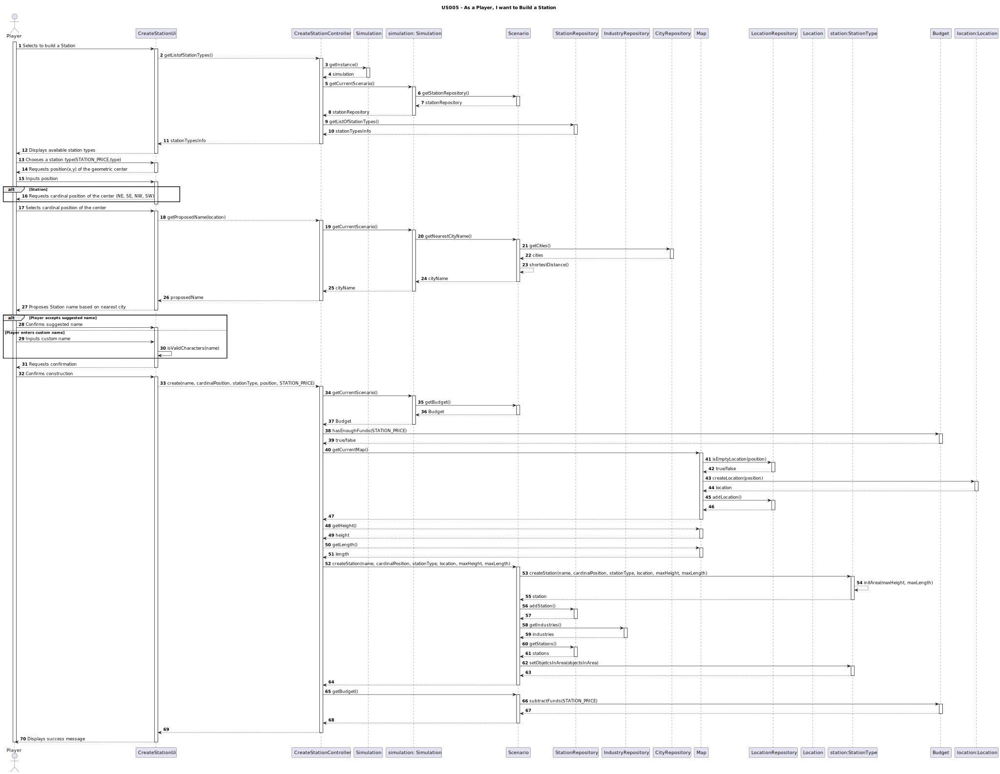
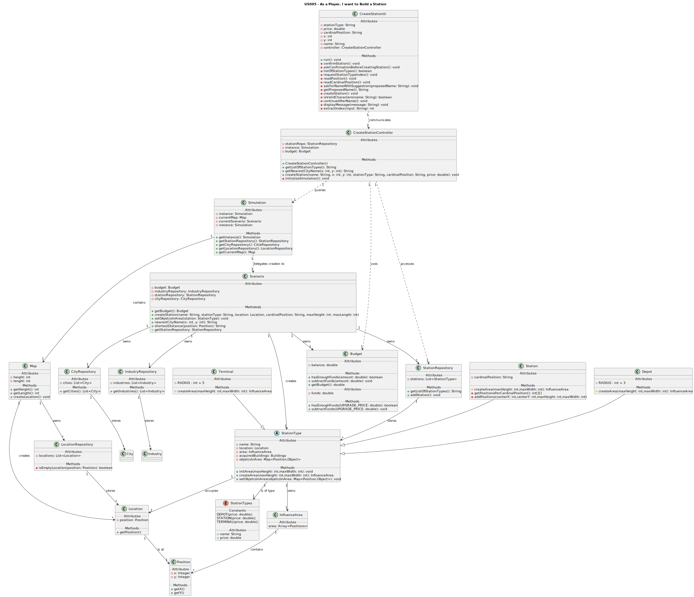

# **US005 - As a Player, I want to build a station**

## 3. Design

### 3.1. Rationale

**The rationale grounds on the SSD interactions and the identified input/output data.**

### 3.1. Rationale

**The rationale grounds on the SSD interactions and the identified input/output data.**

### 3.1. Rationale

**The rationale grounds on the SSD interactions and the identified input/output data.**

| Interaction ID                   | Question: Which class is responsible for...              | Answer               | Justification (Patterns)             |
|----------------------------------|----------------------------------------------------------|----------------------|--------------------------------------|
| **1. Initiate Station Build**    | obtaining station type list?                             | `StationRepository`  | Information Expert                   |
|                                  | instantiating the class that handles the UI?             | `BuildStationUI`     | Pure Fabrication                     |
|                                  | obtaining the StationTypes repository?                   | `Scenario`           | Information Expert, Pure Fabrication |
|                                  | obtaining the current Scenario ?                         | `Simulation`         | Information Expert, Pure Fabrication |
|                                  | accessing the simulation singleton?                      | `Simulation`         | Singleton                            |
| **2. Display Station Types**     | Showing available types?                                 | `CreateStationUi`    | Pure Fabrication                     |
| **3. Select Station Type**       | keeping selected type?                                   | `CreateStationUi`    | Pure Fabrication                     |
| **4. Request Position**          | requesting location of the geometric center?             | `CreateStationUi`    | Pure Fabrication                     |
| **5. Input Position**            | validating the inputted location data(format)?           | `CreateStationUi`    | Pure Fabrication                     |
| **6. Request Cardinal Pos**      | requesting cardinal position?                            | `CreateStationUi`    | Pure Fabrication                     |
| **7. Input cardinal position**   | validating the inputted cardinal position (NE, NW, etc.) | `CreateStationUi`    | Pure Fabrication                     |
| **8. Generate Station Name**     | Calculating nearest city?                                | `Scenario`           | Information Expert                   |
|                                  | showing name proposed by system                          | `CreateStationUi`    | Pure Fabrication                     |
|                                  | obtaining the list of cities?                            | `CityRepository`     | Information Expert                   |
| **9. Confirms or inputs name**   | Validating custom name?                                  | `CreateStationUi`    | Pure Fabrication                     |
| **10: Requests confirmation**    | requesting confirmation to proceed                       | `CreateStationUi`    | Pure Fabrication                     |
| **11. Create Station**           | Creating StationType?                                    | `Scenario`           | Creator                              |
|                                  | Initializing influence area?                             | `StationType`        | Information Expert                   |
|                                  | Reducing funds?                                          | `Budget`             | Information Expert                   |
|                                  | Checking available funds?                                | `Budget`             | Information Expert                   |
|                                  | obtaining the current map                                | `Simulation`         | Information Expert                   |
|                                  | obtaining the current Scenario                           | `Simulation`         | Information Expert                   |
|                                  | obtaining the budget                                     | `Scenario`           | Information Expert                   |
|                                  | obtaining the maxHeight and maxLenght of the map         | `Map`                | Information Expert                   |
|                                  | Creating location object?                                | `Map`                | Creator                              |
|                                  | verifying if location is empty?                          | `locationRepository` | Information Expert                   |
|                                  | add location to locationRepository?                      | `locationRepository` | Information Expert                   |
|                                  | add station to stationRepository?                        | `stationRepository`  | Information Expert                   |
|                                  | set Objects in Area                                      | `Scenario`           | Information Expert                   |
|                                  | obtaining the list of industries?                        | `IndustryRepository` | Information Expert                   |
|                                  | obtaining the list of stations?                          | `StationRepository`  | Information Expert                   |
 **12. Displays success message**  | showing station created confirmation                     | `CreateStationUi`    | Pure Fabrication                     |

### Systematization ##

According to the taken rationale, the conceptual classes promoted to software classes are:

* `Budget`
* `StationType`
* `Depot`
* `Station`
* `Terminal`
* `Map`
* `Location`
* `Position`
* `InfluenceArea`
* `Scenario`

Other software classes (i.e. Pure Fabrication) identified:

* `CreateStationUi`
* `CreateStationController`
* `IndustryRepository`
* `CityRepository`
* `StationRepository`

## 3.2. Sequence Diagram (SD)

## 3.3. Class Diagram (CD)

_In this section, it is suggested to present an UML static view representing the main related software classes that are involved in fulfilling the requirements as well as their relations, attributes and methods._

