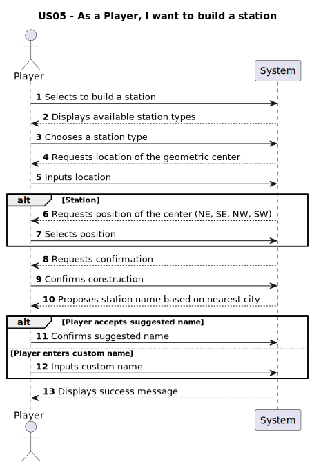

# US005 - As a Player, I want to build a station

## 1. Requirements Engineering

### 1.1. User Story Description

- In this user story, the player is allowed to build a new station on the currently active map. There are three types of stations available: Depot, Station, and Terminal, each with different costs and economic radius. When placing a new station, the player must select its location, and the system will automatically suggest a name based on the nearest city and the type of station.
The way the center of the station is determined varies depending on the station type. For Depots and Terminals, the system uses a geometric center based on the station’s predefined dimensions. However, for Stations, the player must manually define the central orientation by choosing one of four directions: northeast (NE), southeast (SE), northwest (NW), or southwest (SW).

### 1.2. Customer Specifications and Clarifications

From the specifications document:

> "There are three types of stations as represented in figure 3: Depots (50k,3x3 radius), Stations (100k, 4x4 radius), and Terminals (200k, 5x5 radius). Their cost and economic radius distinguish the stations."

> "All industrial and population sites within the radius of a station send (supply) and receive (demand) business through the station.  By adding the supply and demand for cargoes from the industry and population in a range, the supply and demand for the station are determined. For example, if it is assumed that each coal mine creates an average supply of two coal carloads per year, a station with three coal mines in its economic radius generates a supply of about six carloads of coal per year."

#### From the client clarifications:

Nothing.

### 1.3. Acceptance Criteria

**AC1:** Overbuilding is not possible

**AC2:** Have enough money to build it

**AC3:** Garantee that the station is correctly initiated

**AC4:** Check if the position is inside map

### 1.4. Found Dependencies

No dependencies found.

### 1.5. Input and Output Data
#### Input
  ### Selected Input:
  - Type of station to be built
  - Position of the Center
  ### Typed Input:
  - Position of the Center: Two Integers 
  - Custom name (String)

#### Output
- Station built

### 1.6. System Sequence Diagram (SSD)

### 1.7. Other Relevant Remarks

- No other relevant remarks
