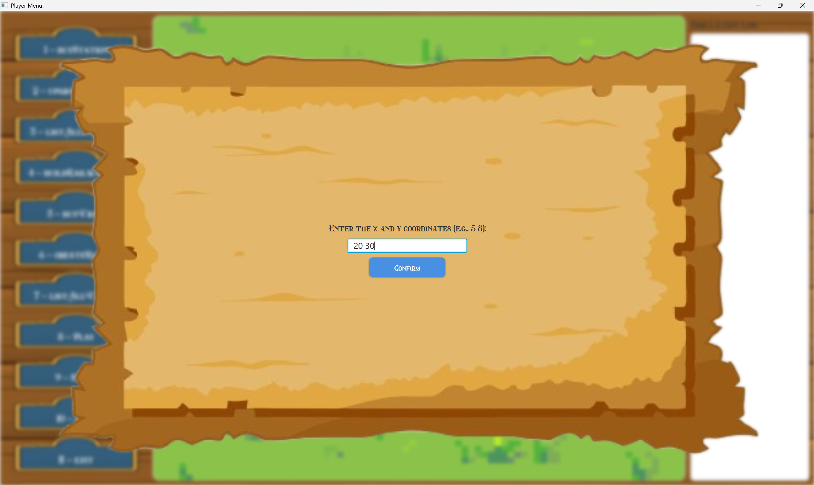

# **US005 - As a Player, I want to build a station**


## 4. Tests
_In this section, it is suggested to systematize how the tests were designed to allow a correct measurement of requirements fulfilling._ 

**_DO NOT COPY ALL DEVELOPED TESTS HERE_**

**Test 1:** Ensure that all stations types are listed correctly.

```java
	@Test
    public void testGetListOfStationTypes() {
        String expected =
                " [0] - DEPOT, price:50,00\n" +
                        " [1] - STATION, price:100,00\n" +
                        " [2] - TERMINAL, price:200,00\n";
    
        String actual = stationRepository.getListOfStationTypes();
    
        assertEquals(expected, actual);
    }
```

**Test 2:** Check if the player has enough money to create a railway line
Remarks: AC2 - Have enough money to build it

```java
    @Test
    public void hasEnoughFundsTest(){
        double value = 2000;
        Budget budget = new Budget(1000);
        boolean actual = budget.hasEnoughFunds(value);
        boolean expected = false;
        assert actual == expected;
    }
```

**Test 3:** "Ensure that the station is properly created and successfully stored in the station repository.
Remarks: AC3 - Garantee that the station is correctly initiated

```java
    @Test
    void createStation(){
        Scenario scenario = new Scenario("Test", new Map("Test", 100, 100, 10),
                new TimeRestrictions(1900, 1950), null, null, null, new Budget(1000));
    
        Location location1 = new Location(new Position(10, 10));
        Location location2 = new Location(new Position(20, 10));
        Location location3 = new Location(new Position(11, 10));
    
        Industry industry = scenario.createIndustry(new Product(ProductType.GRAINS), location3);
        StationType station1 = scenario.createStation("Porto", "DEPOT", location1, null, 100, 100);
        StationType station2 = scenario.createStation("Porto", "DEPOT", location2, null, 100, 100);
    
        String expected = " [0] - GRAINS\n";
        assertEquals(expected,station1.listOfAvailableProducts());
        assertNotNull(station1);
        assertNotNull(station2);
    }
```

**Test 4:** Ensure that the station is not created when invalid input is provided (null or empty name, or null location).

```java
    @Test
    public void testNullNameThrowsException() {
    
        Exception ex = assertThrows(IllegalArgumentException.class, () -> {
            new Depot(null, LOC1,X,Y);
        });
    
        assertEquals("Name cannot be null or empty", ex.getMessage());
    }

```

```java
    @Test
    public void testEmptyNameThrowsException() {
    
        Exception ex = assertThrows(IllegalArgumentException.class, () -> {
            new Depot("", LOC1,X,Y);
        });
    
        assertEquals("Name cannot be null or empty", ex.getMessage());
    }
```

```java
    @Test
    public void testNullLocationThrowsException() {
        Exception ex = assertThrows(IllegalArgumentException.class, () -> {
            new Depot("TestDepot", null,X,Y);
        });
    
        assertEquals("Location cannot be null", ex.getMessage());
    }
```


Remarks:
The acceptance criteria that are not being checked in the test shown are validations that are made by other
classes with that responsibility:
- AC1: Overbuilding is not possible. (Location)
- AC4: Check if the position is inside map (Position)


## 5. Construction (Implementation)

#### UI

```java
    private void confirmStation() {
        try {
            createStation();
            Utils.displayReturnPlayer("Sucessfully Created");
        } catch (InsuficientBudget | IllegalArgumentException e) {
            try {
                Utils.displayReturnPlayer("Error creating " + stationType + ": " + e.getMessage());
            } catch (IOException ex) {
                ex.printStackTrace();
            }
        } catch (IOException e) {
            e.printStackTrace();
        }
    }
```

```java
    private void askConfirmationBeforeCreatingStation() {
        AuthenticationApp.setMessage("Do you want to create the " + stationType + "? (Y/N)");
    
        ReadStringInput.requestUserInputString(userInput -> {
            String input = userInput.trim().toUpperCase();
    
            if (input.equals("Y")) {
                confirmStation();
            } else if (input.equals("N")) {
                try {
                    Utils.displayReturnPlayer("Station creation canceled.");
                } catch (IOException e) {
                    throw new RuntimeException(e);
                }
            } else {
                displayWarningInput("Please enter 'Y' for yes or 'N' for no.");
                askConfirmationBeforeCreatingStation();
            }
        });
    }
```

```java
    private boolean listOfStationTypes() {
        String stations = controller.getListOfStationTypes();
    
        if (stations == null || stations.trim().isEmpty()) {
            Platform.runLater(() -> {
                Alert alert = new Alert(Alert.AlertType.ERROR);
                alert.setTitle("No Stations");
                alert.setHeaderText(null);
                alert.setContentText("No stations found!");
                alert.showAndWait();
            });
            return false;
        }
    
        AuthenticationApp.setMessage("Choose the station type index:");
        AuthenticationApp.setList(stations);
        return true;
    }
```

```java
    private void requestStationTypeIndex() {
        requestUserInputList(selectedInput -> {
            try {
                int index = extractIndex(selectedInput);
                String[] stationArray = AuthenticationApp.getList().split("\n");
    
                if (index < 0 || index >= stationArray.length) {
                    Utils.displayWarningInput("Invalid station type selected.");
                    requestStationTypeIndex(); // tenta de novo
                    return;
                }
    
                String selectedStation = stationArray[index];
                Pattern pattern = Pattern.compile("^\\s*\\[\\d+]\\s*-\\s*(.+?),\\s*price:\\s*([\\d.,]+)$");
                Matcher matcher = pattern.matcher(selectedStation);
    
                if (matcher.find()) {
                    String name = matcher.group(1).trim();
                    double price = Double.parseDouble(matcher.group(2).replace(',', '.'));
    
                    this.stationType = name;
                    this.price = price;
                    System.out.println(price);
                    readPosition();
                } else {
                    Utils.displayWarningInput("Invalid format for selected station type.");
                    requestStationTypeIndex();
                }
            } catch (NumberFormatException e) {
                Utils.displayWarningInput("Invalid input. Please enter a valid number.");
                requestStationTypeIndex();
            }
        });
    }
```

```java
    private void readPosition() {
        AuthenticationApp.setMessage("Enter the x and y coordinates (e.g., 5 8):");
        ReadStringInput.requestUserInputString(userInput -> {
            String[] parts = userInput.trim().split("\\s+");
            if (parts.length != 2) {
                displayWarningInput("Please enter exactly two integers.");
                readPosition();
                return;
            }
    
            try {
                x = Integer.parseInt(parts[0]);
                y = Integer.parseInt(parts[1]);
    
                if (x < 0 || y < 0) {
                    displayWarningInput("Coordinates cannot be negative.");
                    readPosition();
                } else {
                    name = getProposedName();
                    askForNameWithSuggestion(name);
                }
            } catch (NumberFormatException e) {
                displayWarningInput("Invalid input. Try again.");
                readPosition();
            }
        });
    }
```

```java
   private void readCardinalPosition() {
        AuthenticationApp.setMessage("Enter the cardinal position (NE, SE, SW, NW):");
    
        ReadStringInput.requestUserInputString(userInput -> {
            String input = userInput.trim().toUpperCase();
    
            if (input.matches("NE|SE|NW|SW")) {
                cardinalPosition = input.toUpperCase();
                //displayMessage("Cardinal position set to: " + cardinalPosition);
                askConfirmationBeforeCreatingStation();
            } else {
                displayWarningInput("Choose a valid option (NE, SE, SW, NW):");
                readCardinalPosition(); // Repete até ser válido
            }
        });
    }
```

```java
   private void askForNameWithSuggestion(String proposedName) {
    String suggestedText = (proposedName == null || proposedName.isEmpty())
            ? ""
            : proposedName + "'s " + stationType;

    AuthenticationApp.setMessage("Edit the station name if you wish:");

    ReadStringInput.requestUserInputString(suggestedText, userInput -> {
        String input = userInput.trim();
        if (!isValidCharacters(input)) {
            displayWarningInput("Invalid name. Only letters are allowed (max 255 characters).");
            askForNameWithSuggestion(proposedName);
        } else {
            name = input;
            continueAfterName();
        }
    });
}
```

```java
   private String getProposedName() {
        String proposedName = null;
        try{
            proposedName = controller.getNearestCityName(x, y);
        }catch(IllegalArgumentException e){
            displayMessage(e.getMessage());
        }
        return proposedName;
    }
```
```java
   private void createStation() {controller.createStation(name, x, y, stationType,cardinalPosition,price);}
```

```java
   private void continueAfterName() {
    if (StationTypes.STATION.getName().equalsIgnoreCase(stationType)) {
        readCardinalPosition();
    } else {
        askConfirmationBeforeCreatingStation();
    }
}
```
```java
    private int extractIndex(String input) {
        Matcher matcher = Pattern.compile("\\[(\\d+)]").matcher(input.trim());
        return matcher.find() ? Integer.parseInt(matcher.group(1)) : -1;
    }
```
    
#### Controller

```java
   public String getListOfStationTypes() {return stationRepo.getListOfStationTypes();}
```

```java
    public String getNearestCityName(int x, int y){return instance.getCurrentScenario().nearestCityNames(x, y);}
```

```java
    public void createStation(String name, int x, int y, String stationType, String cardinalPosition, double price) {
        if (budget != null && budget.hasEnoughFunds(price)) {
            Position p = new Position(x, y);
            Location tmp = instance.getCurrentMap().createLocation(p);
            Map currentMap = instance.getCurrentMap();
            int maxHeight = currentMap.getHeight();
            int maxLenght = currentMap.getLength();
            StationType station = instance.getCurrentScenario().createStation(name, stationType, tmp, cardinalPosition, maxHeight, maxLenght);
            instance.getCurrentScenario().setObjetcsInArea(station);
            budget.subtractFunds(price);
        } else {
            throw new InsuficientBudget("Insuficient budget. " + price + " required!");
        }
    }
```

#### StationRepository
```java
    public String getListOfStationTypes() {
        StringBuilder s = new StringBuilder();
    
        for (int i = 0; i < (StationTypes.values().length); i++) {
            StationTypes stationTypes = StationTypes.values()[i];
            s.append(" [").append(i).append("] - ").append(stationTypes.toString()).append("\n");
        }
    
        return (s.toString());
    }
```

#### Scenario

```java
    public StationType createStation(String name, String stationType, Location location, String cardinalPosition, int maxHeight, int maxLength) {
        StationType station;
    
        if (stationType.equals("STATION")) {
            station = new Station(name, cardinalPosition, location, maxHeight, maxLength);
        } else if (stationType.equals("DEPOT")) {
            station = new Depot(name, location, maxHeight, maxLength);
        } else {
            station = new Terminal(name, location, maxHeight, maxLength);
        }
    
        stationRepository.addStation(station);
        return station;
    }
```


```java
public Budget getBudget() {return budget;}
```

#### Map

```java
    public Location createLocation(Position position) {
        if (!locationRepository.isEmptyLocation(position)) {
            throw new IllegalArgumentException("The given position already exists!");
        }
        Location l = new Location(position);
        locationRepository.addLocation(l);
        return l;
    }
```

```java
    public int getHeight() { return height; }
```

```java
    public int getLength() { return length; }
```

#### Budget

```java
    public boolean hasEnoughFunds(double value) {
        if (this.funds >= value) {
            return true;
        }
        return false;
    }
```

```java
    public void subtractFunds(double value) {
        this.funds -= value;
    }
```


## 6. Integration and Demo 

###### There must be a scenario and map created.

### 6.1 Editor Authentication
##### In order to reach this demonstration you must authenticate as a Player and start a simulation.





##### In case the station type is set to 'Station', we have one more step.


### 6.2 Station creation
##### You must add a valid name, coordinates and cardinal position.

## 7. Observations

_In this section, it is suggested to present a critical perspective on the developed work, pointing, for example, to other alternatives and or future related work._

A possible improvement for future development is to decouple the station's logic, separating responsibilities into more specialized components. In particular, certain methods — such as the distribution of resources to nearby cities, industries, ports, and residential blocks — could be modularized based on the entities within the station’s influence area.

This also includes the production flow, specifically the logic that handles the transfer of products from primary industries to transforming industries and ports. These responsibilities could be delegated to individual components or services that manage specific types of infrastructure interactions.

Moreover, the logic related to how resources are collected, could also be extracted into dedicated modules or strategies to improve maintainability, scalability, and testability.

It is important to note that these behaviors are not directly related to the station's construction or structural definition, but rather to its runtime behavior and its interaction with other entities in the simulation. Therefore, delegating these operations to dedicated services would lead to a cleaner and more modular design.