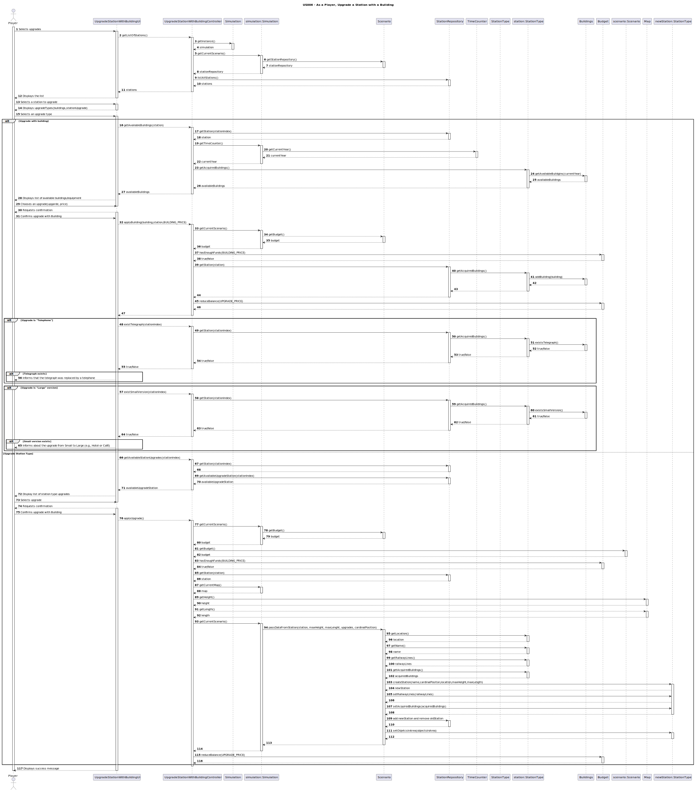
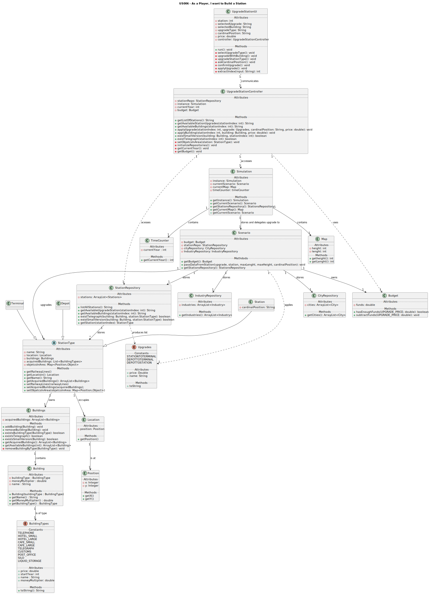

# **US006 - As a Player, I want to upgrade a station**

## 3. Design

### 3.1. Rationale

**The rationale grounds on the SSD interactions and the identified input/output data.**

# **US006 - Upgrade Station Responsibility Analysis**

## Core Upgrade Flow

| Interaction ID                      | Question: Which class is responsible for...             | Answer                         | Justification (Patterns)                            |
|-------------------------------------|---------------------------------------------------------|--------------------------------|-----------------------------------------------------|
| **1. Selects Upgrade**              | instantiating the UI class                              | `UpgradeStationWithBuildingUI` | Pure Fabrication                                    |
|                                     | accessing the simulation singleton?                     | `Simulation`                   | Singleton                                           |
|                                     | obtaining the list of all stations?                     | `StationRepository`            | Information Expert                                  |
|                                     | obtaining the StationTypes repository?                  | `Scenario`                     | Information Expert                                  |
|                                     | obtaining the current Scenario?                         | `Simulation`                   | Information Expert, Pure Fabrication                |
| **2. Display Stations**             | Showing selectable stations?                            | `UpgradeStationWithBuildingUI` | Pure Fabrication                                    |
| **3. Select Station**               | keeping selected station reference?                     | `UpgradeStationWithBuildingUI` | Pure Fabrication                                    |
| **4. Display Upgrade Types**        | Showing building vs station type choices?               | `UpgradeStationWithBuildingUI` | Pure Fabrication                                    |
| **5a. Selects Building upgrade**    | Retrieving available buildings?                         | `Buildings`                    | Information Expert, Low coupling and Hight Cohesion |
|                                     | getting current year year?                              | `TimeCounter`                  | Information Expert                                  |
|                                     | Filtering era-appropriate buildings?                    | `Buildings`                    | Information Expert                                  |
|                                     | getting the time counter                                | `Simulation`                   | Information Expert                                  |           
| **5b.Selects station type upgrade** | obtaining the list of available station types upgrades? | `StationRepository`            | Information Expert                                  |
| **6. Display upgrade options**      | Showing building list or station tiers?                 | `UpgradeStationWithBuildingUI` | Pure Fabrication                                    |
| **7. Selects upgrade**              | Detecting telegraph→telephone replacement?              | `Buildings`                    | Information Expert                                  |
|                                     | Checking small→large version upgrades?                  | `Buildings`                    | Information Expert                                  |
|                                     | Showing replacement warnings?                           | `UpgradeStationWithBuildingUI` | Pure Fabrication                                    |
| **8: Requests confirmation**        | requesting confirmation to proceed                      | `UpgradeStationWithBuildingUI` | Pure Fabrication                                    |
| **8. Confirms Upgrade**             | Managing confirmation dialog?                           | `UpgradeStationWithBuildingUI` | Pure Fabrication                                    |
| **9a. Building Upgrade Execution**  | Adding building to station?                             | `Buildings`                    | Creator                                             |
|                                     | Managing building inventory?                            | `Buildings`                    | Information Expert                                  |
| **9b. Station Type upgrade**        | Creating new station instance?                          | `Scenario`                     | Creator                                             |
|                                     | Preserving data                                         | `Scenario`                     | Information Expert                                  |
|                                     | Verifying available funds?                              | `Budget`                       | Information Expert                                  |
|                                     | getting map Dimensions                                  | `Map`                          | Information Expert                                  |
|                                     | getting Current Scenario                                | `Simulation`                   | Information Expert, Pure Fabrication                |
|                                     | getting Current Map                                     | `Simulation`                   | Information Expert, Pure Fabrication                |
|                                     | getting budget                                          | `Scenario`                     | Information Expert                                  |
|                                     | Subtract upgrade cost?                                  | `Budget`                       | Information Expert                                  |
|                                     | checking available budget                               | `Budget`                       | Information Expert                                  |
| **10. Display Results**             | Showing success message?                                | `UpgradeStationWithBuildingUI` | Pure Fabrication                                    |

### Systematization ##

According to the taken rationale, the conceptual classes promoted to software classes are:

* `Budget`
* `StationType`
* `Depot`
* `Station`
* `Terminal`
* `Map`
* `Location`
* `Position`
* `Buildings`
* `Scenario`

Other software classes (i.e. Pure Fabrication) identified:

* `StationRepostory`
* `UpgradeStationWithBuildingUI`
* `UpgradeStationWithBuildingController`

## 3.2. Sequence Diagram (SD)

_In this section, it is suggested to present an UML dynamic view representing the sequence of interactions between software objects that allows to fulfill the requirements._

## 3.3. Class Diagram (CD)

_In this section, it is suggested to present an UML static view representing the main related software classes that are involved in fulfilling the requirements as well as their relations, attributes and methods._

