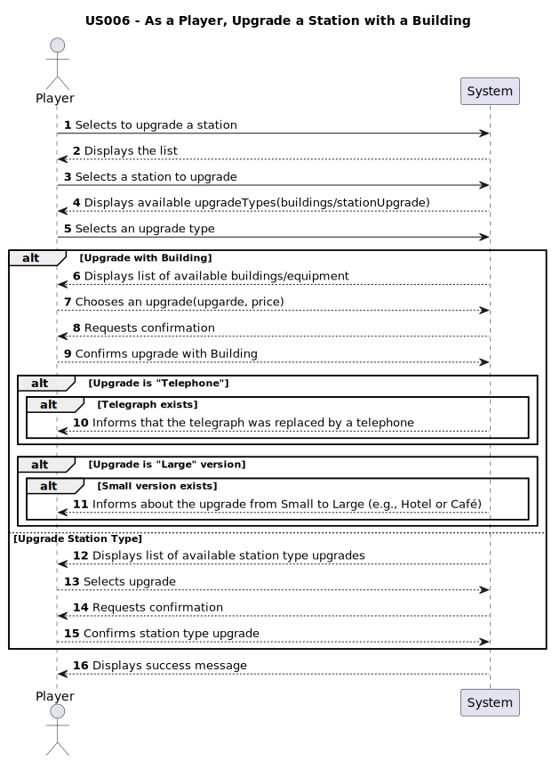

# US006 - As a Player, I want to upgrade a station

## 1. Requirements Engineering

### 1.1. User Story Description

- In this user story, the player can upgrade an existing station by adding buildings such as cafés, hotels, silos, and communication systems. Some upgrades are mutually exclusive (e.g., small vs. grand hotel). Each type of station improvement becomes available only after a specific date and replaces the telegraph, which becomes unavailable once the telephone is built. Upgrades enhance station performance, train operations, and cargo storage.

### 1.2. Customer Specifications and Clarifications

From the specifications document:

> "When built, a station consists of just one building, which can be upgraded with other buildings that can increase the station's performance, improve train operation, facilitate train manoeuvres, and increase the lifespan of cargo stored at the station. Some of the buildings that can be used to upgrade stations are: telegraph (later telephone), café  (small or large), customs, post office, hotel (small or large), silo, liquid storage."

#### From the client clarifications:
> **Q:** Do station upgrades require more space units?
>
> **A:** No, the upgrades will remain within the existing station space.

### 1.3. Acceptance Criteria

**AC1:** Have enough money to upgrade it.

**AC2.** No mutually exclusive upgrade with any existing upgrade on the station,  
  except when the new upgrade is a "Large" version of an already present "Small" one (such as Hotel or Café),  
  in which case the upgrade is allowed and the "Small" version is replaced by the "Large" one.

**AC3:** Each type of station improvement should only be available from a certain date.

**AC4:** The telephone should automatically replace the telegraph, making the telegraph unavailable once the telephone is built.

**AC5:** Guarantee that the station is properly upgraded 

### 1.4. Found out Dependencies

- There is a dependency on [US005 - As a Player, Build a Station](../US005), as there must exist a station to upgrade it with a building.

### 1.5. Input and Output Data
#### Input
  ### Selected Input:
  - Station selected from list.
  - Type of building to upgrade it with.

#### Output
- Building

### 1.6. System Sequence Diagram (SSD)

### 1.7. Other Relevant Remarks

- No other relevant remarks
