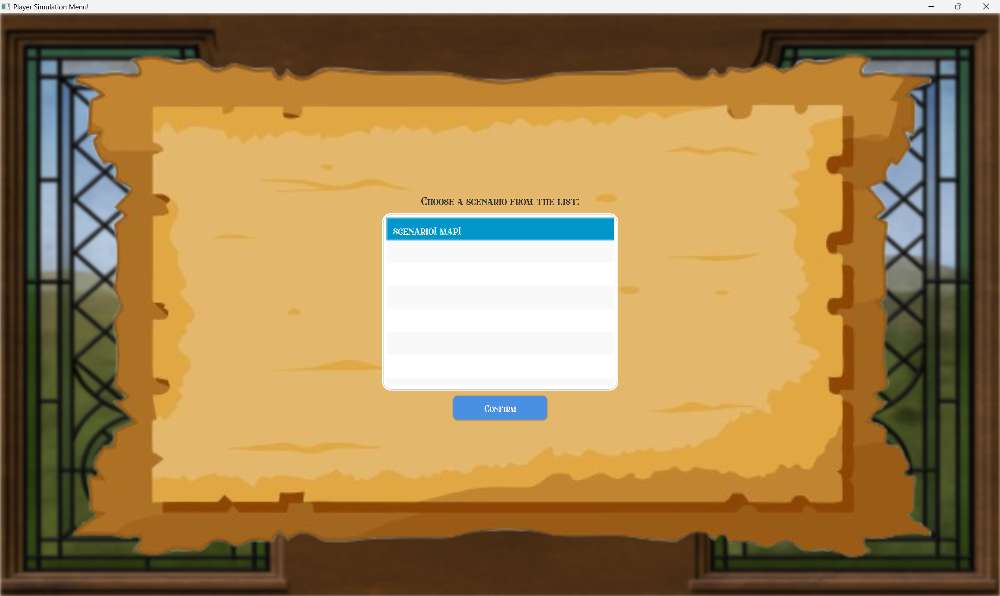

# US006 - As a Player, I want to upgrade a station


## 4. Tests
_In this section, it is suggested to systematize how the tests were designed to allow a correct measurement of requirements fulfilling._ 

**_DO NOT COPY ALL DEVELOPED TESTS HERE_**

**Test 1:** Ensure that all exclusive buildings logistic is working

Remarks: AC2 - No mutually exclusive upgrade with any existing upgrade on the station,  
except when the new upgrade is a "Large" version of an already present "Small" one (such as Hotel or Café),  
in which case the upgrade is allowed and the "Small" version is replaced by the "Large" one.

```java
	@Test
    void testAddBuilding_CaffeeLargeReplacesCaffeeSmall() {
        buildings.addBuilding(BuildingType.CAFFEE_SMALL.name);
        buildings.addBuilding(BuildingType.CAFFEE_LARGE.name);
    
        assertFalse(buildings.existsBuildingType(BuildingType.CAFFEE_SMALL));
        assertTrue(buildings.existsBuildingType(BuildingType.CAFFEE_LARGE));
    }
```

```java
    @Test
    void testGetAvailableBuildings_SmallNotAvailableIfLargeExists() {
        buildings.addBuilding(BuildingType.CAFFEE_LARGE.name);
        buildings.addBuilding(BuildingType.HOTEL_LARGE.name);
        int year = BuildingType.TELEPHONE.getStartYear();
        String available = buildings.getAvailableBuildings(year);
        assertFalse(available.contains(BuildingType.HOTEL_SMALL.name()));
        assertFalse(available.contains(BuildingType.CAFFEE_SMALL.name()));
    }
```


**Test 2:** Check if the player has enough money upgrade the station
Remarks: AC1 - Have enough money to build it

```java
    @Test
    public void hasEnoughFundsTest(){
        double value = 2000;
        Budget budget = new Budget(1000);
        boolean actual = budget.hasEnoughFunds(value);
        boolean expected = false;
        assert actual == expected;
    }
```

**Test 3:** Ensure that the simulation current year is affecting the available upgrades
Remarks: AC3 - Each type of station improvement should only be available from a certain date.

```java
    @Test
    void testGetAvailableBuildings_BasedOnCurrentYear() {
        int year = BuildingType.TELEGRAPH.getStartYear();
        String available = buildings.getAvailableBuildings(year);
    
    
        assertTrue(available.contains(BuildingType.TELEGRAPH.name));
        assertFalse(available.contains(BuildingType.TELEPHONE.name));
    }
```

**Test 4:** Ensure that the telegraph is replaced by the telephone
Remarks: AC4 - The telephone should automatically replace the telegraph, making the telegraph unavailable once the telephone is built.

```java
	@Test
void testAddBuilding_TelephoneReplacesTelegraph() {
    buildings.addBuilding(BuildingType.TELEGRAPH.name);
    buildings.addBuilding(BuildingType.TELEPHONE.name);

    assertFalse(buildings.existsBuildingType(BuildingType.TELEGRAPH));
    assertTrue(buildings.existsBuildingType(BuildingType.TELEPHONE));
}
```

```java
    @Test
    void testGetAvailableBuildings_AfterTelephoneYear_TelegraphUnavailable() {
        int year = BuildingType.TELEPHONE.getStartYear();
        String available = buildings.getAvailableBuildings(year);
    
        assertFalse(available.contains(BuildingType.TELEGRAPH.name));
    }
```

**Test 4:** Ensure that the station is properly upgraded
Remarks: AC5 - Guarantee that the station is properly upgraded

```java
    @Test
    void testAddBuilding_NewBuilding_AddsSuccessfully() {
        String building = BuildingType.TELEGRAPH.name;
        buildings.addBuilding(building);
        assertTrue(buildings.existsBuildingType(BuildingType.TELEGRAPH));
    }
```


```java
    @Test
    void testDepotToTerminalUpgrade() {
        // Arrange
        Scenario scenario = new Scenario("Test", new Map("Test", 100, 100, 10),
                new TimeRestrictions(1900, 1950), null, null, null, new Budget(1000));
    
        Location location = new Location(new Position(10,20));
    
        StationRepository stationRepository = scenario.getStationRepository();
        Depot depot = new Depot("Depot1",  location, 10, 20);
        stationRepository.addStation(depot);
    
        // Act
        scenario.passDataFromStation(depot, 15, 25, "DEPOTTOTERMINAL", null);
    
        StationType result = stationRepository.getStation("Depot1");
        // Assert
        assertInstanceOf(Terminal.class, result);
        Terminal newStation = (Terminal) result;
        assertEquals("Depot1", newStation.getName());
        assertEquals(location, newStation.getLocation());
        assertTrue(stationRepository.getStations().contains(newStation));
        stationRepository.deleteStation(depot);
        assertFalse(stationRepository.getStations().contains(depot));
    }
```

```java
    @Test
    void testStationToTerminalUpgrade() {
        // Arrange
        Scenario scenario = new Scenario("Test", new Map("Test", 100, 100, 10),
                new TimeRestrictions(1900, 1950), null, null, null, new Budget(1000));
    
        Location location = new Location(new Position(10,20));
    
        StationRepository stationRepository = scenario.getStationRepository();
        Station depot = new Station("Station1", "NE" ,location, 10, 20);
        stationRepository.addStation(depot);
    
        // Act
        scenario.passDataFromStation(depot, 15, 25, "STATIONTOTERMINAL", null);
        StationType result = stationRepository.getStation("Station1");
        // Assert
        assertInstanceOf(Terminal.class, result);
        Terminal newStation = (Terminal) result;
        assertEquals("Station1", newStation.getName());
        assertEquals(location, newStation.getLocation());
        assertTrue(stationRepository.getStations().contains(newStation));
        stationRepository.deleteStation(depot);
        assertFalse(stationRepository.getStations().contains(depot));
    }
```

## 5. Construction (Implementation)

#### UI

```java
    public void run() {
        String stationList = controller.getListOfStations();
        if (stationList.isEmpty()) {
            Utils.displayWarningInput("No stations available. Returning to main menu.");
            return;
        }
    
        AuthenticationApp.setMessage("Select a station to upgrade:");
        AuthenticationApp.setList(stationList);
        requestUserInputList(input -> {
            station = extractIndex(input);
            if (station < 0) {
                Utils.displayWarningInput("Invalid station selection.");
                return;
            }
    
            selectUpgradeType();
        });
    }
```

```java
    private void selectUpgradeType() {
        String message = "Choose an upgrade option:\n" +
                "[0] - Upgrade with building\n" +
                "[1] - Upgrade station type";
    
        AuthenticationApp.setMessage(message);
        AuthenticationApp.setList("");
    
        requestUserInputString(input -> {
            switch (input.trim()) {
                case "0":
                    upgradeWithBuilding();
                    break;
                case "1":
                    upgradeStationType();
                    break;
                default:
                    Utils.displayWarningInput("Invalid option. Please choose 0 or 1.");
                    selectUpgradeType();
            }
        });
    }
```

```java
    private void upgradeWithBuilding() {
        String buildingsList = controller.getAvailableBuildings(station);
        if (buildingsList.isEmpty()) {
            Utils.displayWarningInput("No available building upgrades.");
            try {
                Utils.displayReturnPlayer("No available building upgrades.");
            } catch (IOException e) {
                e.printStackTrace();
            }
        }else{
            App.setMessage("Select a building to add:");
            App.setList(buildingsList);
    
            requestUserInputList(input -> {
                int index = extractIndex(input);
                String[] options = buildingsList.split("\n");
                if (index < 0 || index >= options.length) {
                    Utils.displayWarningInput("Invalid index.");
                    return;
                }
    
                String selectedLine = options[index];
                Pattern pattern = Pattern.compile("^\\[\\d+] - (.+?) \\(Price: ([\\d,.]+)\\)");
                Matcher matcher = pattern.matcher(selectedLine);
    
                if (matcher.find()) {
                    selectedBuilding = matcher.group(1);
                    price = Double.parseDouble(matcher.group(2).replace(",", "."));
                    upgradeType = "WITH_BUILDING";
    
                    confirmUpgrade();
                } else {
                    Utils.displayWarningInput("Error parsing selected upgrade.");
                }
            });
        }
    }
```

```java
    private void upgradeStationType() {
        String upgradeList = controller.getAvailableStationUpgrades(station);
        if (upgradeList.isEmpty()) {
            Utils.displayWarningInput("No available station type upgrades.");
            try {
                Utils.displayReturnPlayer("No available station type upgrades.");
            } catch (IOException e) {
                e.printStackTrace();
            }
        }else{
            App.setMessage("Select a station type upgrade:");
            App.setList(upgradeList);
    
            requestUserInputList(input -> {
                int index = extractIndex(input);
                String[] upgrades = upgradeList.split("\n");
                if (index < 0 || index >= upgrades.length) {
                    Utils.displayWarningInput("Invalid index.");
                    return;
                }
    
                String selectedLine = upgrades[index];
                Pattern pattern = Pattern.compile("^\\s*\\[\\d+]\\s*-\\s*(.+?),\\s*price:\\s*([\\d.,]+)$");
                Matcher matcher = pattern.matcher(selectedLine.trim());
    
                if (matcher.find()) {
                    selectedUpgrade = matcher.group(1).trim();
                    price = Double.parseDouble(matcher.group(2).replace(",", "."));
                    upgradeType = "STATION_TYPE_UPGRADE";
    
                    if (selectedUpgrade.equals(Upgrade.DEPOTTOSTATION.name)) {
                        askCardinalPosition();
                    } else {
                        confirmUpgrade();
                    }
                } else {
                    Utils.displayWarningInput("Error parsing selected upgrade.");
                }
            });
        }
    
    }
```

```java
    private void askCardinalPosition() {
        AuthenticationApp.setMessage("Enter the cardinal position (NE, SE, NW, SW):");
        AuthenticationApp.setList("");
    
        requestUserInputString(input -> {
            String normalized = input.trim().toUpperCase();
            if (normalized.matches("NE|SE|NW|SW")) {
                cardinalPosition = normalized;
                confirmUpgrade();
            } else {
                Utils.displayWarningInput("Invalid cardinal position.");
                askCardinalPosition();
            }
        });
    }
```

```java
   private void confirmUpgrade() {
        AuthenticationApp.setMessage("Do you want to apply this upgrade? (Y/N)");
        AuthenticationApp.setList("");
    
        requestUserInputString(input -> {
            String upper = input.trim().toUpperCase();
            if (upper.equals("Y")) {
                try {
                    applyUpgrade();
                } catch (InsuficientBudget | IllegalArgumentException e) {
                    Utils.displayWarningInput("Error: " + e.getMessage());
                }
            } else if (upper.equals("N")) {
                Utils.displayWarningInput("Upgrade canceled.");
            } else {
                Utils.displayWarningInput("Invalid input. Please enter 'Y' or 'N'.");
                confirmUpgrade();
            }
        });
    }
```

```java
    private void applyUpgrade() {
        if ("WITH_BUILDING".equals(upgradeType)) {
            controller.applyBuilding(station, selectedBuilding, price);
            if ((selectedBuilding.equals(BuildingType.CAFFEE_LARGE.name) ||
                    selectedBuilding.equals(BuildingType.HOTEL_LARGE.name)) &&
                    controller.existSmallVersion(selectedBuilding, station)) {
                try {
                    Utils.displayReturnPlayer("The small version was  upgraded!");
                } catch (IOException e) {
    
                }
            } else if (selectedBuilding.equals(BuildingType.TELEPHONE.name) &&
                    controller.existTelegraph(station)) {
                try {
                    Utils.displayReturnPlayer("The telegraph was substituted!");
                } catch (IOException e) {
                    e.printStackTrace();
                }
            }else {
                try {
                    Utils.displayReturnPlayer("The station was successfully upgraded!");
                } catch (IOException e) {
                    e.printStackTrace();
                }
            }
        } else if ("STATION_TYPE_UPGRADE".equals(upgradeType)) {
            controller.applyUpgrade(station, selectedUpgrade, cardinalPosition, price);
            try {
                Utils.displayReturnPlayer("The station was successfully upgraded!");
            } catch (IOException e) {
                e.printStackTrace();
            }
        }
    }
```

```java
    private int extractIndex(String input) {
        Matcher matcher = Pattern.compile("\\[(\\d+)]").matcher(input.trim());
        return matcher.find() ? Integer.parseInt(matcher.group(1)) : -1;
    }
```

#### Controller

```java
   public String getListOfStations() {return stationRepo.listAllStations();}
```

```java
    public String getAvailableStationUpgrades(int stationIndex){
        StationType station = stationRepo.getStation(stationIndex);
        return stationRepo.getAvailableUpgradeStation(station);
    }
```

```java
    public String getAvailableBuildings(int stationIndex){
        StationType station = stationRepo.getStation(stationIndex);
        return station.getAcquiredBuildings().getAvailableBuildings(currentYear);
    }
```

```java
    public void applyUpgrade(int stationIndex, String upgrade, String cardinalPosition, double price) {
        if (budget != null && budget.hasEnoughFunds(price)){
            StationType station = stationRepo.getStation(stationIndex);
            Map currentMap = instance.getCurrentMap();
            int maxHeight = currentMap.getHeight();
            int maxLength = currentMap.getLength();
            instance.getCurrentScenario().passDataFromStation(station, maxHeight, maxLength, upgrade, cardinalPosition);
            budget.subtractFunds(price);
        } else {
            throw new InsuficientBudget("Insuficient budget. " + price + " required!");
        }
    }
```

```java
    public boolean existSmallVersion(String building, int stationIndex) {return stationRepo.getStation(stationIndex).getAcquiredBuildings().existsSmallVersion(building);}
```

```java
    public boolean existTelegraph(int stationIndex) {return stationRepo.getStation(stationIndex).getAcquiredBuildings().existsTelegraph();}
```
#### Scenario

```java
    public StationType passDataFromStation(StationType station, int maxHeight, int maxLength, String upgrade, String cardinalPosition) {
    Location location = station.getLocation();
    String name = station.getName();
    RailwayLines railwayLines = station.getRailwayLines();
    Buildings acquiredBuildings = station.getAcquiredBuildings();
    Upgrade upgrade1 = null;
    for (Upgrade u : Upgrade.values()) {
        if (!upgrade.isEmpty() && u.name().equals(upgrade)) {
            upgrade1 = u;
        }
    }
    if (station instanceof Depot) {
        if (upgrade1 == Upgrade.DEPOTTOSTATION) {
            Station stationNew = new Station(name, cardinalPosition, location, maxHeight, maxLength);
            stationNew.setRailwayLines(railwayLines);
            stationNew.setAcquiredBuildings(acquiredBuildings);
            stationRepository.getStations().add(stationNew);
            stationRepository.deleteStation(station);
            return stationNew;
        } else if (upgrade1 == Upgrade.DEPOTTOTERMINAL) {
            Terminal terminalNew = new Terminal(name, location, maxHeight, maxLength);
            terminalNew.setRailwayLines(railwayLines);
            terminalNew.setAcquiredBuildings(acquiredBuildings);
            stationRepository.getStations().add(terminalNew);
            stationRepository.deleteStation(station);
            return terminalNew;
        }
    } else {
        Terminal terminalNew = new Terminal(name, location, maxHeight, maxLength);
        terminalNew.setRailwayLines(railwayLines);
        terminalNew.setAcquiredBuildings(acquiredBuildings);
        stationRepository.getStations().add(terminalNew);
        stationRepository.deleteStation(station);
        return terminalNew;
    }
}
```

```java
public Budget getBudget() {return budget;}
```

#### Map

```java
    public int getHeight() { return height; }
```

```java
    public int getLength() { return length; }
```

#### StationRepository

```java
    public StationType getStation(int index) {
        if (index < 0 || index >= stations.size())
            throw new IndexOutOfBoundsException("Index out of bounds");
        return stations.get(index);
    }
```

```java
    public String getAvailableUpgradeStation(StationType station) {
        Upgrade[] upgrades;
    
        if (station instanceof Depot) {
            upgrades = new Upgrade[]{
                    Upgrade.DEPOTTOSTATION,
                    Upgrade.DEPOTTOTERMINAL
            };
        } else if (station instanceof Station) {
            upgrades = new Upgrade[]{ Upgrade.STATIONTOTERMINAL };
        } else {
            upgrades = new Upgrade[0];
        }
    
        StringBuilder s = new StringBuilder();
    
        for (int i = 0; i < upgrades.length; i++) {
            s.append(" [").append(i).append("] - ").append(upgrades[i].toString()).append("\n");
        }
    
        return s.toString();
    }
```

```java
    public String listAllStations() {
        StringBuilder s = new StringBuilder();
        int i = 0;
    
        for (StationType tmp : stations) {
            s.append("[").append(i).append("] ").append(tmp.toString()).append("\n");
            i++;
        }
        return s.toString();
    }
```

#### Budget

```java
    public boolean hasEnoughFunds(double value) {
        if (this.funds >= value) {
            return true;
        }
        return false;
    }
```

```java
    public void subtractFunds(double value) {
        this.funds -= value;
    }
```

#### StationType

```java
    public Buildings getAcquiredBuildings() {
        return acquiredBuildings;
    }
```

#### Buildings

```java
    public void addBuilding(String building) {
        BuildingType type = null;
        for (BuildingType build : BuildingType.values()) {
            if (build.name.equals(building)) {
                type = build;
            }
        }
    
        if (type != null) {
            // Automatic replacement: TELEGRAPH -> TELEPHONE
            if (type == BuildingType.TELEPHONE && existsBuildingType(BuildingType.TELEGRAPH)) {
                removeBuildingByType(BuildingType.TELEGRAPH);
            }
    
            // Automatic replacement: SMALL → LARGE versions
            if (type == BuildingType.CAFFEE_LARGE && existsBuildingType(BuildingType.CAFFEE_SMALL)) {
                removeBuildingByType(BuildingType.CAFFEE_SMALL);
            }
            if (type == BuildingType.HOTEL_LARGE && existsBuildingType(BuildingType.HOTEL_SMALL)) {
                removeBuildingByType(BuildingType.HOTEL_SMALL);
            }
    
            // Prevents adding duplicates
            if (!existsBuildingType(type)) {
                acquiredBuildings.add(new Building(type));
            }
        }
    }
```

```java
    private void removeBuildingByType(BuildingType type) {
        acquiredBuildings.removeIf(b -> b.getBuildingType() == type);
    }
```

```java
    public boolean existsBuildingType(BuildingType type) {
        for (Building b : acquiredBuildings) {
            if (b.getBuildingType() == type) {
                return true;
            }
        }
        return false;
    }
```

```java
    public boolean existsTelegraph() {
        return existsBuildingType(BuildingType.TELEGRAPH);
    }
```

```java
    public boolean existsSmallVersion(Building requiredBuilding) {
        BuildingType type = requiredBuilding.getBuildingType();
        for (Building building : acquiredBuildings) {
            if (type == BuildingType.HOTEL_LARGE) {
                if (building.getBuildingType() == BuildingType.HOTEL_SMALL) { return true; }
            } else if (type == BuildingType.CAFFEE_LARGE) {
                if (building.getBuildingType() == BuildingType.CAFFEE_SMALL) { return true; }
            }
        }
        return false;
    }
```

```java
    public ArrayList<Building> getAcquiredBuildings() {
        return new ArrayList<>(acquiredBuildings);
    }
```

```java
    public String   getAvailableBuildings(int currentYear) {
        ArrayList<Building> available = new ArrayList<>();
    
        for (BuildingType type : BuildingType.values()) {
            // 1. Check year availability
            if (type.getStartYear() > currentYear) continue;
    
            // 2. Already acquired?
            if (existsBuildingType(type)) continue;
    
            // 3. Exclusion rules for small versions
            if ((type == BuildingType.CAFFEE_SMALL && existsBuildingType(BuildingType.CAFFEE_LARGE)) ||
                    (type == BuildingType.HOTEL_SMALL && existsBuildingType(BuildingType.HOTEL_LARGE))) {
                continue;
            }
    
            // 4. If TELEPHONE is owned, ignore TELEGRAPH
            if (type == BuildingType.TELEGRAPH && existsBuildingType(BuildingType.TELEPHONE)) continue;
    
            if (type == BuildingType.TELEGRAPH &&
                    (existsBuildingType(BuildingType.TELEPHONE) || currentYear >= BuildingType.TELEPHONE.getStartYear())) {
                continue;
            }
    
            // 5. Add new available building
            available.add(new Building(type));
        }
        StringBuilder sb = new StringBuilder();
        for (int i = 0; i < available.size(); i++) {
            Building b = available.get(i);
            sb.append("[").append(i).append("] - ").append(b.toString()).append("\n");
        }
    
        return sb.toString();
    }
```


## 6. Integration and Demo 

###### There must be a scenario, map and station created.

### 6.1 Editor Authentication
##### In order to reach this demonstration you must authenticate as a Player and start a simulation.





##### In case the upgrade type is set to 'Upgrade With Building'


##### In case the upgrade type is set to 'Upgrade Station Type'


In case the selected upgrade is from Depot to Station, an additional field called 'Cardinal Position' will need to be filled in, just like during station construction.

##### Conclusion


## 7. Observations

_In this section, it is suggested to present a critical perspective on the developed work, pointing, for example, to other alternatives and or future related work._