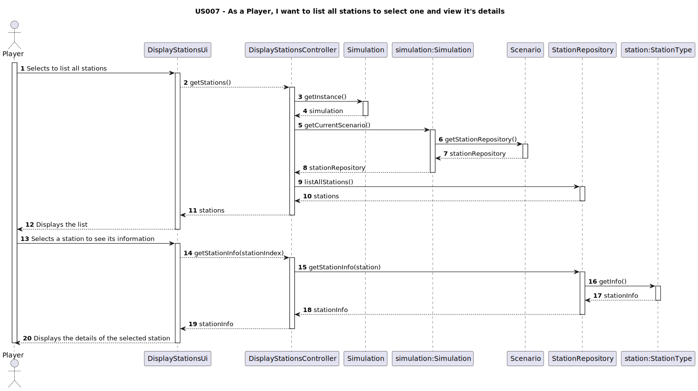
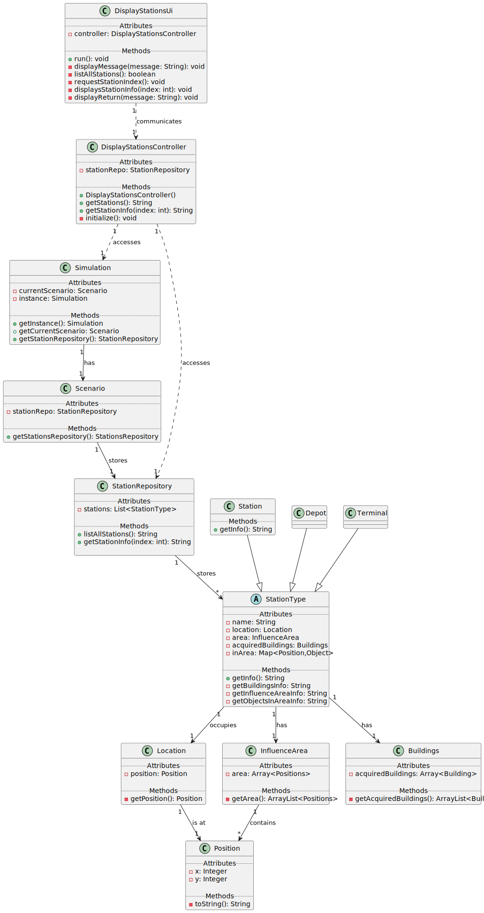

# US007 - As a player, I want to list all stations to select one and view it's details

## 3. Design

### 3.1. Rationale

**The rationale grounds on the SSD interactions and the identified input/output data.**

| Interaction ID                                              | Question: Which class is responsible for...         | Answer              | Justification (with patterns)        |
|-------------------------------------------------------------|-----------------------------------------------------|---------------------|--------------------------------------|
| Step 1: Selects to list all stations                        | instantiating the class that handles the UI?        | `DisplayStationsUI` | Pure Fabrication                     |
|                                                             | obtaining the list of stations                      | `StationRepository` | Information Expert, Pure Fabrication |
|                                                             | accessing the simulation singleton                  | `Simulation`        | Singleton                            |
|                                                             | getting the station repository                      | `Scenario`          | Information Expert                   |
|                                                             | getting the Current Scenario                        | `Simulation`        | Information Expert, Pure Fabrication |
| Step 2: Displays the stations list                          | displaying the list of stations to the player       | `DisplayStationsUI` | Pure Fabrication                     |
| Step 3: Selects a station to see its information            | getting the selected station’s detailed information | `StationRepository` | Information Expert                   |
|                                                             | getting info from the station object                | `StationType`       | Information Expert                   |
| Step 4 Displays the station details of the selected station | displaying the station details to the player        | `DisplayStationsUI` | Pure Fabrication                     |

### Systematization ##

According to the taken rationale, the conceptual classes promoted to software classes are:

* `StationTypes`
* `Depot`
* `Station`
* `Terminal`
* `Location`
* `Position`
* `Buildigns`
* `InfluenceArea`

Other software classes (i.e. Pure Fabrication) identified:

* `DisplayStationsUI`
* `DisplayStationsController`
* `StationsRepository`

## 3.2. Sequence Diagram (SD)

## 3.3. Class Diagram (CD)

