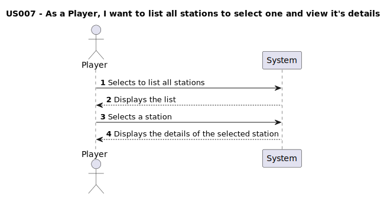

# US007 - As a player, I want to list all stations to select one and view it's details

## 1. Requirements Engineering

### 1.1. User Story Description

- In this user story, the player can view a list of all existing stations and select one to see its details. This includes the station's name, location, existing buildings, and the cargo supply and demand within its economic radius. 

### 1.2. Customer Specifications and Clarifications

#### From the specifications document:

> "When viewing a station, in addition to the buildings present, the cargo that is ready for collection and the cargo that needs to be delivered (as in the example) should also be displayed."

#### From the client clarifications:
> **Q:** When a telephone is purchased for a station, it replaces the telegraph. However, in the station's details, should the telegraph appear as inactive?
>
> **A:** No, the telephone completely replaces the telegraph. Once a telephone is purchased, the telegraph should no longer appear in the station's details at all.

### 1.3. Acceptance Criteria

**AC1:** All stations should be displayed with basic information (name, location)

### 1.4. Found out Dependencies

- There is a dependency on [US005 - As a Player, Build a Station](../US005), as there must exist at least one station to list it.

### 1.5. Input and Output Data
#### Input
  ### Selected Input:
  - Station

#### Output
- Array of stations
- Details of the selected station

### 1.6. System Sequence Diagram (SSD)

### 1.7. Other Relevant Remarks

- No other relevant remarks
