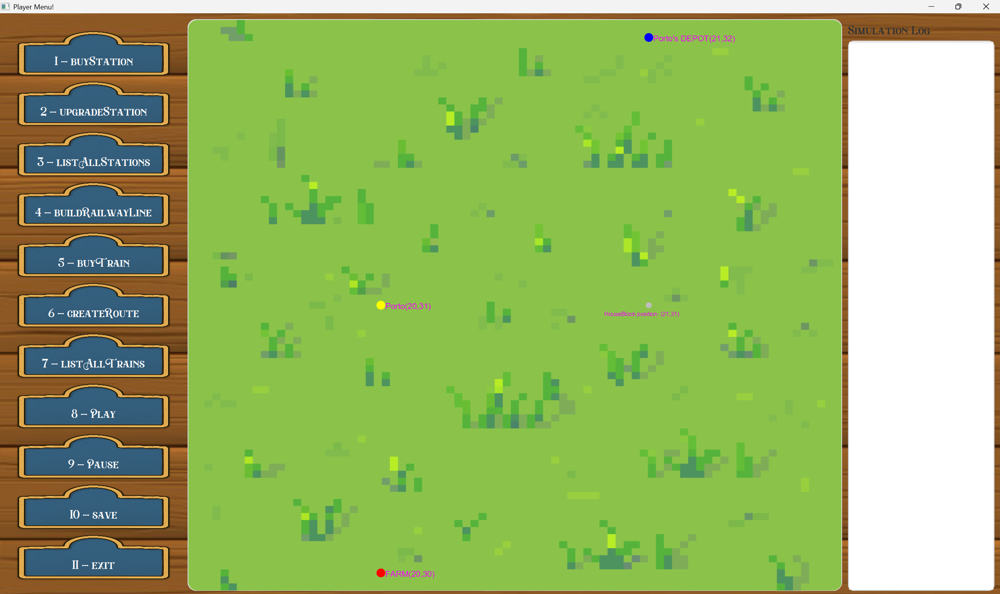
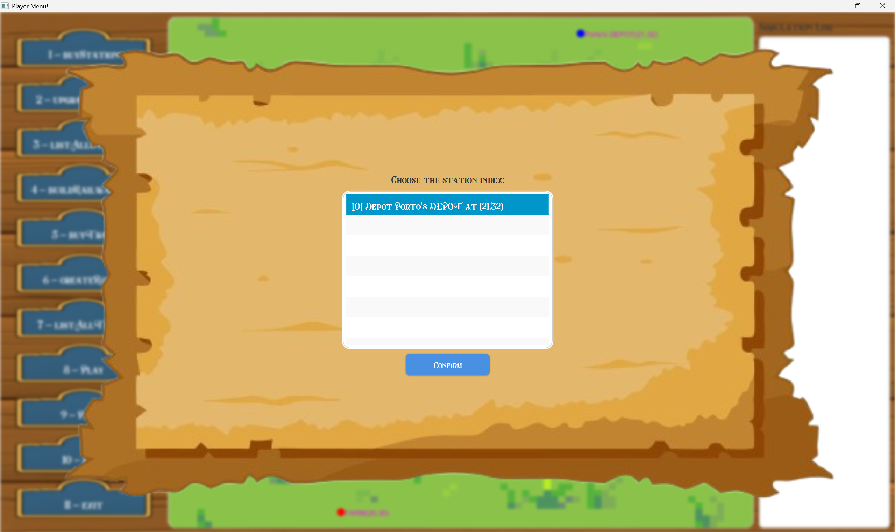
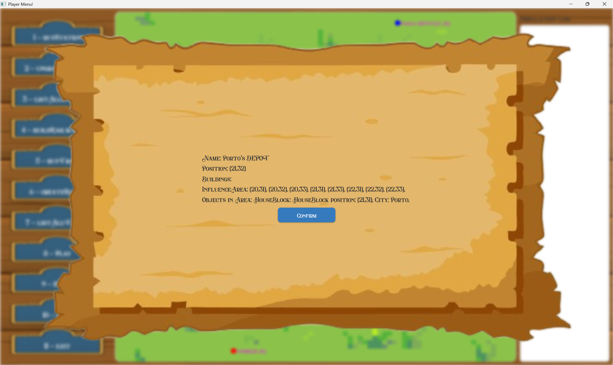

# US007 - As a player, I want to list all stations to select one and view it's details

## 4. Tests
_In this section, it is suggested to systematize how the tests were designed to allow a correct measurement of requirements fulfilling._ 

**_DO NOT COPY ALL DEVELOPED TESTS HERE_**

**Test 1:** Ensure that all created stations are listed correctly.
Remarks: AC1 - All stations should be displayed with basic information (name, location)
```java
	@Test
    public void testListAllStations() {
        //Arrange
        StationType station1 = scenario.createStation("North Station","DEPOT", new Location(new Position(0, 0)),null,X,Y);
        StationType station2 = scenario.createStation("South Station","STATION", new Location(new Position(5, 10)),"NE",X,Y);


        String expected =
                "[0] Depot North Station at (0,0)\n" +
                        "[1] Station South Station at (5,10)\n";
        //Act
        String actual = stationRepository.listAllStations();

        //Assert
        assertEquals(expected, actual);
    }
```

**Test 2:** Ensure that station information is correct

```java
	@Test
    public void testGetInfo() {
    // Arrange
    StationType depot = new Depot("Depot", LOC1, X, Y);

    String b1 = BuildingType.CAFFEE_LARGE.name;
    String b2 = BuildingType.TELEGRAPH.name;
    depot.getAcquiredBuildings().addBuilding(b1);
    depot.getAcquiredBuildings().addBuilding(b2);

    // Act
    String info = depot.getInfo();

    // Assert
    assertTrue(info.contains("Name: Depot"));
    assertTrue(info.contains("Position: (10,13)"));
    assertTrue(info.contains("Buildings: LARGE_CAFFEE, TELEGRAPH"));
    assertTrue(info.contains("InfluenceArea: (9,12), (9,13), (9,14), (10,12), (10,14), (11,12), (11,13), (11,14)"));
    assertTrue(info.contains("Objects in Area: "));
}
```


## 5. Construction (Implementation)

#### UI

```java
    private boolean listAllStations() {
        String stations = controller.getListOfStations();
    
        if (stations == null || stations.trim().isEmpty()) {
            Platform.runLater(() -> {
                Alert alert = new Alert(Alert.AlertType.ERROR);
                alert.setTitle("No Stations");
                alert.setHeaderText(null);
                alert.setContentText("No stations found!");
                alert.showAndWait();
            });
            return false; // ← Indica que falhou
        }
    
        AuthenticationApp.setMessage("Choose the station index:");
        AuthenticationApp.setList(stations);
        return true; // ← Sucesso
    }
```

```java
    private void requestStationIndex() {
        requestUserInputList(selectedInput -> {
            try {
                Pattern pattern = Pattern.compile("\\[(\\d+)]");
                Matcher matcher = pattern.matcher(selectedInput.trim());
    
                if (matcher.find()) {
                    int index = Integer.parseInt(matcher.group(1));
                    String[] stations = AuthenticationApp.getList().split("\n");
    
                    if (index < 0 || index >= stations.length) {
                        displayWarningInput("Invalid index. Please choose a valid station from the list.");
                    } else {
                        displaysStationInfo(index);
                    }
                } else {
                    displayWarningInput("Invalid format. Please select an item from the list.");
                }
            } catch (NumberFormatException e) {
                displayWarningInput("Please enter a valid number.");
            } catch (IOException e) {
                throw new RuntimeException(e);
            }
        });
    }
```

```java
    private void displaysStationInfo(int index) throws IOException {
        String info = controller.getStationInfo(index);
        Utils.displayReturnPlayer(info);
    }
```

#### Controller

```java
   public String getListOfStations() {return stationRepo.listAllStations();}
```

```java
    public String getStationInfo(int index) {return stationRepo.getStationInfo(index);}
```

#### StationRepository

```java
   public String listAllStations() {
        StringBuilder s = new StringBuilder();
        int i = 0;
    
        for (StationType tmp : stations) {
            s.append("[").append(i).append("] ").append(tmp.toString()).append("\n");
            i++;
        }
        return s.toString();
    }
```

```java
   public String getStationInfo(int index) {return getStation(index).getInfo();}
```

#### StationType

```java
   public String getInfo() {
        StringBuilder info = new StringBuilder();
        info.append("Name: ").append(name).append("\n");
        info.append("Position: ").append(location.getPosition()).append("\n");
    
        info.append(getBuildingsInfo());
        info.append(getInfluenceAreaInfo());
        info.append(getObjectsInAreaInfo());
    
        return info.toString();
    }
```

```java
    private String getBuildingsInfo() {
        StringBuilder info = new StringBuilder();
        info.append("Buildings: ");
        int buildingCount = 0;
        int totalBuildings = acquiredBuildings.getAcquiredBuildings().size();
        for (int i = 0; i < totalBuildings; i++) {
            info.append(acquiredBuildings.getAcquiredBuildings().get(i).getName());
            buildingCount++;
            if (i < totalBuildings - 1) {
                info.append(", ");
            }
            if (buildingCount % 7 == 0 && i < totalBuildings - 1) {
                info.append("\n");
            }
        }
        if (buildingCount % 7 != 0) {
            info.append("\n");
        }
    
        return info.toString();
    }
```

```java
   private String getInfluenceAreaInfo() {
        StringBuilder info = new StringBuilder();
        // Influence Area
        info.append("InfluenceArea: ");
        int positionCount = 0;
        int addedPositions = 0;
        for (Position p : area.getArea()) {
            if (p != null) {
                info.append(p);
                addedPositions++;
                positionCount++;
                if (addedPositions < area.getArea().size()) {
                    info.append(", ");
                }
                if (positionCount % 12 == 0 && addedPositions < area.getArea().size()) {
                    info.append("\n");
                }
            }
        }
        if (positionCount % 12 != 0) {
            info.append("\n");
        }
        return info.toString();
    }
```

```java
   private String getObjectsInAreaInfo() {
        StringBuilder info = new StringBuilder();
        // Objects in Area
        info.append("Objects in Area: ");
        if (inArea != null && !inArea.isEmpty()) {
            int objectCount = 0;
            int processed = 0;
            int totalObjects = inArea.size();
            for (Object o : inArea.values()) {
                if (o != null) {
                    if (o instanceof City) {
                        info.append(((City) o).getName());
                    } else if (o instanceof HouseBlock) {
                        info.append(o.toString());
                    } else if (o instanceof Industry) {
                        info.append(((Industry) o).getType());
                    }
                    processed++;
                    objectCount++;
                    if (processed < totalObjects) {
                        info.append(", ");
                    }
                    if (objectCount % 7 == 0 && processed < totalObjects) {
                        info.append("\n");
                    }
                }
            }
            if (objectCount % 7 != 0) {
                info.append("\n");
            }
        }
        return info.toString();
    }
```

## 6. Integration and Demo

###### There must be a scenario, map and station created.

### 6.1 Editor Authentication
##### In order to reach this demonstration you must authenticate as a Player and start a simulation.








## 7. Observations

_In this section, it is suggested to present a critical perspective on the developed work, pointing, for example, to other alternatives and or future related work._