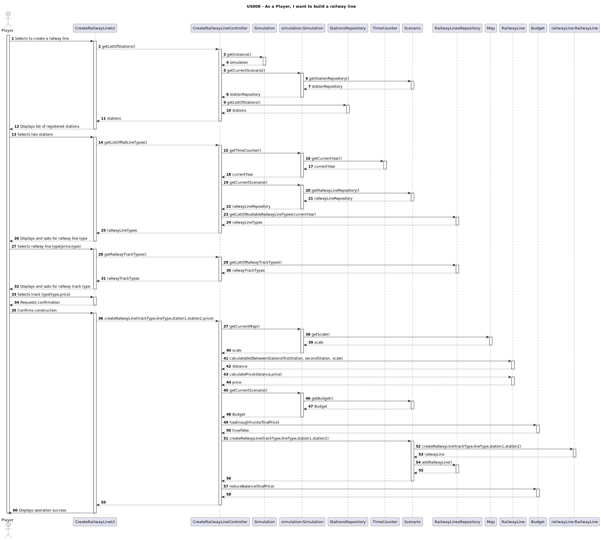

# **US008 - As a Player, I want to build a railway line**

## 3. Design

### 3.1. Rationale

**The rationale grounds on the SSD interactions and the identified input/output data.**

| Interaction ID               | Question: Which class is responsible for...   | Answer                   | Justification (with patterns)        |
|:-----------------------------|:----------------------------------------------|:-------------------------|:-------------------------------------|
| **1: Initiates creation**    | instantiating the UI class                    | `CreateRailwayLineUi`    | Pure Fabrication                     |
|                              | obtaining the list of stations                | `StationRepository`      | Information Expert, Pure Fabrication |
|                              | accessing the simulation singleton            | `Simulation`             | Singleton                            |
|                              | getting the station repository                | `Scenario`               | Information Expert                   |
|                              | getting the current scenario                  | `Simulation`             | Information Expert                   |
| **2: Displays stations**     | displaying the list of stations to the player | `CreateRailwayLineUi`    | Pure Fabrication                     |
| **3: Selects stations**      | keeping the selected stations                 | `CreateRailwayLineUi`    | Pure Fabrication                     |
| **4: Displays line types**   | getting current year                          | `TimeCounter`            | Information Expert                   |
|                              | getting the time counter                      | `Simulation`             | Information Expert                   |
|                              | getting available types                       | `RailwayLinesRepository` | Information Expert                   |
|                              | getting the railwayLine repository            | `Scenario`               | Information Expert                   |
|                              | showing type options                          | `CreateRailwayLineUi`    | Pure Fabrication                     |
| **5: Selects line type**     | receiving type selection                      | `CreateRailwayLineUi`    | Pure Fabrication                     |
| **6: Displays track types**  | retrieving track types                        | `RailwayLinesRepository` | Information Expert, Pure Fabrication |
|                              | showing type options                          | `CreateRailwayLineUi`    | Pure Fabrication                     |
| **7: Selects track type**    | receiving track selection                     | `CreateRailwayLineUi`    | Pure Fabrication                     |
| **8: Requests confirmation** | requesting confirmation to proceed            | `CreateRailwayLineUi`    | Pure Fabrication                     |
| **9: Confirms creation**     | calculating distance                          | `RailwayLine`            | Information Expert                   |
|                              | calculating price                             | `RailwayLine `           | Information Expert                   |
|                              | checking budget                               | `Budget`                 | Information Expert                   |
|                              | creating railway line                         | `Scenario`               | Creator                              |
|                              | reducing balance                              | `Budget`                 | Information Expert                   |
|                              | getting Current Scenario                      | `Simulation`             | Information Expert                   |
|                              | getting Current Map                           | `Simulation`             | Information Expert                   |
|                              | getting the map scale                         | `Map`                    | Information Expert                   |
|                              | getting budget                                | `Scenario`               | Information Expert                   |
|                              | add railway to RailwayLineRepository?         | `locationRepository`     | Information Expert, Pure Fabrication |
| **Displays success message** | showing station created confirmation          | `CreateRailwayLineUi`    | Pure Fabrication, Pure Fabrication   | 

### Systematization ##

According to the taken rationale, the conceptual classes promoted to software classes are:

* `Station`
* `RailwayLine`
* `Budget`
* `Simulation`
* `Scenario`

Other software classes (i.e. Pure Fabrication) identified:

* `CreateRailwayLineUi`
* `CreateRailwayLineController`
* `StationsRepository`
* `RailwayLinesRepository`

## 3.2. Sequence Diagram (SD)

_In this section, it is suggested to present an UML dynamic view representing the sequence of interactions between software objects that allows to fulfill the requirements._

## 3.3. Class Diagram (CD)

_In this section, it is suggested to present an UML static view representing the main related software classes that are involved in fulfilling the requirements as well as their relations, attributes and methods._

