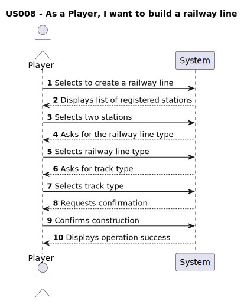

# US008 - As a Player, I want to build a railway line

## 1. Requirements Engineering

### 1.1. User Story Description

- In this user story, the player can build a railway line between two registered stations, represented topologically. . The line can be single or double track, and may be electrified depending on the scenario. 
 
### 1.2. Customer Specifications and Clarifications

From the specifications document:

> " In the context of this project, it is not intended to make a detailed graphical edition of the route, but only a topological representation of the connection between two stations. A line has a certain length, can be single or double, and can be electrified (or not)."

#### From the client clarifications:

Nothing.

### 1.3. Acceptance Criteria

**AC1:** The player should choose the stations from a list of registered stations

**AC2:** Have enough money to build it

**AC3:** Type of railway line depends on the context of the scenario

**AC4:** Garantee that the railway line is properly built and displayed

### 1.4. Found out Dependencies

- There is a dependency on [US005 - As a Player, Build a Station](../US005), as there must exist at least two stations to build a railway line between them.

### 1.5. Input and Output Data
#### Input
  ### Selected Input:
  - Two stations
  - Railway line type 
  - Track type

#### Output
- Array of all registered stations
- Railway line built

### 1.6. System Sequence Diagram (SSD)

### 1.7. Other Relevant Remarks

- No other relevant remarks
