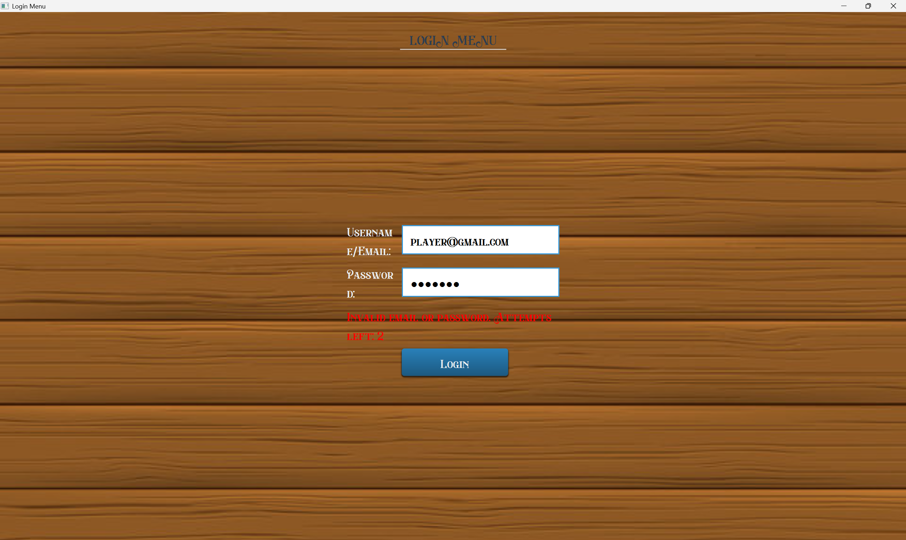
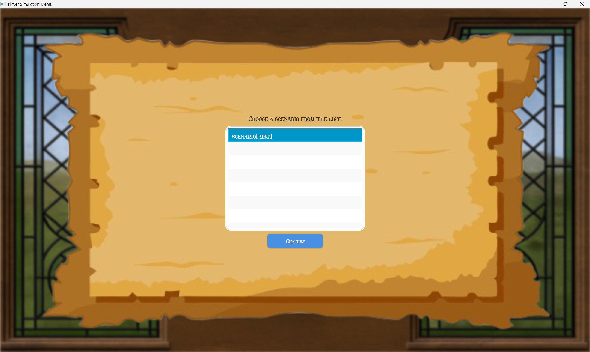
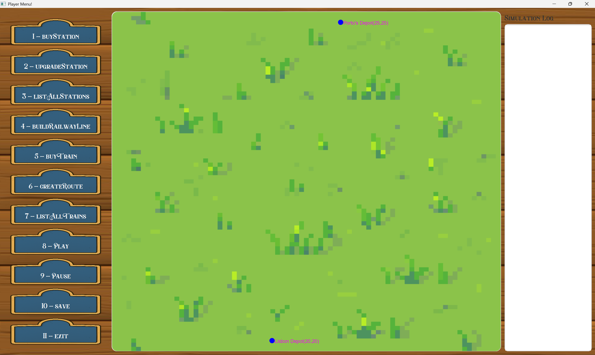
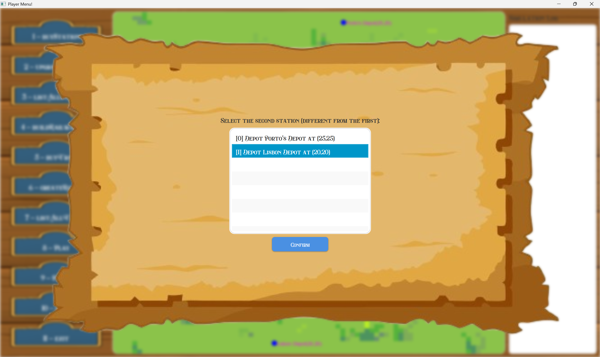
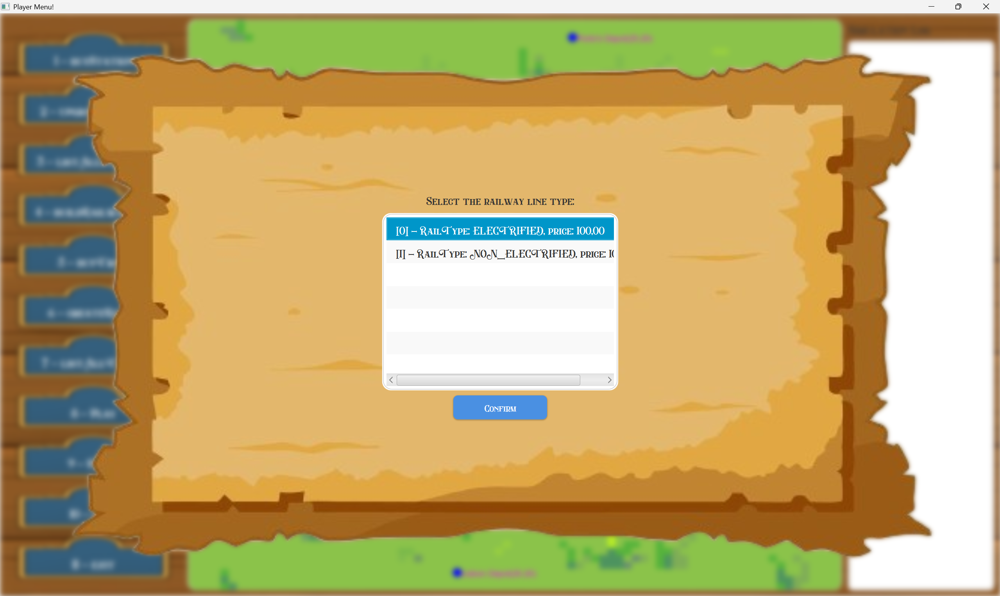
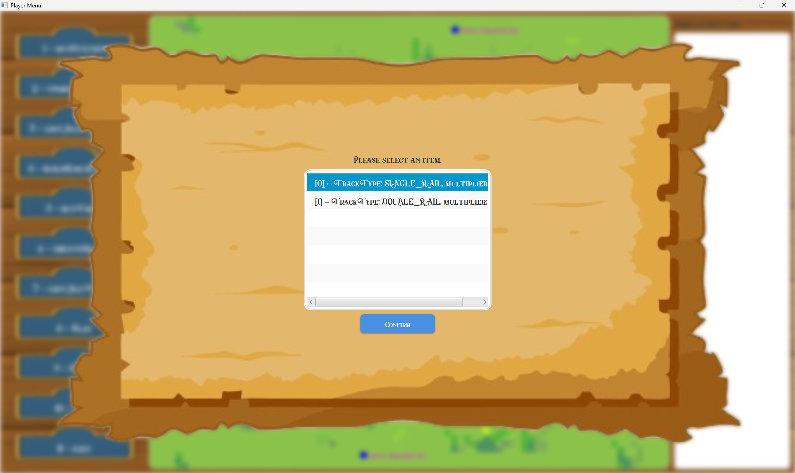
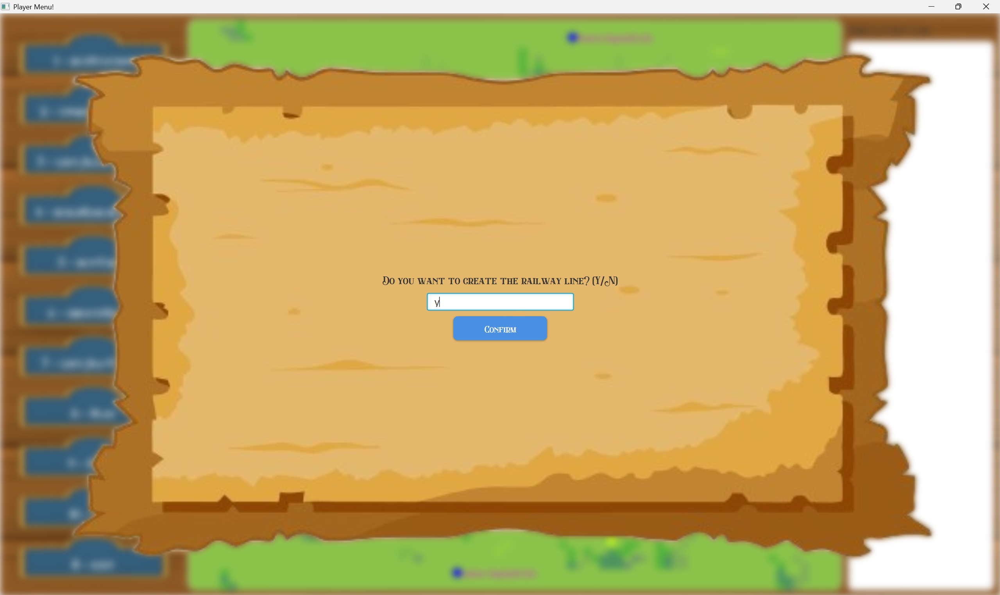
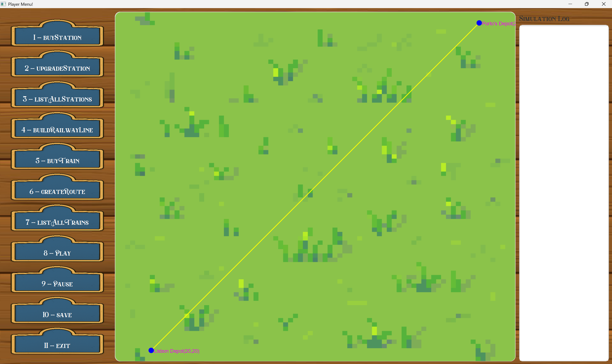

# **US008 - As a Player, I want to build a railway line**


## 4. Tests

**Test 1:** Check if railwayLine between two stations already exists
```java
	@Test
    void testAlreadyExists_trueAndFalseCases() {
        scenario.createRailwayLine(ALFA, CHARLIE, "DOUBLE_RAIL", "NON_ELECTRIFIED", 15.0);

        assertTrue(railwaylineRepository.alreadyExists(ALFA, CHARLIE));
        assertTrue(railwaylineRepository.alreadyExists(CHARLIE, ALFA));
        assertFalse(railwaylineRepository.alreadyExists(BRAVO, CHARLIE));
    }
```

**Test 2:** Check if railwayLine was properly created
Remarks: AC4 - Garantee that the railway line is properly built

```java
    @Test
    void testCreateRailwayLine() {
        RailwayLine line = scenario.createRailwayLine(ALFA, BRAVO, "SINGLE_RAIL", "NON_ELECTRIFIED", 22.0);
        assertEquals(1, railwaylineRepository.getRails().size());
        assertEquals(ALFA, line.getStation1());
        assertEquals(BRAVO, line.getStation2());
    }
```

```java
	@Test
    void createRailwayLine() {
        // Arrange
        Scenario scenario = new Scenario("Test", new Map("Test", 100, 100, 10),
                new TimeRestrictions(1900, 1950), null, null, null, new Budget(1000));
    
        Location location1 = new Location(new Position(10, 10));
        Location location2 = new Location(new Position(20, 10));
        RailType railType = RailType.NON_ELECTRIFIED;
        TrackType trackType = TrackType.DOUBLE_RAIL;
    
        // Act
        Depot depot1 = new Depot("Depot1",  location1, 10, 20);
        Depot depot2 = new Depot("Depot1",  location2, 10, 20);
        assertNotNull(depot1);
        assertNotNull(depot2);
    
        RailwayLine railwayLine = new RailwayLine(depot1,depot2, railType, trackType,10);
        assertNotNull(railwayLine);
        assertEquals(trackType, railwayLine.getTrackType());
        assertEquals(railType, railwayLine.getRailType());
    }
```

**Test 3:** Check if the player has enough money to create a railway line
Remarks: AC2 - Garantee that the railway line is properly built

```java
    @Test
    public void hasEnoughFundsTest(){
        double value = 2000;
        Budget budget = new Budget(1000);
        boolean actual = budget.hasEnoughFunds(value);
        boolean expected = false;
        assert actual == expected;
    }
```

**Test 3:** Checks if the lists of tracks and lines is correct
Remarks: AC3 - Type of railway line depends on the context of the scenario
```java
    @Test
    void testGetListOfAvailableRailwayLineTypes() {
        String rails = railwaylineRepository.getListOfAvailableRailwayLineTypes(scenario.getTimeRestrictions().getStartYear());
        assertFalse(rails.isEmpty());
        assertTrue(rails.contains("NON_ELECTRIFIED"));
        assertTrue(rails.contains("ELECTRIFIED"));
    }
```

```java
    @Test
    void testGetListOfRailwayTrackTypes() {
        String result = railwaylineRepository.getListOfRailwayTrackTypes();
        assertTrue(result.contains("SINGLE_RAIL"));
        assertTrue(result.contains("DOUBLE_RAIL"));
    }
```

**Test 4:** Checks if the lists of registered stations is correct
Remarks: AC1 - The player should choose the stations from a list of registered stations

```java
	@Test
    public void testListAllStations() {
        //Arrange
        StationType station1 = scenario.createStation("North Station","DEPOT", new Location(new Position(0, 0)),null,X,Y);
        StationType station2 = scenario.createStation("South Station","STATION", new Location(new Position(5, 10)),"NE",X,Y);


        String expected =
                "[0] Depot North Station at (0,0)\n" +
                        "[1] Station South Station at (5,10)\n";
        //Act
        String actual = stationRepository.listAllStations();

        //Assert
        assertEquals(expected, actual);
    }
```
## 5. Construction (Implementation)

#### UI

```java
    private void chooseStations(String stationList, String[] stations) {
        AuthenticationApp.setMessage("Select the first station:");
        AuthenticationApp.setList(stationList);
        requestUserInputList(first -> {
            station1 = extractIndex(first);
            if (station1 < 0 || station1 >= stations.length) {
                Utils.displayWarningInput("Invalid selection. Aborting.");
                return;
            }
    
            AuthenticationApp.setMessage("Select the second station (different from the first):");
            AuthenticationApp.setList(stationList);
            requestUserInputList(second -> {
                station2 = extractIndex(second);
                if (station2 < 0 || station2 >= stations.length || station2 == station1) {
                    Utils.displayWarningInput("Invalid second station. Must be different from the first.");
                    return;
                }
    
                selectRailwayLineType();
            });
        });
    }
```

```java
    private void selectRailwayLineType() {
        String railTypesString = controller.getListOfRailLineTypes();
        AuthenticationApp.setMessage("Select the railway line type:");
        AuthenticationApp.setList(railTypesString);
        requestUserInputList(selectedInput -> {
            try {
                int index = extractIndex(selectedInput);
                String[] railTypesArray = railTypesString.split("\n");
                if (index < 0 || index >= railTypesArray.length) {
                    Utils.displayWarningInput("Invalid index. Please choose a valid railway line type.");
                    selectRailwayLineType();
                    return;
                }
    
                String selectedLine = railTypesArray[index];
                Pattern linePattern = Pattern.compile("RailType: (.*), price: ([0-9]+(\\.[0-9]+)?)");
                Matcher lineMatcher = linePattern.matcher(selectedLine);
                if (lineMatcher.find()) {
                    String name = lineMatcher.group(1).trim();
                    double price = Double.parseDouble(lineMatcher.group(2));
    
                    this.railwayLineType = name;
                    this.price = price;
                    selectTrackType();
                } else {
                    Utils.displayWarningInput("Invalid format for selected railway line.");
                    selectRailwayLineType();
                }
            } catch (NumberFormatException e) {
                Utils.displayWarningInput("Invalid input. Please enter a valid number.");
                selectRailwayLineType();
            }
        });
    }
```

```java
    private void selectTrackType() {
        String trackList = controller.getListOfTrackTypes();
        AuthenticationApp.setMessage("Select the track type:");
        AuthenticationApp.setList(trackList);
    
        requestUserInputList(selectedInput -> {
            try {
                int index = extractIndex(selectedInput);
                String[] trackArray = trackList.split("\n");
    
                if (index < 0 || index >= trackArray.length) {
                    Utils.displayWarningInput("Invalid track type selected.");
                    selectTrackType();
                    return;
                }
    
                String selectedTrack = trackArray[index];
                Pattern trackPattern = Pattern.compile("TrackType: (.*), multiplier: ([0-9]+(\\.[0-9]+)?)");
                Matcher trackMatcher = trackPattern.matcher(selectedTrack);
                if (trackMatcher.find()) {
                    String name = trackMatcher.group(1).trim();
                    double multiplier = Double.parseDouble(trackMatcher.group(2).replace(',', '.'));
    
                    this.railwayTrackType = name;
                    this.price *= multiplier;
                    confirmCreation();
                } else {
                    Utils.displayWarningInput("Invalid format for selected railway track.");
                    selectTrackType();
                }
            } catch (NumberFormatException e) {
                Utils.displayWarningInput("Invalid input. Please enter a valid number.");
                selectTrackType();
            }
        });
    }
```

```java
    private void confirmCreation() {
        AuthenticationApp.setMessage("Do you want to create the railway line? (Y/N)");
    
        requestUserInputString(userInput -> {
            String input = userInput.trim().toUpperCase();
    
            if (input.equals("Y")) {
                try {
                    createRailwayLine();
                    Utils.displayReturnPlayer("RailwayLine created.");
                } catch (InsuficientBudget | IllegalArgumentException | IOException e) {
                    Utils.displayWarningInput("Error: " + e.getMessage());
                    try {
                        Utils.displayReturnPlayer("RailwayLine creation cancelled");
                    } catch (IOException ex) {
                        ex.printStackTrace();
                    }
                }
            } else if (input.equals("N")) {
                Utils.displayWarningInput("Railway line creation cancelled.");
            } else {
                Utils.displayWarningInput("Please enter 'Y' for yes or 'N' for no.");
                confirmCreation();
            }
        });
    }
```

```java
    private int extractIndex(String input) {
        Matcher matcher = Pattern.compile("\\[(\\d+)]").matcher(input.trim());
        return matcher.find() ? Integer.parseInt(matcher.group(1)) : -1;
    }
```

#### Controller

```java
   public String getListOfStations() {return stationRepo.listAllStations();}
```

```java
   public void createRailwayline(int station1, int station2, String trackType, String railType, double price) {
    StationType firstStation = stationRepo.getStation(station1);
    StationType secondStation = stationRepo.getStation(station2);

    if (firstStation == null || secondStation == null) {
        throw new IllegalArgumentException("One or both stations do not exist.");
    }

    double distance = RailwayLine.calculateDistBetweenStations(firstStation, secondStation, instance.getCurrentMap().getScale());
    double totalPrice = RailwayLine.calculatePrice(distance, price);

    if (budget != null && budget.hasEnoughFunds(totalPrice)) {
        if (railwaylineRepo.alreadyExists(firstStation, secondStation)) {
            throw new IllegalArgumentException("Railway line already exists between these stations.");
        } else {
            instance.getCurrentScenario().createRailwayLine(firstStation, secondStation, trackType, railType, distance);
            budget.subtractFunds(totalPrice);
        }
    } else {
        throw new InsuficientBudget("Insufficient budget. " + totalPrice + " required!");
    }
}
```

```java
public String getListOfRailLineTypes() {return railwaylineRepo.getListOfAvailableRailwayLineTypes(currentYear);}
```

```java
public String getListOfTrackTypes() {return railwaylineRepo.getListOfRailwayTrackTypes();}
```

#### Scenario

```java
public RailwayLine createRailwayLine(StationType station1, StationType station2, String trackType, String lineType, Double distance) {
    TrackType trackType1 = null;
    for (TrackType t : TrackType.values()) {
        if (!trackType.isEmpty() && t.name().equals(trackType)) {
            trackType1 = t;
        }
    }
    RailType lineType1 = null;
    for (RailType r : RailType.values()) {
        if (!lineType.isEmpty() && r.name().equals(lineType)) {
            lineType1 = r;
        }
    }
    RailwayLine rl = new RailwayLine(station1, station2, lineType1, trackType1, distance);
    station1.addRailwayLines(rl);
    station2.addRailwayLines(rl);
    railwaylineRepository.addRailwayLine(rl);
    return rl;
}
```
```java
public Budget getBudget() {return budget;}
```

#### RailwayLineRepository
```java
public boolean alreadyExists(StationType station1, StationType station2) {
    if (station1 == null || station2 == null) {
        return false;
    }
    for (RailwayLine tmp : rails) {
        if (tmp.getStation1().equals(station1) && tmp.getStation2().equals(station2) || tmp.getStation1().equals(station2) && tmp.getStation2().equals(station1)) {
            return true;
        }
    }
    return false;
}
```

```java
public String getListOfTrackTypes() {return railwaylineRepo.getListOfRailwayTrackTypes();}
```
#### Budget

```java
    public boolean hasEnoughFunds(double value) {
        if (this.funds >= value) {
            return true;
        }
        return false;
    }
```

```java
    public void subtractFunds(double value) {
        this.funds -= value;
    }
```

#### RailwayLine

```java
    public static double calculateDistBetweenStations(StationType st1, StationType st2, int scale){
        int xSt1 = st1.getLocation().getPosition().getX();
        int ySt1 = st1.getLocation().getPosition().getY();
        int xSt2 = st2.getLocation().getPosition().getX();
        int ySt2 = st2.getLocation().getPosition().getY();
    
        return ((Math.abs(xSt2 - xSt1) + Math.abs(ySt2 - ySt1)) * scale);
    }
```

```java
    public static double calculatePrice(double distance, double pricePerUnit) {
        return distance * COST_DISTANCE_MONEY_CONVERSION * pricePerUnit;
    }
```

#### Map

```java
    public int getScale() { return scale; }
```

## 6. Integration and Demo

###### There must be a scenario, map and 2 stations created.

### 6.1 Editor Authentication
##### In order to reach this demonstration you must authenticate as a Player and start a simulation.



















## 7. Observations

_In this section, it is suggested to present a critical perspective on the developed work, pointing, for example, to other alternatives and or future related work._