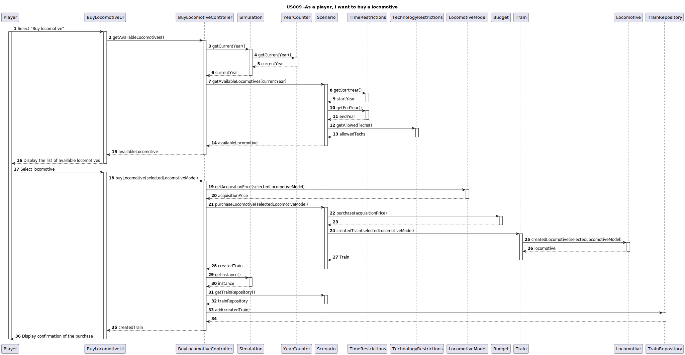

# US009 - As a player, I want to buy a locomotive

## 3. Design

### 3.1. Rationale

**The rationale grounds on the SSD interactions and the identified input/output data.**

| Interaction ID | Question: Which class is responsible for...           | Answer  | Justification (with patterns)  |
|:-------------  |:---------------------|:------------|:---------------------------- |
| Step 1/Msg 1:Select "Buy locomotive"  |...instantiating the class that handles the UI?   |`BuyLocomotiveUI`         |Pure Fabrication                       |
|                               		|... obtaining the list of available locomotives?  |`TrainRepository`         |Information Expert, Pure Fabrication   |
|   		                            |...accessing the repositories singleton?          |`Simulation`              |Information Expert            |
|  		                                |...getting the Train repository?			       |`Scenario`              |Information Expert   |
|  		                                |....getting the necessary data to filter the list of locomotives |`Scenario` |InformationExpert |	
| Step 2/Msg 2:Display the list of available locomotives|... displaying the list of available locomotives? |`BuyLocomotiveUI`|Pure Fabrication                |
| Step 3/Msg 3:Select locomotive  		|...validating selected data? 					   |`BuyLocomotiveUI`         |Pure Fabrication                       |
|                               		|...creating the  Train object ?	               |`Scenario`                |Creator R:3,4                          |
|                               		|...creating the  Loocmotive object ?              |`Train`                   |Creator R:1,2                          |
|                               		|...save the traisn purchased?                     |`TrainRepository`         |Information Expert, Pure Fabrication |           
|                               		|...validate the purchase? 						   |`Budget`                  |Information Expert                     |
|Step 4/Msg 4:Display confirmation of the purchase|...display the purchase corfirmation?   |`BuyLocomotiveUI`         |Pure Fabrication                       |

### Systematization ##

According to the taken rationale, the conceptual classes promoted to software classes are:

* Locomotive
* Train
* Budget
* Scenario
* YearCounter
* Simulation
* TimeRestrictions
* LocomotiveModel
* Technology Type
* TechnologyRestrictions

Other software classes (i.e. Pure Fabrication) identified:

* BuyLocomotiveUI  
* BuyLocomotiveController
* trainRepository

## 3.2. Sequence Diagram (SD)

## 3.3. Class Diagram (CD)

