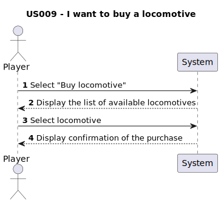

# US009 -As a player, I want to buy a locomotive

## 1. Requirements Engineering
### 1.1. User Story Description

This user story involves the player purchasing a locomotive within the simulation.The player selects a locomotive from a list of available options according to the scenario and the current date selected previously.

### 1.2. Customer Specifications and Clarifications 

### From the specifications document:
> - "Trains are composed of locomotives and carriages."
> - "The carriages are distinguished by the type of cargo they can transport (e.g., passengers, mail, coal, iron ore, steel, cars)and, in the context of the simulator, they have no acquisition cost."
> - "The locomotives are characterized by several technical aspects, such as power, acceleration, top speed, start year of operation, fuel cost and maintenance per year, and acquisition price."

#### From the client clarifications:
> **Q:** Is there a limit to the number of trains a player can buy?
>
> **A:** There is no physical limit, just the available memory.

### 1.3. Acceptance Criteria
### Acceptance Criteria from the client:
**AC1:** The player should choose the locomotive from a list of available locomotives for the scenario as well as a current date.
### Other Acceptance Criteria:
**AC2:** The player must have enough budget to buy the locomotive.
**AC3:** Garantee that the locomotive is properly bought

### 1.4. Found out Dependencies
- No dependencies found

### 1.5 Input and Output Data

#### Input data:
- Budget (double)

#### Selected Input:
- Select "Buy locomotive"
- Select locomotive

#### Output:
- Confirmation of the train purchased

### 1.6. System Sequence Diagram (SSD)

### 1.7 Other Relevant Remarks

- No other relevant remarks, at the moment.