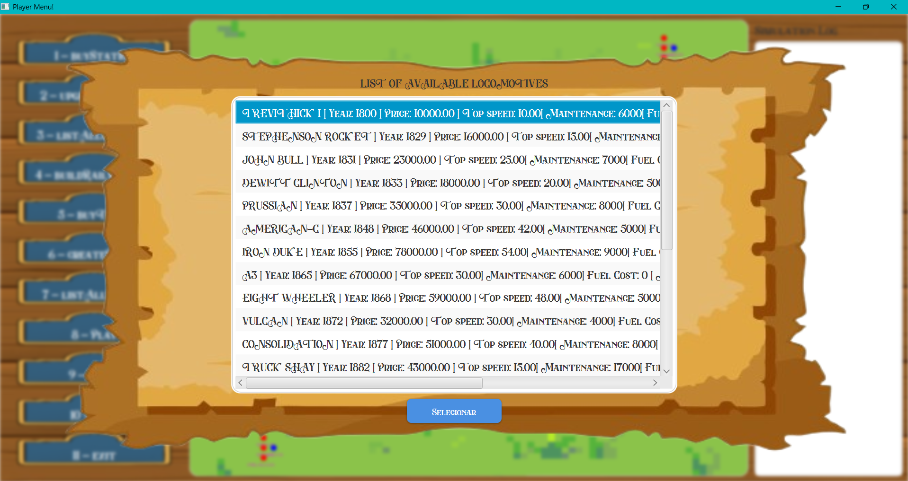
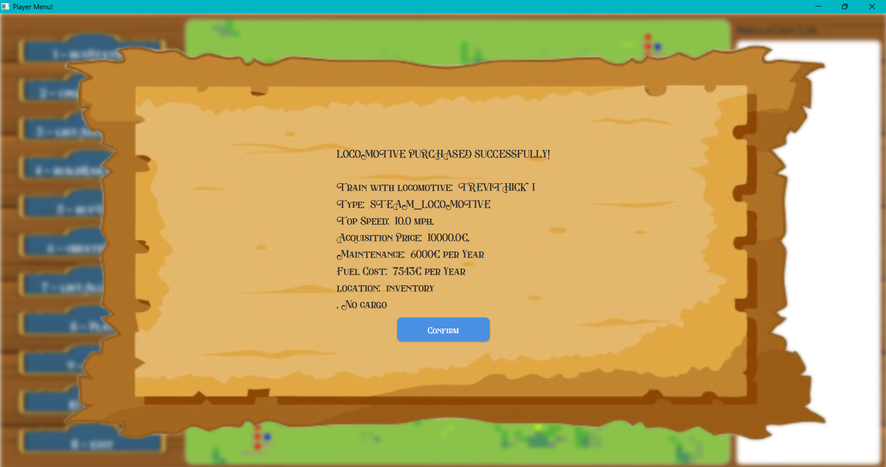
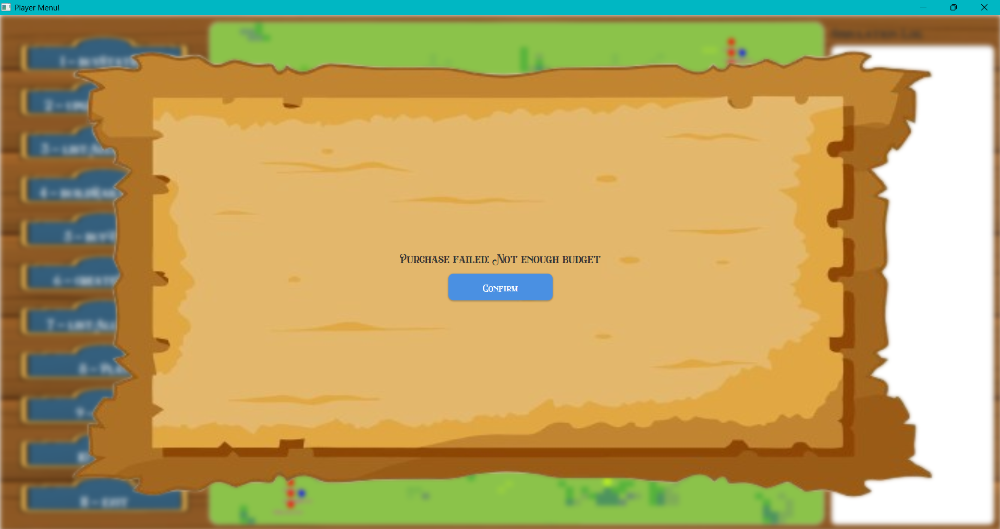
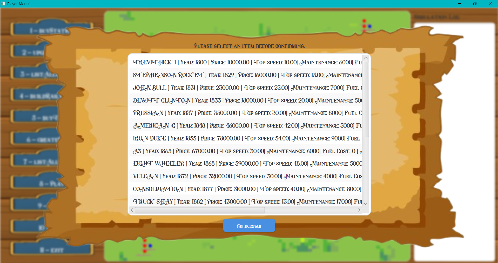

# US009 -  As a player, I want to buy a locomotive


## 4. Tests
_In this section, it is suggested to systematize how the tests were designed to allow a correct measurement of requirements fulfilling._ 

**_DO NOT COPY ALL DEVELOPED TESTS HERE_**

**Test 1:** Test Locomotive creation from model and properties

```java
    @Test
    void testLocomotiveModelAttributes() {
        //Arrange
        int startYear = 1800;
        double acquisitionPrice = 10000;
        int topSpeed = 10;
        int maintenance = 6000;
        int fuelCoast = 7543;
        String name = "TREVITHICK 1";
        LocomotiveType type = LocomotiveType.STEAM_LOCOMOTIVE;

        //Act
        LocomotiveModel model = LocomotiveModel.TREVITHICK_1;

        //Assert
        assertEquals(startYear,model.getStartYear());
        assertEquals(acquisitionPrice, model.getAcquisitionPrice());
        assertEquals(topSpeed, model.getTopSpeed());
        assertEquals(maintenance, model.getMaintenance());
        assertEquals(fuelCoast, model.getFuelCoast());
        assertEquals(name, model.getName());
        assertEquals(type, model.getType());

    }
```


**Test 2:**	 Test LocomotiveModel enum values
```java
	  @Test
    void testLocomotiveModelAttributes() {
        LocomotiveModel model = LocomotiveModel.TREVITHICK_1;
        assertEquals("TREVITHICK 1", model.getName());
        assertEquals(LocomotiveType.STEAM_LOCOMOTIVE, model.getType());
        assertEquals(1800, model.getStartYear());
        assertEquals(10000, model.getAcquisitionPrice());
    }
```
	

_It is also recommended to organize this content by subsections._


## 5. Construction (Implementation)

_In this section, it is suggested to provide, if necessary, some evidence that the construction/implementation is in accordance with the previously carried out design. Furthermore, it is recommeded to mention/describe the existence of other relevant (e.g. configuration) files and highlight relevant commits._

_It is also recommended to organize this content by subsections._ 

#### UI


```java
    public void onItemSelected(int index) {
		Train createdTrain = controller.buyLocomotive(locomotives.get(index));

        if(createdTrain == null){
            try{
                Utils.displayReturnPlayer("Purchase failed: Not enough budget");
            }catch (IOException ex){
                ex.printStackTrace();
            }
        }else {
            try {
                Utils.displayReturnPlayer("LOCOMOTIVE PURCHASED SUCCESSFULLY!\n \n" + createdTrain);
            }catch (IOException ex){
                ex.printStackTrace();
            }
        }             
    }
```


```java
 private List<String> formatLocomotivesForDisplay(List<LocomotiveModel> locomotives) {
    return locomotives.stream()
            .map(m -> String.format("%s | Year: %d | Price: %.2f | Top speed: %.2f| Maintenance: %d| Fuel Cost: %d | MiType: %s",
                    m.getName(), m.getStartYear(), m.getAcquisitionPrice(), m.getTopSpeed(), m.getMaintenance(), m.getFuelCoast()
                    ,m.getType()))
            .collect(Collectors.toList());
}

```


#### Controller

```java
 public List<LocomotiveModel> getAvailableLocomotives() {
    int currentYear = getCurrentYear();
    return scenario.getAvailableLocomotives(currentYear);
}
```


```java
public Train buyLocomotive(LocomotiveModel model) {

    Train train = scenario.purchaseLocomotive(model);

    if (train == null){
        return  null;
    }else{
        Simulation.getInstance().getTrainRepository().addTrain(train);
        return train;
    }
}
```
#### Scenario

```java
public List<LocomotiveModel> getAvailableLocomotives(int currentYear) {
     int scenarioStartYear = timeRestrictions.getStartYear();
     int scenarioEndYear = timeRestrictions.getEndYear();
     List<TechnologyType> allowedTechs = getAllowedTechs();

     List<LocomotiveModel> availableModels = new ArrayList<>();

     System.out.println("Current Year: " + currentYear);
     System.out.println("Scenario Start Year: " + scenarioStartYear);
     System.out.println("Scenario End Year: " + scenarioEndYear);
     System.out.println("Allowed Technologies: " + allowedTechs);
     System.out.println();

    for (LocomotiveModel model : LocomotiveModel.values()) {
        int modelStartYear = model.getStartYear();
        TechnologyType techType = convertToTechnologyType(model.getType());

        if (modelStartYear <= currentYear &&
                modelStartYear <= scenarioEndYear &&
                allowedTechs.contains(techType)) {
            availableModels.add(model);
        }
    }
    return availableModels;
}
```

```java
private TechnologyType convertToTechnologyType(LocomotiveType type) {
    switch (type) {
        case DIESEL_LOCOMOTIVE:
             return TechnologyType.DIESEL;
        case ELECTRICITY_LOCOMOTIVE:
             return TechnologyType.ELECTRIC;
        case STEAM_LOCOMOTIVE:
              return TechnologyType.STEAM;
         default:
             throw new IllegalArgumentException("Type of locomotive unknown: " + type);
    }
}
```


```java
private List<TechnologyType> getAllowedTechs() {
    if (technologyRestriction == null || technologyRestriction.getTechList() == null) {
        return List.of(TechnologyType.DIESEL, TechnologyType.ELECTRIC, TechnologyType.STEAM);
    }

    List<TechnologyType> restricted = technologyRestriction.getTechList();
    System.out.println("Restricted Technologies: " + restricted);

    List<TechnologyType> allTechs = List.of(TechnologyType.DIESEL, TechnologyType.ELECTRIC, TechnologyType.STEAM);
    List<TechnologyType> allowed = new ArrayList<>(allTechs);
    allowed.removeAll(restricted);

    return allowed;
}
```

```java
public Train purchaseLocomotive(LocomotiveModel model) {
    if (budget.hasEnoughFunds(model.getAcquisitionPrice())){
        budget.purchase(model.getAcquisitionPrice());
        return createTrain(model);
    }

    return null;
}
```

```java
public Train createTrain(LocomotiveModel model) {
    return new Train(model, trainRepository.getNewID());
}
```

#### Budget

```java
public void purchase(double amount) {
    funds -= amount;
}
```

```java
public boolean hasEnoughFunds(double value) {
    if (this.funds >= value) {
        return true;
    }
    return false;
}
```


## 6. Integration and Demo 

_In this section, it is suggested to describe the efforts made to integrate this functionality with the other features of the system._

###### Purchased Of the locomotive (Sucssess, the palyer as enough Budget)





###### Purchased Of the locomotive (Fail, the palyer don't have enough Budget)




###### Selecting - Warning message in case the player select confirm before chossing the locomotive



## 7. Observations

_In this section, it is suggested to present a critical perspective on the developed work, pointing, for example, to other alternatives and or future related work._