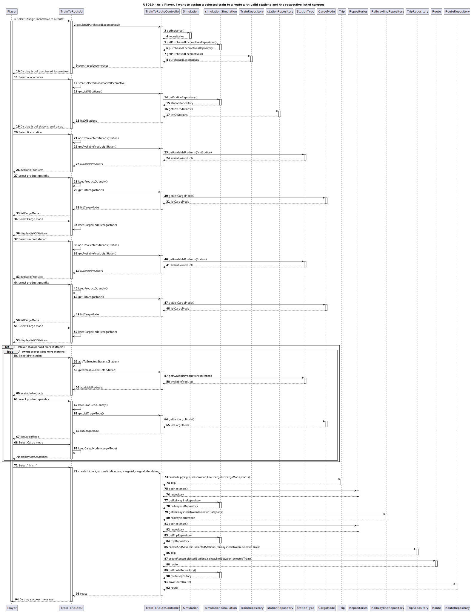
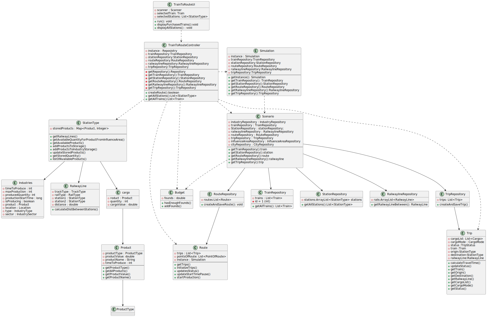

# US010 - As a Player, I want to assign a selected train to a route with a valid station and the respective list of cargoes to be picked up

## 3. Design

### 3.1. Rationale

**The rationale grounds on the SSD interactions and the identified input/output data.**

| Interaction ID | Question: Which class is responsible for... | Answer  | Justification (with patterns)  |
|:-------------  |:--------------------- |:------------|:---------------------------- |
| Step 1/MSG:Select "assign train to a route"     |...obtaining the list of the purchased locomotives? |`TrainRepository`  |Information Expert, Pure Fabrication |
|        |...accessing the repositories singleton?							 |`	Simulation`            | Pure Fabrication         |
|  		 |...getting the purchased locomotives repository?	 | `Scenario`            | Information Expert |
| Step 2/MSG:Dispaly list of purchased Locomotives  		 |...displaying the list of purchased locomotives?	 |`TrainToRouteUI`   |Pure Fabrication    |
| Step 3/MSG:Select locomotive  		 |...temporarily keeping the selected locomotives ?		 |`TrainToRouteUI`       | Pure Fabrication       |
|        		                  |...gettting the list of stations?	 |`StationRepository`             |Information Expert, Pure Fabrication         |              
| Step 4/MSG:Display lsit of stations and cargo  	 |...displaying the list of stations and cargo?		 | `TrainToRouteUI`     |Pure Fabrication    |
| Step 5/MSG:Select first station  		 |...temporarily keeping the first station?		 |`TrainToRouteUI`         | Pure Fabrication           |
| Step 6/MSG:Display confirmation 		 |...displaying the success of operation?	     |`TrainToRouteUI`         | Pure Fabrication           |
| Step 7/MSG:Select second station  	 |...temporarily keeping the second station?	 |`TrainToRouteUI`         | Pure Fabrication           | 
| Step 8/MSG:Display confirmation 		 |...displaying the success of operation?	     |`TrainToRouteUI`         | Pure Fabrication           | 
| 		 |...displaying the cargoMode	                 |`TrainToRouteUI`         | Pure Fabrication           | 
| 		 |...displaying the the products	             |`TrainToRouteUI`         | Pure Fabrication           | 
| Step 9/MSG:Select addicional station   |...temporarily keeping the station(s) ?		 |`TrainToRouteUI`         | Pure Fabrication           | 
|  		                                 |...gettting the list of stations?			     |`StationRepository`            |Information Expert, Pure Fabrication | 
| Step 10/MSG:Display list of stations   |...displaying the list of stations?		 | `SelectTrainToRouteUI`     |Pure Fabrication    |
| Step 11/MSG:Select finish 		 |...getting the railwayline | `RailwaylineRepository`      |Information Expert, Pure Fabrication  |
| 		                             |...creating the trips  | `TripRepository`      |Information Expert, Pure Fabrication  |
|		                             |...creating the route  | `RouteRepository`      |Information Expert, Pure Fabrication  |
| Step 12/MSG:Display success message  		 |...displaying the success of operation?|`TrainToRouteUI`            | Pure Fabrication  |

### Systematization ##

According to the taken rationale, the conceptual classes promoted to software classes are:

* Route
* trip

Other software classes (i.e. Pure Fabrication) identified:

* TrainToRouteUI  
* TrainToRouteController
* StationRepository
* RouteRepository
* TripRepository
* StationRepository
* RailwaylineRepository

## 3.2. Sequence Diagram (SD)

## 3.3. Class Diagram (CD)

_In this section, it is suggested to present an UML static view representing the main related software classes that are involved in fulfilling the requirements as well as their relations, attributes and methods._

