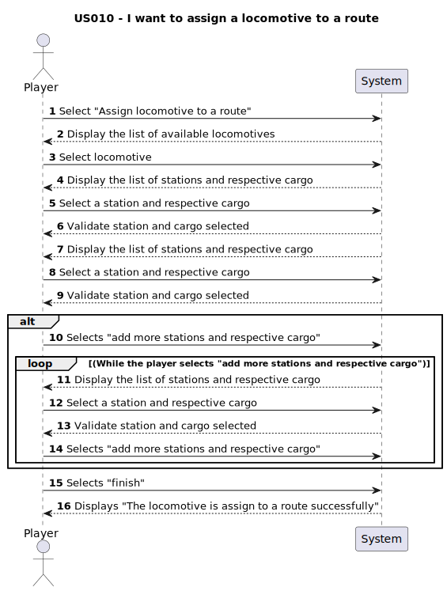

# US010 - As a Player, I want to assign a selected train to a route. A route is a list of Points-of-Route, each Point-of-Route is defined by: a station, a list of cargoes to be picked up.

## 1. Requirements Engineering
### 1.1. User Story Description
This user story describes the functionality for a player to assign a train to a specific route, which includes a valid station and a list of cargoes the train will pick up. The player will need to select a train and define its route based on existing stations and cargos within the game.

### 1.2. Customer Specifications and Clarifications 

### From the specifications document:
> -"In the simulator, the player/user acquires trains within the available budget and can put the train into service on a specific route."
> -"A route is a list of stations where the train passes, along which it loads (carriages) cargo at each station."

#### From the client clarifications:
Nothing.

### 1.3. Acceptance Criteria

### Acceptance Criteria from the client:
**AC1:** AC01: For each Point-of-Route I want to assign a cargo mode, that can be: FULL (the train only departs when full loaded); HALF (the train departs as soon it haves half of carriages loaded); AVAILABLE (the train departs with available cargoes in the station)

### Other Acceptance Criteria:
**AC2:** There's should be selected at least two stations and their respective cargo to create a route.
**AC3:** Locomotives can only be assign to a route if the type of railway matches the type of the locomotive.
**AC4:** Garantee that the train is in a proper route and the cargos are properly listed

### 1.4. Found out Dependencies
- There is a dependency on[US007-As a Player, I want to list all the stations](../US007), the list of the stations is needed to define the route.
- There is a dependency on[US008-As a Player, I want to build a railway line between two stations](../US008), the railway line between two stations must be built before a train can be assigned to a route.
- There is a dependency on[US009-As a Player, I want to buy a locomotive.](../US009),a train must be purchased before it can be assigned to a route.
- There is a dependency on[US011-As a Player, I want to list all trains.](../US011), to assign a locomotive to a route it is necessary the list of all trains.

### 1.5 Input and Output Data
#### Selected Input:
- Select "Assign locomotive to a route" 
- Select locomotive
- Select station 
- Select cargoes
- Select "Add more stations and respective cargoes"
- Select cargo mode

#### Output:
- Confirmation of the train assignment 

### 1.6. System Sequence Diagram (SSD)

### 1.7 Other Relevant Remarks
- There are no other relevant remarks
