# US010 - As a Player, I want to assign a selected train to a route. A route is a list of Points-of-Route, each Point-of-Route is defined by: a station, a list of cargoes to be picked up.

_XXX stands for User Story number and YYY for User Story description (e.g. US006 - Create a Task)_

## 4. Tests
_In this section, it is suggested to systematize how the tests were designed to allow a correct measurement of requirements fulfilling._ 

**_DO NOT COPY ALL DEVELOPED TESTS HERE_**

**Test 1:** Check that it is not possible to create an instance of the Example class with null values. 

	@Test(expected = IllegalArgumentException.class)
		public void ensureNullIsNotAllowed() {
		Exemplo instance = new Exemplo(null, null);
	}

_It is also recommended to organize this content by subsections._


## 5. Construction (Implementation)

_In this section, it is suggested to provide, if necessary, some evidence that the construction/implementation is in accordance with the previously carried out design. Furthermore, it is recommeded to mention/describe the existence of other relevant (e.g. configuration) files and highlight relevant commits._

_It is also recommended to organize this content by subsections._ 

#### UI

```java
 private void selectTrain() {
    List<Train> trains = controller.getAllTrains();

    if (trains.isEmpty()) {

        try {
            Utils.displayReturnPlayer("No trains purchased.");
        } catch (IOException e) {
            e.printStackTrace();
        }
        return;
    }

    List<String> trainDescriptions = trains.stream()
            .map(Train::toString)
            .collect(Collectors.toList());

    App.setMessage("Choose a train:");
    DisplayDynamicList.displayList(trainDescriptions, new DisplayListControllerInterface() {
        @Override
        public void initialize(List<String> items) {}

        @Override
        public void onItemSelected(int trainIndex) {
            selectedTrain = trains.get(trainIndex);
            selectStations();
        }
    }, "Choose a train:");
}
```

```java
private void selectStations() {
    List<StationType> stations = controller.getAllStations();

    if (stations.size() < 2) {
        try {
            Utils.displayReturnPlayer("Not enough stations to create a route.");
        } catch (IOException e) {
            e.printStackTrace();
        }
        return;
    }

    List<String> stationNames = stations.stream()
            .map(StationType::getName)
            .collect(Collectors.toList());

    pointsOfRoute.clear();
    List<Integer> selectedIndices = new ArrayList<>();

    selectStationRecursive(stations, stationNames, selectedIndices, "Select stations for the route:");
}
```

```java
private void selectStationRecursive(List<StationType> stations, List<String> stationNames,
                                        List<Integer> selectedIndices, String message) {
    List<String> options = new ArrayList<>(stationNames);
    options.add("Finish selection");

    DisplayDynamicList.displayList(options, new DisplayListControllerInterface() {
        @Override
        public void initialize(List<String> items) {}

        @Override
        public void onItemSelected(int index) {
            if (index == options.size() - 1) {
                if (pointsOfRoute.size() >= 2) {
                    finalizeRoute();
                } else {
                    selectStationRecursive(stations, stationNames, selectedIndices, "You must select at least two stations.");
                }
                return;
            }

            if (selectedIndices.contains(index)) {
                selectStationRecursive(stations, stationNames, selectedIndices, "Station already selected.");
                return;
            }

            selectedIndices.add(index);
            StationType selectedStation = stations.get(index);

            selectProductsForStation(selectedStation, cargos -> {
                selectCargoMode(mode -> {
                    pointsOfRoute.add(new PointOfRoute(selectedStation, cargos, mode));
                    selectStationRecursive(stations, stationNames, selectedIndices, "Select stations for the route:");
                });
            });
        }
    }, message);
}
```

```java
private void selectProductsForStation(StationType station, ProductSelectionCallback callback) {
    List<Product> availableProducts = station.getAvailableProducts();

    if (availableProducts.isEmpty()) {
        App.setMessage("No available products in this station.");
        DisplayMessage.displayMessage(userInput -> {});
        callback.onProductsSelected(new ArrayList<>());
        return;
    }

    List<String> productNames = availableProducts.stream()
            .map(Product::getProductName)
            .collect(Collectors.toList());

    List<Cargo> selectedCargos = new ArrayList<>();
    selectProductRecursive(station, availableProducts, productNames, selectedCargos, callback);
}
```

```java
private void selectProductRecursive(StationType station, List<Product> products, List<String> productNames,
                                        List<Cargo> selectedCargos, ProductSelectionCallback callback) {
    List<String> options = new ArrayList<>(productNames);
    options.add("Finish product selection");

    DisplayDynamicList.displayList(options, new DisplayListControllerInterface() {
        @Override
        public void initialize(List<String> items) {}

        @Override
        public void onItemSelected(int index) {
            if (index == options.size() - 1) {
                callback.onProductsSelected(selectedCargos);
                return;
            }

            Product selectedProduct = products.get(index);
            boolean alreadySelected = selectedCargos.stream()
                    .anyMatch(c -> c.getProduct().equals(selectedProduct));

            if (alreadySelected) {
                App.setMessage("Product already selected.");
                DisplayMessage.displayMessage(userInput -> {});
                selectProductRecursive(station, products, productNames, selectedCargos, callback);
                return;
            }

            App.setMessage("Enter quantity for product: " + selectedProduct.getProductName());
            ReadStringInput.requestUserInputString(quantityStr -> {
                try {
                    int quantity = Integer.parseInt(quantityStr);
                    if (quantity <= 0) {
                        App.setMessage("Quantity must be positive.");
                        DisplayMessage.displayMessage(userInput -> {});
                        selectProductRecursive(station, products, productNames, selectedCargos, callback);
                        return;
                    }

                    selectedCargos.add(new Cargo(selectedProduct, quantity));
                    selectProductRecursive(station, products, productNames, selectedCargos, callback);
                } catch (NumberFormatException e) {
                    App.setMessage("Invalid quantity input.");
                    DisplayMessage.displayMessage(userInput -> {});
                    selectProductRecursive(station, products, productNames, selectedCargos, callback);
                }
            });
        }
    }, "Select product for station " + station.getName() + ":");
}
```

```java
private void selectCargoMode(CargoModeSelectionCallback callback) {
    CargoMode[] modes = CargoMode.values();
    List<String> modeNames = Arrays.stream(modes)
            .map(Enum::toString)
            .collect(Collectors.toList());

    DisplayDynamicList.displayList(modeNames, new DisplayListControllerInterface() {
        @Override
        public void initialize(List<String> items) {}

        @Override
        public void onItemSelected(int index) {
            if (index >= 0 && index < modes.length) {
                callback.onCargoModeSelected(modes[index]);
            } else {
                App.setMessage("Invalid cargo mode index.");
                DisplayMessage.displayMessage(userInput -> {});
                selectCargoMode(callback);
            }
        }
    }, "Select Cargo Mode:");
}
```

```java
private void finalizeRoute() {
    if (selectedTrain == null) {
        try {
            Utils.displayReturnPlayer("No train selected.");
        } catch (IOException e) {
            e.printStackTrace();
        }
        return;
    }

    if (pointsOfRoute.size() < 2) {
         try {
            Utils.displayReturnPlayer("You must select at least two stations.");
        } catch (IOException e) {
            e.printStackTrace();
        }
        return;
    }

    List<String> validationMessages = controller.validateTrainRouteCompatibility(selectedTrain, pointsOfRoute);

    if (!validationMessages.isEmpty()) {
        StringBuilder errorBuilder = new StringBuilder("Cannot create route due to the following issues:\n");
        for (String msg : validationMessages) {
            errorBuilder.append("- ").append(msg).append("\n");
        }
        try {
            Utils.displayReturnPlayer(errorBuilder.toString());
        } catch (IOException e) {
            e.printStackTrace();
        }
        return;
    }

    boolean success = controller.createRoute(selectedTrain, pointsOfRoute);

    try {
        if (success) {
            Utils.displayReturnPlayer("Route created and saved successfully.");
        } else {
            Utils.displayReturnPlayer("Failed to create route. Check if all stations are connected.");
        }
    } catch (IOException e) {
        e.printStackTrace();
    }
}
```

```java
private interface ProductSelectionCallback {
    void onProductsSelected(List<Cargo> cargos);
}
```


```java
private interface CargoModeSelectionCallback {
    void onCargoModeSelected(CargoMode mode);
}

```

#### Controller

```java
public List<StationType> getAllStations() {
    return stationRepository.getStations();
}
```

```java
public List<Train> getAllTrains() {
    return trainRepository.getTrains();
}
```

```java
private boolean isValidCarriageLoad(List<Cargo> cargoList, int maxCapacity) {
    int total = cargoList.stream().mapToInt(Cargo::getQuantity).sum();
    return total <= maxCapacity;
}
```

```java
private int calculateAvailableCargo(StationType station, List<Cargo> cargoList) {
    int totalAvailable = 0;

    for (Cargo cargo : cargoList) {
        Product product = cargo.getProduct();
        int requestedQuantity = cargo.getQuantity();

        int availableQuantity = station.getAvailableQuantityForProductFromInfluenceArea(product);

        totalAvailable += Math.min(requestedQuantity, availableQuantity);
    }

    return totalAvailable;
}
```

```java
public boolean createRoute(Train train, List<PointOfRoute> pointsOfRoute) {
    try {
        List<Trip> trips = new ArrayList<>();
        final int MAX_CAPACITY = 10;
        double totalRouteDistance = 0.0;

        for (int i = 0; i < pointsOfRoute.size(); i++) {
            PointOfRoute originPoint = pointsOfRoute.get(i);
            PointOfRoute destinationPoint = pointsOfRoute.get((i + 1) % pointsOfRoute.size());

            StationType origin = originPoint.getStation();
            StationType destination = destinationPoint.getStation();

            RailwayLine line = instance.getRailwaylineRepository().getRailwayLineBetween(origin,destination);
            if (!isTrainCompatibleWithLine(train, line)) {
                throw new IllegalArgumentException("Train type '" + train.getLocomotive().getLocomotiveType() +
                    " is not compatible with rail type " + line.getRailType() + " between " +
                    origin.getName() + " and " + destination.getName());
            }

            if (line == null) {
                throw new IllegalArgumentException("No railway line between " + origin.getName() + " and " + destination.getName());
            }

            List<Cargo> cargoList = originPoint.getCargoList();
            CargoMode cargoMode = originPoint.getCargoMode();

            // Verifica se carga total ultrapassa capacidade máxima
            int totalQuantity = cargoList.stream().mapToInt(Cargo::getQuantity).sum();
            if (totalQuantity > MAX_CAPACITY) {
                throw new IllegalArgumentException("Total cargo exceeds max capacity of " + MAX_CAPACITY);
            }

            TripStatus status = (i == 0) ? TripStatus.WAITING_FOR_CARGO : TripStatus.PENDING;

            // Cria a Trip com distância já conhecida (via RailwayLine)

            Trip trip = tripRepository.createAndSaveTrip(train, origin, destination, line, cargoList, cargoMode, status);
            

            trips.add(trip);

            double travelTime = trip.calculateTravelTime();
            System.out.println("Tempo estimado da trip: " + travelTime + " segundos");

            // Acumula a distância da trip na distância total da rota
            totalRouteDistance += line.getDistance();

            // DEBUG
            System.out.println("DEBUG: Criando trip " + origin.getName() + " -> " + destination.getName() +
                    " | Status: " + status +
                    " | Total requerido: " + totalQuantity +
                    " | Disponível: " + calculateAvailableCargo(origin, cargoList) +
                    " | Distância da trip: " + line.getDistance());
        }

        // DEBUG: listar todos os trips criados
        System.out.println("DEBUG: Trips criados:");
        for (Trip t : trips) {
            System.out.println("  Trip: " + t.getOrigin().getName() + " -> " + t.getDestination().getName() +
                    " | Status: " + t.getStatus() +
                    " | Carga: " + t.getCargoList().stream()
                    .map(c -> c.getProduct().getProductName() + " x" + c.getQuantity())
                    .collect(Collectors.joining(", ")) +
                    " | Distância: " + t.getDistance());
        }

        // Mostra a distância total da rota
        System.out.println("DEBUG: Distância total da rota: " + totalRouteDistance);

        // Define a localização do trem para a estação de origem da primeira trip
        if (!trips.isEmpty()) {
            StationType startingStation = trips.get(0).getOrigin();
            train.setCurrentLocation(startingStation);
        }

        train.setActive(true);

        // Salva a rota no repositório
        routeRepository.createAndSaveRoute(pointsOfRoute, train, Simulation.getInstance());


        // Atualiza trips no time counter
        TimeCounter timeCounter = Simulation.getInstance().getTimeCounter();
        timeCounter.refreshTrips(trips);

        return true;

    } catch (Exception e) {
        System.out.println("Error while creating route: " + e.getMessage());
        return false;
    }
}
```


```java
private boolean isTrainCompatibleWithLine(Train train, RailwayLine line) {
    switch (train.getLocomotive().getLocomotiveType()) {
        case ELECTRICITY_LOCOMOTIVE:
            return line.getRailType() == RailType.ELECTRIFIED;
        case DIESEL_LOCOMOTIVE:
        case STEAM_LOCOMOTIVE:
            return line.getRailType() == RailType.NON_ELECTRIFIED;
        default:
            return false;
    }
}
```

```java
public List<String> validateTrainRouteCompatibility(Train train, List<PointOfRoute> pointsOfRoute) {
    List<String> messages = new ArrayList<>();

    final int MAX_CAPACITY = 10;

    for (int i = 0; i < pointsOfRoute.size(); i++) {
        PointOfRoute originPoint = pointsOfRoute.get(i);
        PointOfRoute destinationPoint = pointsOfRoute.get((i + 1) % pointsOfRoute.size());

        StationType origin = originPoint.getStation();
        StationType destination = destinationPoint.getStation();

        RailwayLine line = railwaylineRepository.getRailwayLineBetween(origin, destination);

           

        if (line == null) {
            messages.add("There is no railway line between " + origin.getName() + " and "  + destination.getName());
            continue;
        }

        if (!isTrainCompatibleWithLine(train, line)) {
            messages.add("The type train " + train.getLocomotive().getLocomotiveType() + "\n" +
                    "does not support line type  " + line.getRailType() +"\n" + "between " +
                     origin.getName() + " and " + destination.getName());
        }

        List<Cargo> cargoList = originPoint.getCargoList();
        int totalQuantity = cargoList.stream().mapToInt(Cargo::getQuantity).sum();

        if (totalQuantity > MAX_CAPACITY) {
            messages.add("The total load (" + totalQuantity + ") exceeds maximum capacity (" + MAX_CAPACITY +
                    ") at the station " + origin.getName());
        }
    }
    return messages;
}
```

#### Trip

```java
public String updateStatus(long timeNow) {
    StringBuilder log = new StringBuilder();
    List<Cargo> loadedCargoList = new ArrayList<>();

    if (this.status == TripStatus.PENDING) {
        
        log.append("[TRIP SKIPPED] Trip from ").append(origin.getName()).append(" to ").append(destination.getName())
                .append(" is still PENDING. Waiting for previous trip to complete.\n");
        return log.toString();
    }

    if (this.status == TripStatus.WAITING_FOR_CARGO) {
            
        train.setCurrentLocation(origin);

        int totalRequired = cargoList.stream().mapToInt(Cargo::getQuantity).sum();
        boolean readyToGo = false;
        int availableSum = 0;

        // DEBUG: imprimir quantidade disponível para cada produto na estação
        System.out.println("DEBUG: Verificando disponibilidade na estação " + origin.getName());
        for (Cargo cargo : cargoList) {
            int availableQty = origin.getAvailableQuantityForProductFromInfluenceArea(cargo.getProduct());
            System.out.println("DEBUG: Produto " + cargo.getProduct().getProductName() +
                    ", requerido: " + cargo.getQuantity() +
                    ", disponível: " + availableQty);
        }

        // Verificar modo de carregamento
        switch (cargoMode) {
            case FULL:
                readyToGo = cargoList.stream().allMatch(cargo ->
                        origin.getAvailableQuantityForProductFromInfluenceArea(cargo.getProduct()) >= cargo.getQuantity());
                break;
            case HALF:
                for (Cargo cargo : cargoList) {
                    int stationQty = origin.getAvailableQuantityForProductFromInfluenceArea(cargo.getProduct());
                    availableSum += Math.min(cargo.getQuantity(), stationQty);
                }
                int requiredHalf = (int) Math.ceil(totalRequired / 2.0);
                readyToGo = availableSum >= requiredHalf;
                 break;
            case AVAILABLE:
                readyToGo = cargoList.stream().anyMatch(cargo ->
                        origin.getAvailableQuantityForProductFromInfluenceArea(cargo.getProduct()) > 0);
                break;
        }

        if (readyToGo) {
            log.append("[CARGO LOADED] Train at station ").append(origin.getName()).append(" loaded with:\n");
            boolean somethingLoaded = false;

            for (Cargo cargo : cargoList) {
                int availableQty = origin.getAvailableQuantityForProductFromInfluenceArea(cargo.getProduct());
                int quantityToLoad = Math.min(cargo.getQuantity(), availableQty);
                if (quantityToLoad > 0) {
                    loadedCargoList.add(new Cargo(cargo.getProduct(), quantityToLoad));
                    log.append("  • ").append(cargo.getProduct().getProductName())
                            .append(" x ").append(quantityToLoad).append("\n");
                    somethingLoaded = true;
                }
            }

            if (somethingLoaded) {
                cargoList.clear();
                cargoList.addAll(loadedCargoList);

                this.status = TripStatus.IN_TRANSIT;
                train.setCurrentLocation(null); // Em trânsito

                log.append("[TRIP DEPARTED] Trip from ").append(origin.getName())
                        .append(" to ").append(destination.getName()).append(" has departed.\n");

                // Entrega imediata
                for (Cargo cargo : cargoList) {
                    Product product = cargo.getProduct();
                    int quantity = cargo.getQuantity();
                    destination.addProductsToStorage(product, quantity);
                    log.append("[CARGO UNLOADED] Delivered ").append(quantity)
                            .append(" of ").append(product.getProductName())
                            .append(" to station ").append(destination.getName()).append("\n");
                }
                destination.addProductsToIndustryStorage();


                //Adiciona dinheiro ao orçamento
                double revenue = 0.0;
                for (Cargo cargo : cargoList) {
                    revenue += cargo.getProduct().getProductValue() * cargo.getQuantity();
                }
                getInstance().getCurrentScenario().getBudget().addFunds(revenue);

                //instance.getCurrentScenario().getBudget().addFunds(revenue);

                log.append("[BUDGET UPDATED] Receita de ").append(revenue).append(" adicionada ao orçamento.\n");


                this.status = TripStatus.DELIVERED;
                train.setCurrentLocation(destination);

                log.append("[TRIP COMPLETED] Trip from ").append(origin.getName())
                        .append(" to ").append(destination.getName()).append(" is now DELIVERED.\n");

            } else {
                log.append("[CARGO LOADED] No cargo available to load.\n");
                log.append("[WAITING] Not enough cargo to depart. Trip still waiting at station ")
                        .append(origin.getName()).append("\n");
            }
        } else {
            log.append("[CARGO LOADED] No cargo available to load.\n");
            log.append("[WAITING] Not enough cargo to depart. Trip still waiting at station ")
                        .append(origin.getName()).append("\n");
        }
    }

    return log.toString();
}
```


```java
public double calculateTravelTime() {
    double distance = this.getDistance(); // em KM
    double speedMph = this.getTrain().getLocomotive().getTopSpeed(); // em mph
    double speedKmph = speedMph * 1.60934; // converte para km/h
    return distance / speedKmph; // tempo em horas
}
```

#### TripStatus

```java
public enum TripStatus {
    WAITING_FOR_CARGO,
    READY,
    IN_PROGRESS,
    COMPLETED,
    DELIVERED,
    IN_TRANSIT,
    PENDING
}
```

#### Route

```java
public String updateStatus(long currentTime) {
    StringBuilder log = new StringBuilder();

    // Liberta a próxima trip que está PENDING se a anterior foi entregue
    for (int i = 0; i < trips.size() - 1; i++) {
        Trip current = trips.get(i);
        Trip next = trips.get(i + 1);

        if ((current.getStatus() == TripStatus.DELIVERED || current.getStatus() == TripStatus.COMPLETED)
                && next.getStatus() == TripStatus.PENDING) {
            next.setStatus(TripStatus.WAITING_FOR_CARGO);
            log.append("[ROUTE] Trip from ").append(next.getOrigin().getName())
                    .append(" to ").append(next.getDestination().getName())
                    .append(" is now WAITING_FOR_CARGO.\n");
        }
    }

    // Só reinicia o loop se TODAS já forem executadas e entregues
    boolean allDelivered = trips.stream().allMatch(trip ->
            trip.getStatus() == TripStatus.DELIVERED || trip.getStatus() == TripStatus.COMPLETED
    );

    boolean nonePending = trips.stream().noneMatch(trip ->
            trip.getStatus() == TripStatus.PENDING || trip.getStatus() == TripStatus.WAITING_FOR_CARGO
                    || trip.getStatus() == TripStatus.IN_TRANSIT
    );

    if (allDelivered && nonePending) {
        for (Trip trip : trips) {
            trip.setStatus(TripStatus.WAITING_FOR_CARGO);
        }
        timeStart = currentTime;
        log.append("[ROUTE LOOP] All trips delivered. Restarting circular route.\n");
    }

    return log.toString();
}
```

```java
public void initializeTrips(Train train) {
    trips.clear();

    // Cria as trips normais entre pontos consecutivos
    for (int i = 0; i < pointsOfRoute.size() - 1; i++) {
        PointOfRoute origin = pointsOfRoute.get(i);
        PointOfRoute destination = pointsOfRoute.get(i + 1);

        RailwayLine rl = instance.getCurrentScenario()
                .getRailwaylineRepository()
                .getRailwayLineBetween(origin.getStation(), destination.getStation());

        if (rl == null) {
            throw new IllegalArgumentException("No railway line between " +
                    origin.getStation().getName() + " and " + destination.getStation().getName());
        }

        TripStatus status = (i == 0) ? TripStatus.WAITING_FOR_CARGO : TripStatus.PENDING;

        Trip trip = new Trip(train,
                origin.getStation(),
                destination.getStation(),
                rl,
                origin.getCargoList(),
                origin.getCargoMode(),
                status);

        trips.add(trip);
    }

    // Fecha o ciclo: última estação → primeira estação
    if (pointsOfRoute.size() > 1) {
        PointOfRoute last = pointsOfRoute.get(pointsOfRoute.size() - 1);
        PointOfRoute first = pointsOfRoute.get(0);

        RailwayLine returnLine = instance.getCurrentScenario()
                .getRailwaylineRepository()
                .getRailwayLineBetween(last.getStation(), first.getStation());

        if (returnLine != null) {
            Trip returnTrip = new Trip(train,
                    last.getStation(),
                    first.getStation(),
                    returnLine,
                    last.getCargoList(),
                    last.getCargoMode(),
                    TripStatus.PENDING); 

            trips.add(returnTrip);
        } else {
            System.out.println("WARNING: No railway line between " +
                    last.getStation().getName() + " and " + first.getStation().getName() +
                    ". Circular route not closed.");
        }
    }
}
```

```java
public enum CargoMode {
    FULL,
    HALF,
    AVAILABLE
}
```


## 6. Integration and Demo 

_In this section, it is suggested to describe the efforts made to integrate this functionality with the other features of the system._

##### Seleting

###### Selecting train purchased and having purchased at list one train before
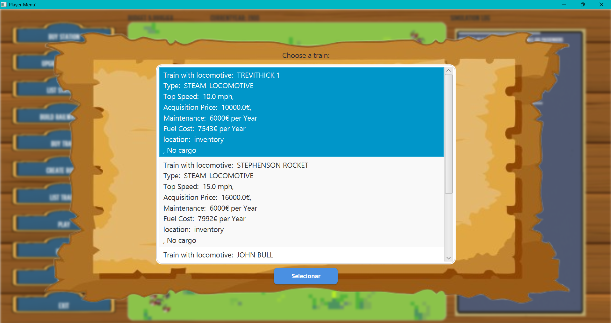

###### Selecting stations built
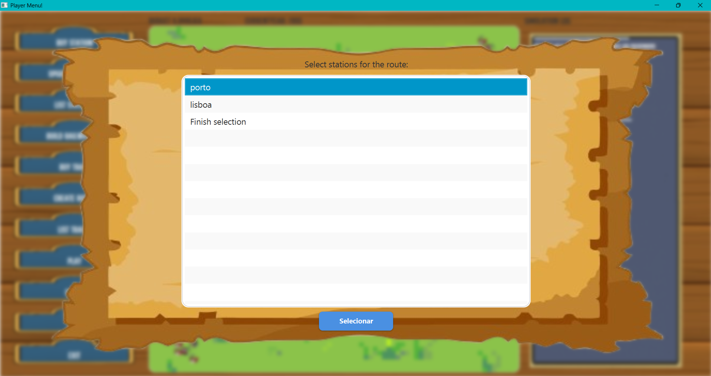

###### Selecting products at station
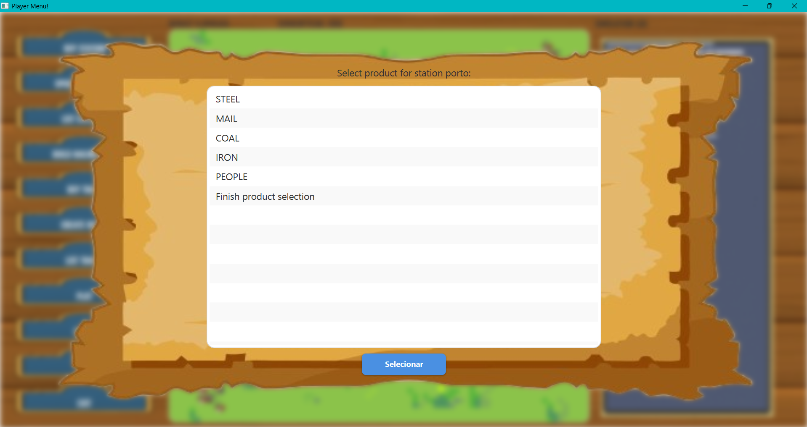


###### Selecting quantities for products to be piked up ate each station
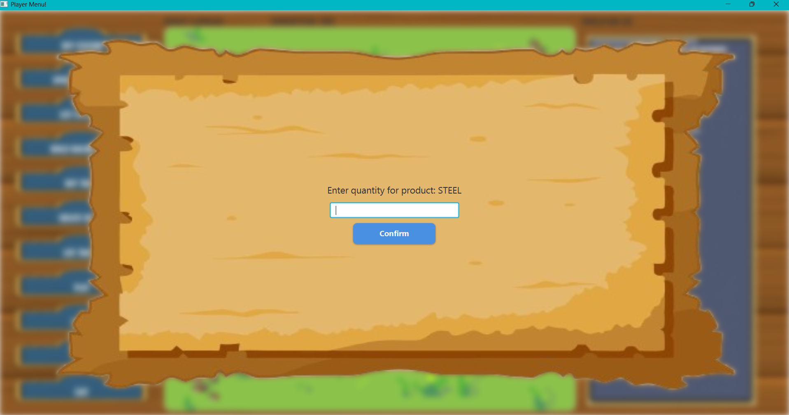

###### Selecting Cargo mode for each station
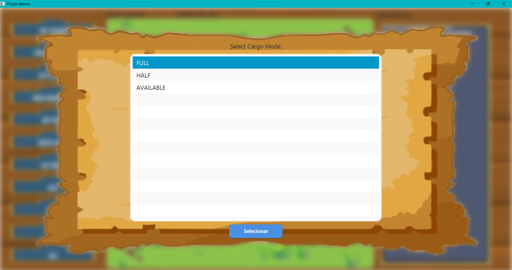

###### Success Message
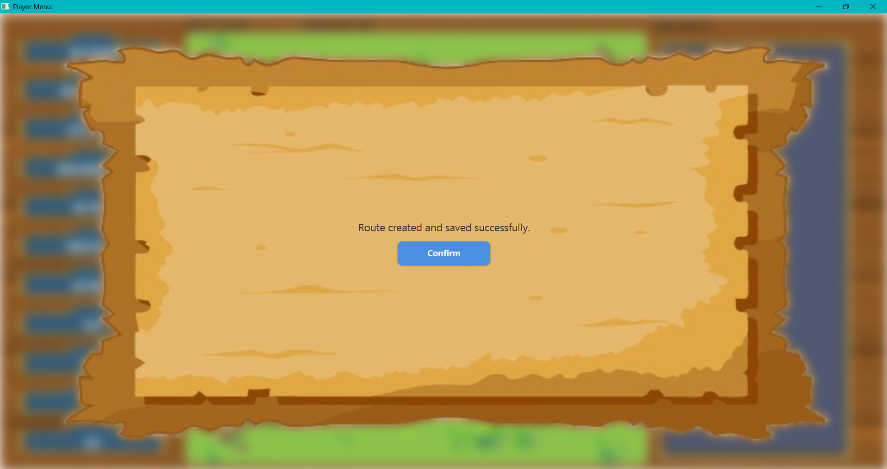


##### WARNINGS

###### Warning for no trains purchased

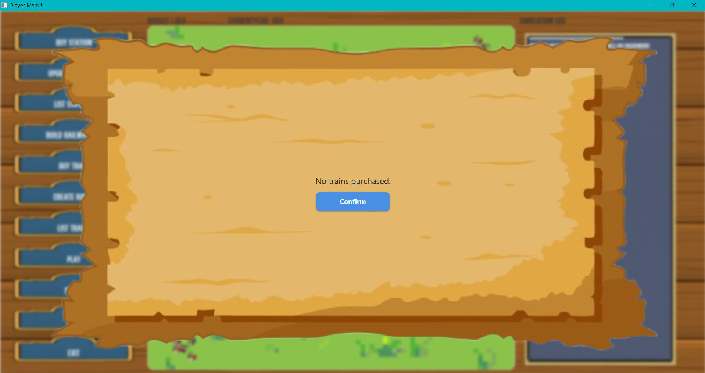


###### Warning for not having built a previous railwayline 

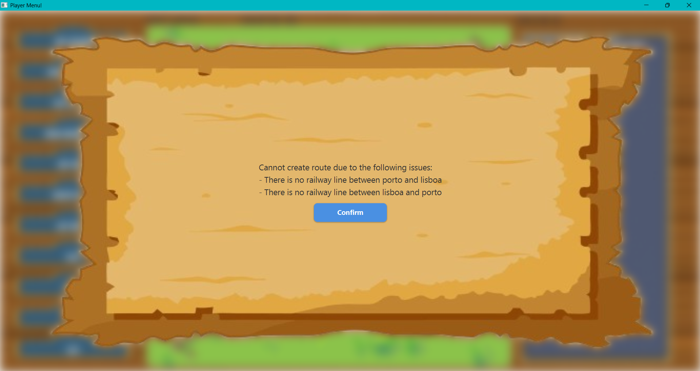

###### Warning for railway type and train type not matching

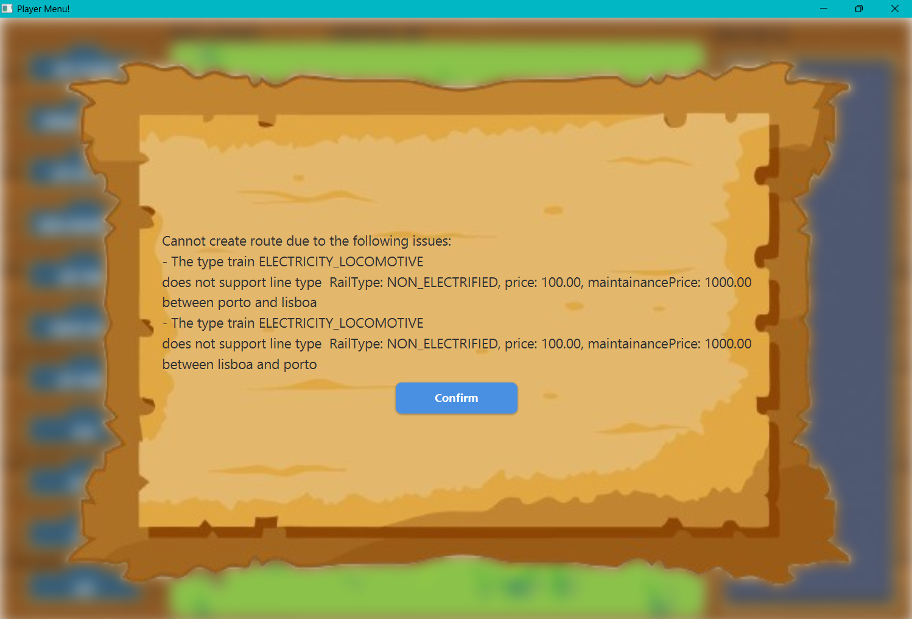

###### Warning for seleting stations 

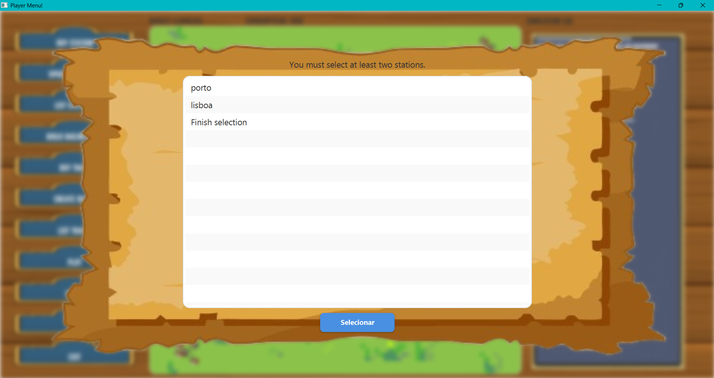

###### Warning for total cargo exceded

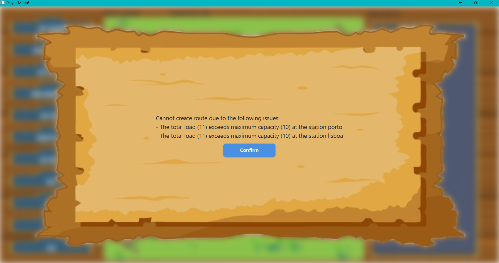

###### Warning for selecting at least 2 stations


## 7. Observations

_In this section, it is suggested to present a critical perspective on the developed work, pointing, for example, to other alternatives and or future related work._