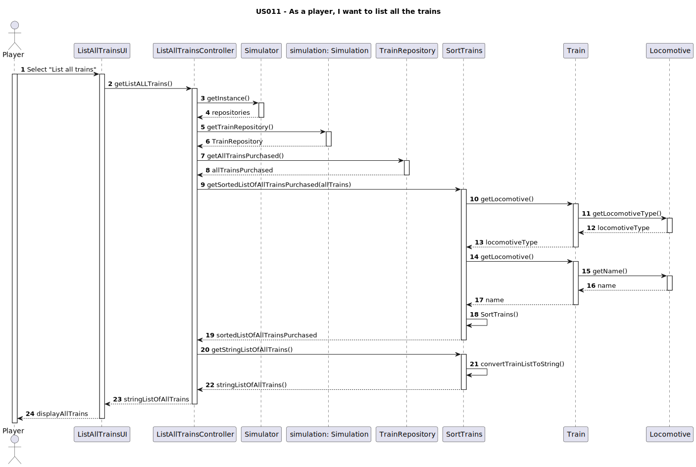

# US011 - As a Player, I want to list all trains.

## 3. Design

### 3.1. Rationale

**The rationale grounds on the SSD interactions and the identified input/output data.**

| Interaction ID | Question: Which class is responsible for... | Answer  | Justification (with patterns)  |
|:-------------  |:--------------------- |:------------|:---------------------------- |
| Step 1/MSG: Select"List all trains"|...accessing the repositories?   |`Simulation ` |Information Expert  |
|   		 |... orchestrating/delegating responsibilities |`ListAllTrainsController`   |Controller       |
|   		 |...obtaining the Train repository? |`Simulation`         |Information Expert       |
|   		 |...obtaining the Train  list?		 |`TrainRepository`             |Pure Fabrication, Information Expert |
|   		 |...get the general Repository?	|`ListAllTrainsController`             |Pure Fabrication           |
|   		 |... instantiating the classthat handles the UI?|`ListAllTrainsUI`             |PureFabrication     |
|   		 |... sort the list of all the trains?	 |`SortTrains`   | Pure Fabrication, Low Coupling  |
|   		 |...covert the list of the train objects to String		 |`SortTrains`     | Information Expert,High Cohesion      |
|   		 |...getting the locomotive information?(name and type)	 |`Train`             |Information Expert       |
|   		 |...having the locomotive information?	 |`Locomotive`   |Information Expert     |
|Step 2/MSG:display allTrains   		 |...display all trains?	 |`ListAllTrainsUI`             |Pure Fabrication        |

### Systematization ##

According to the taken rationale, the conceptual classes promoted to software classes are:

* Train
* Locomotive
* Simulation

Other software classes (i.e. Pure Fabrication) identified:

* ListAllTrainsUI  
* ListAllTrainsController
* TrainRepository
* SortTrains

## 3.2. Sequence Diagram (SD)

## 3.3. Class Diagram (CD)

