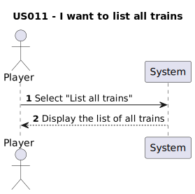

# US011 - As a Player, I want to list all trains.

## 1. Requirements Engineering
### 1.1. User Story Description
This user story describes the functionality for a player to list all the trains in the game. Each train should include relevant information such as the locomotive type and its current cargoes. The list must be grouped by locomotive type and ordered alphabetically by train name. 

### 1.2. Customer Specifications and Clarifications 

### From the specifications document:
> - "Note that electric locomotives require electrified lines." 
> - "The locomotives provide  traction to the composition (train) and can be of different types, namely, run by steam, diesel, and electricity."

#### From the client clarifications:
> **Q:** When we list the trains, do we consider all the trains in the game or just the ones the player has purchased?
>
> **A:** The ones that the player bought.

### 1.3. Acceptance Criteria

### Acceptance Criteria from the client:
**AC1:** The display of trains must include the locomotive and the current cargoes. 
**AC2:** The trains should be grouped by locomotive type and then listed alphabetically by name.
**AC3:** Garantee that the trains are being properly listed

### 1.4. Found out Dependencies
- There is a dependency on[US009-As a Player, I want to buy a locomotive.](../US009),for the player list all the trains, he needs to buy them first.
- There is a dependency on[US010-As I player, I want to assign a selected train to a route](../US010), to list all trains(including the ones that are active) and their current cargo the trains should be assign to a route first.

### 1.5 Input and Output Data

#### Selected Input:
- Select to "list all trains"

#### Output:
- List of all the trains

### 1.6. System Sequence Diagram (SSD)

### 1.7 Other Relevant Remarks
- There are no other relevant remarks.

