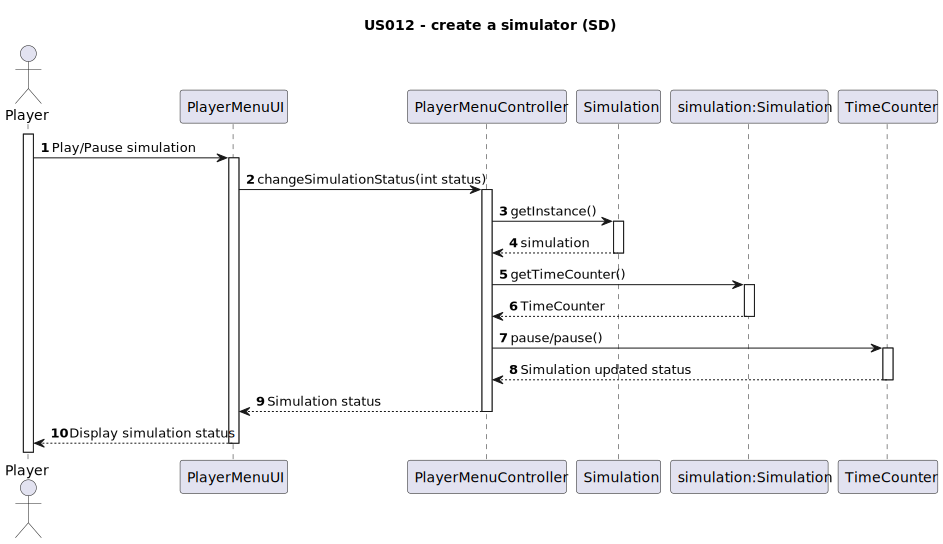
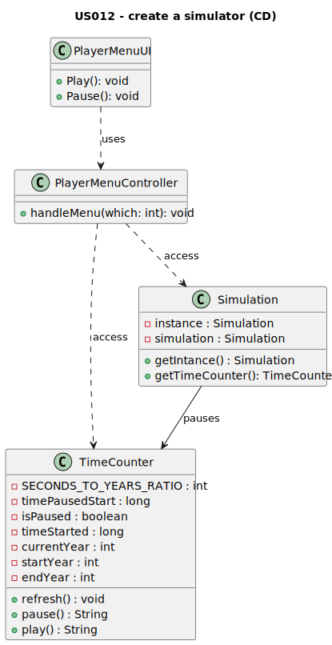

# US012 - As a User, I want to create a simulator that generates cargoes at current stations, automatically, considering the cities and industries that the railway network serves.

## 3. Design

### 3.1. Rationale

**The rationale grounds on the SSD interactions and the identified input/output data.**

| Interaction ID              | Question: Which class is responsible for...    | Answer               | Justification (with patterns) |
|:----------------------------|:-----------------------------------------------|:---------------------|:------------------------------|
| Step 1: display options     | display the menu to pause/play the simulation? | PlayerMenuUI         | PureFabrication               |
| Step 2: get the simulation  | getting the simulation                         | PlayerMenuController | PureFabrication               |
| Step 3: get the timeCounter | getting the timeCounter                        | Simulation           | Creator, InformationExpert    |
| Step 4: change status       | change status                                  | TimeCounter          | InformationExpert             |
| Step 5: display status      | display status                                 | PlayerMenuUI         | PureFabrication               |              

### Systematization ##

According to the taken rationale, the conceptual classes promoted to software classes are:

* Simulation
* TimeCounter

Other software classes (i.e. Pure Fabrication) identified:

* PlayerMenuUI  
* PlayerMenuController

## 3.2. Sequence Diagram (SD)

## 3.3. Class Diagram (CD)

