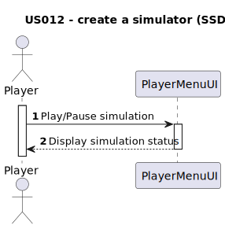

# US012 - As a Player, I want to create a simulator that generates cargoes at current stations, automatically, considering the cities and industries that the railway network serves. 

## 1. Requirements Engineering

### 1.1. User Story Description

As a Player, I want to create a simulator that generates cargoes at current stations, automatically, considering the cities and industries that the railway network serves in order to ease the managment of my station. I want to be implemented as well a button to start and stop the simulation.

### 1.2. Customer Specifications and Clarifications
Nothing mentioned.

### 1.3. Acceptance Criteria
**AC1:** The simulation should be possible to be paused/played.
**AC2:** In order to generate cargo the station need to be connected to cities or industries.
**AC3:** Guarantee that the simulation is properly working with cargoes being automatically generated, taking into account cities and industries.

### 1.4. Found out Dependencies
 -  . The dependency in the map exist because the current station only exist if the map exists and is well set.
 -  . The dependency cames from the the need of existing industries to consume the cargo that will be delivered.
 -  . The dependency cames from the the need of existing cities to consume the cargo that will be delivered.
 -  . The dependency cames from the need to see the connected stations to the current station in order to simulate the cargo.
 -  . The dependency cames from the need of existing the connection between two or more station to calaculate the cargo to be delivered in another station.
 -  . The dependency cames from being one of the interactions of the player with the simulation that generate money.
 
### 1.5 Input and Output Data
Input:
- Current station

Output:
- Simulated cargo.

### 1.6. System Sequence Diagram (SSD)

### 1.7 Other Relevant Remarks

No other relevant remarks.
