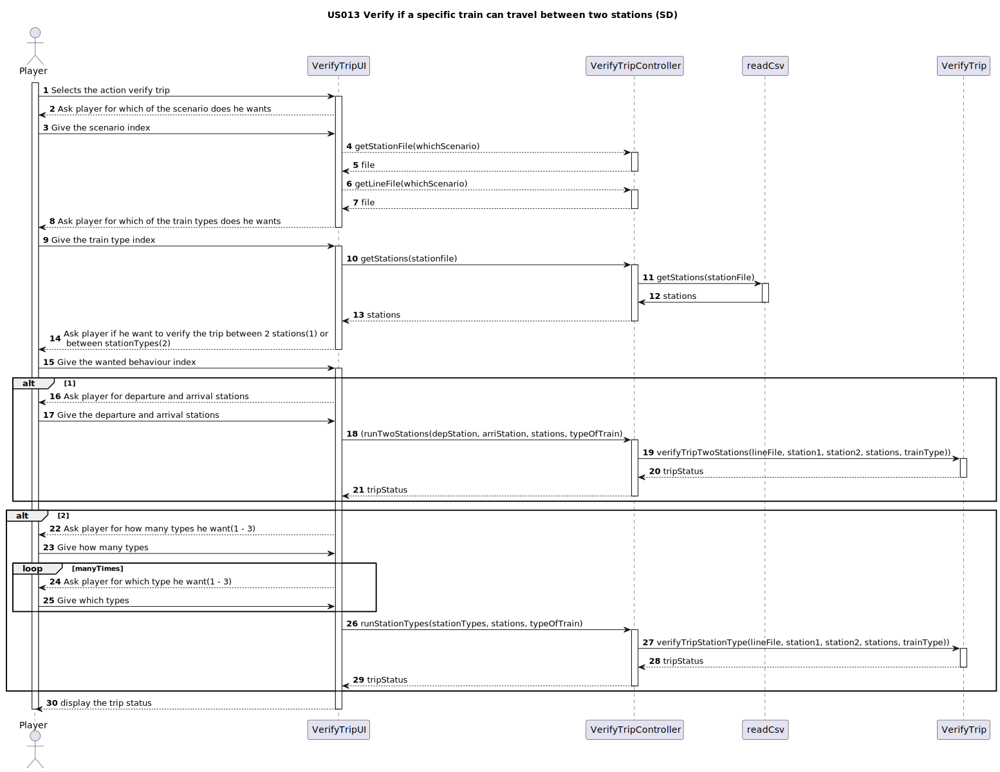
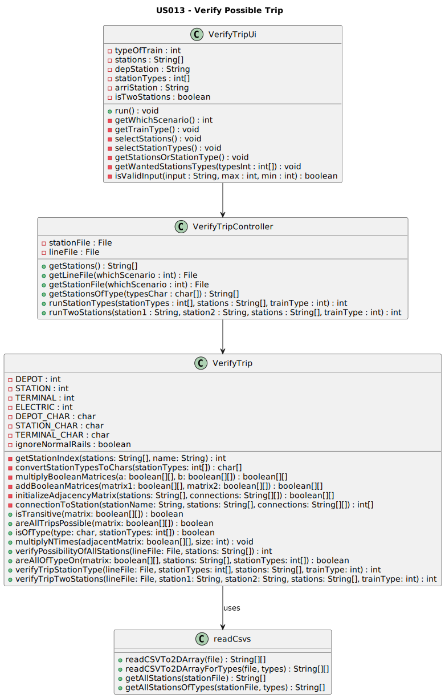

# US013 - As a Player, given a railway with stations and lines connecting pairs of stations, I want to verify if a specific train (steam, diesel, or electric powered) can travel between two stations belonging to the rail network (or from any type of station to another of the same type).

## 3. Design

### 3.1. Rationale

**The rationale grounds on the SSD interactions and the identified input/output data.**

| Interaction ID | Question: Which class is responsible for... | Answer  | Justification (with patterns)  |
|:-------------  |:--------------------- |:------------|:---------------------------- |
| Step 1: List the train   		 |	receive the input to verify trip?						 | `VerifyTripUI`             | Pure Fabrication  |
| 		       |	get the general repository?                                    | `CreateMapController`      | Pure Fabrication         |
|            |	get the train repository?						                           |  `Repository`              | Creator, InformationExpert |
|            |	list the trains?						                                   |  `TrainRepository`         | Creator, InformationExpert |
|            |	display the list of trains?						                         |  `VerifyTripUI`            | Pure Fabrication |
| Step 2: Select the train 		 |	receiving the selected train?					       | `VerifyTripUI`             | Pure Fabrication |
| Step 3: get the train repository    |	get the train repository?						   |  `Repository`              | Creator, InformationExpert |
| Step 4: List the stations   		 |	list the stations?								       | `StationRepository`        | Creator, InformationExpert  |
|            |	list the trains?						                                   |  `TrainRepository`         | Creator, InformationExpert |
| |	display the list of stations?						                                   |  `VerifyTripUI`            | Pure Fabrication |
| Step 5: Select the stations 		 |	receiving the selected stations?					      | `VerifyTripUI`            | Pure Fabrication |
| Step 6: calculate possibility of trip  		 | calculate possibility of trip?							 | `Train`       | InformationExpert      |
| Step 7: Confirmation message  	 |	the delivery of the confirmation message?					      | `VerifyTripUI`            | Pure Fabrication |

### Systematization ##

According to the taken rationale, the conceptual classes promoted to software classes are:

* TrainRepository
* StationRepository
* Train

Other software classes (i.e. Pure Fabrication) identified:

* VerifyTripUI  
* VerifyTripController

## 3.2. Sequence Diagram (SD)

_In this section, it is suggested to present an UML dynamic view representing the sequence of interactions between software objects that allows to fulfill the requirements._

## 3.3. Class Diagram (CD)

_In this section, it is suggested to present an UML static view representing the main related software classes that are involved in fulfilling the requirements as well as their relations, attributes and methods._

