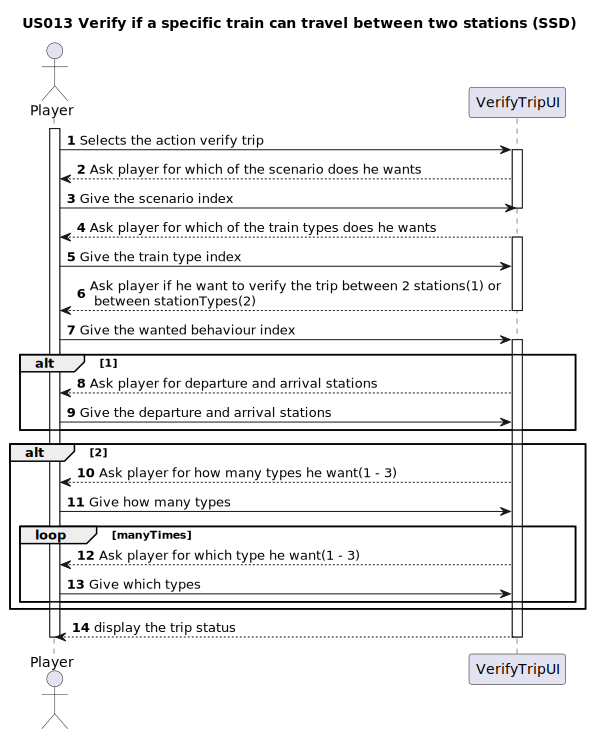

# US013 - As a Player, given a railway with stations and lines connecting pairs of stations, I want to verify if a specific train (steam, diesel, or electric powered) can travel between two stations belonging to the rail network (or from any type of station to another of the same type).

## 1. Requirements Engineering

### 1.1. User Story Description

As a Player, given a railway with stations and lines connecting pairs of stations, I want to verify if a specific train (steam, diesel, or electric powered) can travel between two stations belonging to the rail network (or from any type of station to another of the same type). !complete later!

### 1.2. Customer Specifications and Clarifications 

#### From specification document

#### From the client clarifications
> **Q:** 
>
> **A:** 

### 1.3. Acceptance Criteria

- **AC01**: The player should be able to choose the type of train (steam, diesel or electric) and station type (depot, station or terminal) in real time.
- **AC02**: A visualization of the stations, and the lines connecting stations of this scenario (using, for example, Graphviz or GraphStream packages) should be displayed to the player, where electrified railway lines are drawn with a different color from the others.
- **AC03**: All implemented procedures (except the used for graphic visualization) must use primitive operations only, and not existing functions in JAVA libraries.
- **AC04**: The algorithm(s) implemented to solve this problem should be documented/detailed in the repository documentation (using markdown format).
- **AC05**: There should be at least two stations in the map to call this function.

### 1.4. Found out Dependencies

### 1.5 Input and Output Data

Inputs:
- Train to be assigned.
- Station to depart from.
- Station to arrive.

Outputs:
- Possibility to do the trip (True or False).

### 1.6. System Sequence Diagram (SSD)

### 1.7 Other Relevant Remarks
_Use this section to capture other relevant information that is related with this US such as:  
&nbsp; &nbsp; (i) special requirements;  
&nbsp; &nbsp; (ii) data and/or technology variations;  
&nbsp; &nbsp; (iii) how often this US is held._

Using the Dijkstra algorithm to find to verufy if there is some path between the station and if so it will retreive the shortest one.
