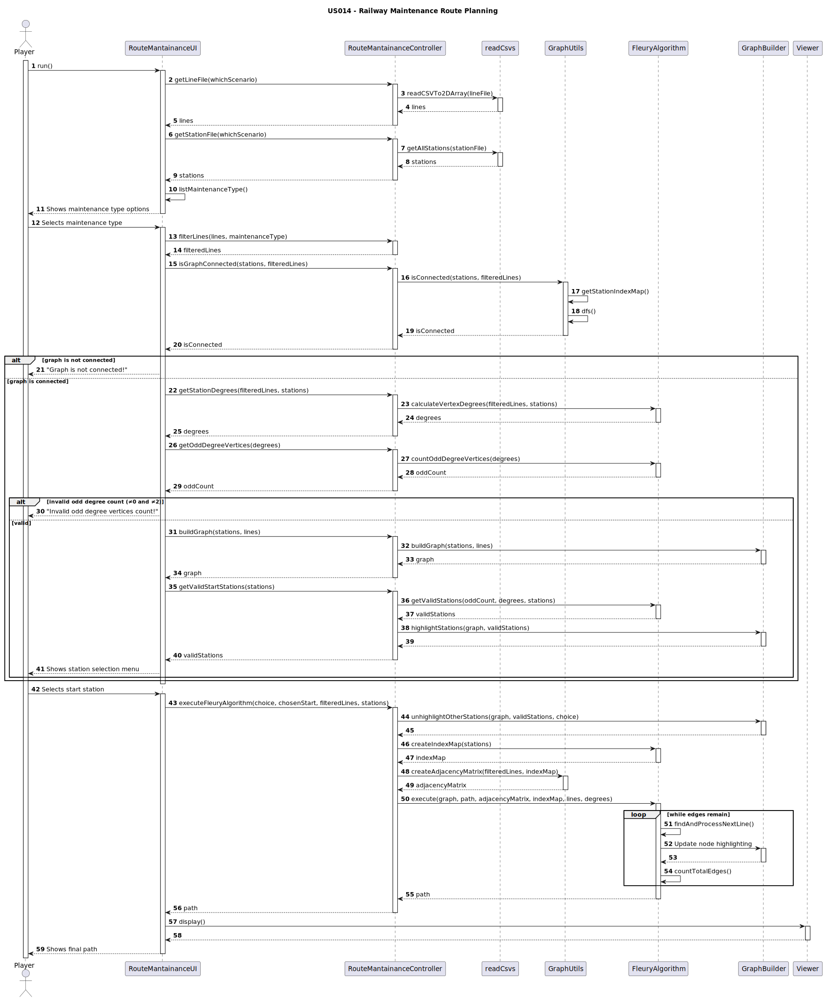
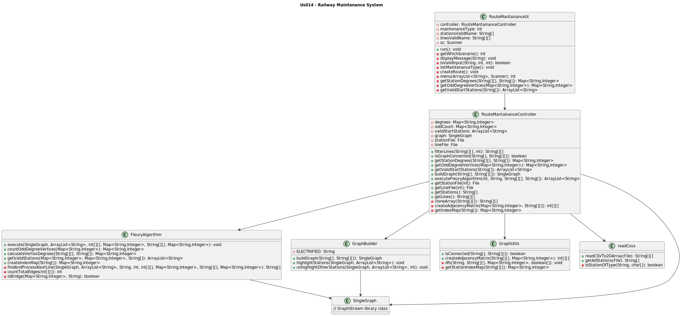

# US014 - As a Player, given a railway with stations and railway lines, I want to see a route that passes once, and only once, by each railway line to carry out maintenance on the lines.

## 3. Design

### 3.1. Rationale

**The rationale grounds on the SSD interactions and the identified input/output data.**

# Class Responsibility Table for US014 - Railway Maintenance Route Planning

| Step                             | Question: Which class is responsible for...   | Answer                       | Justification (with patterns)    |
|----------------------------------|-----------------------------------------------|------------------------------|----------------------------------|
| Step 1: Player runs the UI       | instantiating the class that handles the UI   | `RouteMantainanceUI`         | Pure Fabrication                 |
|                                  | reading the CSV file for lines                | `readCsvs`                   | Information Expert               |
| Step 2: Load stations            | reading station file                          | `readCsvs`                   | Information Expert               |
| Step 3: Display options          | displaying maintenance type options           | `RouteMantainanceUI`         | Pure Fabrication                 |
| Step 4: Selects maintenance type | filtering lines by maintenance type           | `RouteMantainanceController` | Information Expert               |
| Step 5: Check graph connectivity | checking connectivity                         | `GraphUtils`                 | Information Expert, Low Coupling |
|                                  | performing DFS and mapping                    | `GraphUtils`                 | Information Expert               |
| Step 6: Handle invalid graph     | displaying error if not connected             | `RouteMantainanceUI`         | Pure Fabrication                 |
| Step 7: Degree analysis          | calculating station degrees                   | `FleuryAlgorithm`            | Information Expert               |
|                                  | counting odd-degree stations                  | `FleuryAlgorithm`            | Information Expert               |
|                                  | displaying error on invalid count             | `RouteMantainanceUI`         | Pure Fabrication                 |
| Step 8: Valid start stations     | building the graph                            | `GraphBuilder`               | Pure Fabrication, Creator        |
|                                  | identifying valid stations                    | `FleuryAlgorithm`            | Information Expert               |
|                                  | highlighting stations in graph                | `GraphBuilder`               | Pure Fabrication                 |
|                                  | showing selection menu                        | `RouteMantainanceUI`         | Pure Fabrication                 |
| Step 9: Execute Fleury           | unhighlighting others                         | `GraphBuilder`               | Pure Fabrication                 |
|                                  | creating index map                            | `FleuryAlgorithm`            | Information Expert               |
|                                  | creating adjacency matrix                     | `GraphUtils`                 | Information Expert               |
|                                  | executing Fleury algorithm                    | `FleuryAlgorithm`            | Information Expert               |
|                                  | updating node highlighting                    | `GraphBuilder`               | Pure Fabrication                 |
|                                  | counting remaining edges                      | `FleuryAlgorithm`            | Information Expert               |
| Step 10: Display final result    | displaying final path                         | `Viewer`                     | Pure Fabrication                 |
|                                  | sending final result to player                | `RouteMantainanceUI`         | Pure Fabrication                 |

### Systematization ##

According to the taken rationale, the conceptual classes promoted to software classes are:

* **RailwayNetwork** 
* **Station** 
* **RailwayLine** 

Other software classes (i.e. Pure Fabrication) identified:

* **RouteMantainanceUI** 
* **RouteMantainanceController**
* **GraphUtils** 
* **GraphBuilder** 
* **FleuryAlgorithm** 
* **readCsvs** 

## 3.2. Sequence Diagram (SD)

## 3.3. Class Diagram (CD)

_In this section, it is suggested to present an UML static view representing the main related software classes that are involved in fulfilling the requirements as well as their relations, attributes and methods._

