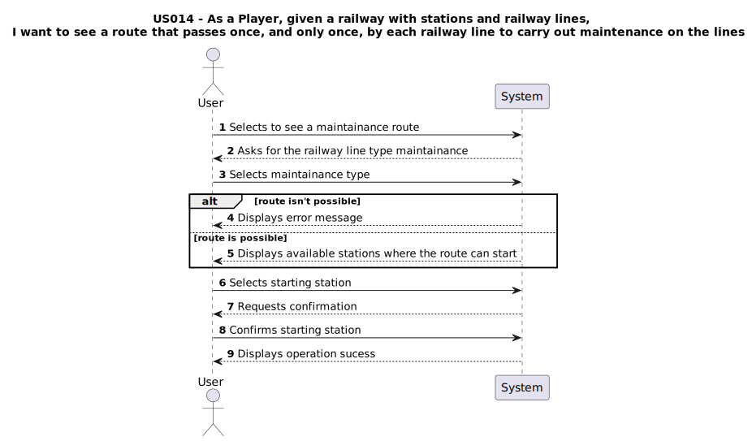

#  US014 - As a Player, given a railway with stations and railway lines, I want to see a route that passes once, and only once, by each railway line to carry out maintenance on the lines.

## 1. Requirements Engineering

### 1.1. User Story Description

As a Player, given a railway with stations and railway lines, I want to see a route that passes once, and only once, by each railway line to carry out maintenance on the lines.

### 1.2. Customer Specifications and Clarifications 

#### From specification document

#### From the client clarifications
> **Q:** "When the maintenance type "electric" is selected, is the system supposed to only traverse electric lines, as long as they are connected?"
>
> **A:** "Yes"

### 1.3. Acceptance Criteria

- **AC01**: The player should be able to choose between the maintenance of all the lines, or only the electrified ones.
- **AC02**: A warning message should be displayed in case it is not possible to get such route. If possible, the station(s) where the route can start, should be displayed so that the player may select it.
- **AC03**: A visualization of the rail network (stations, railway lines) should be displayed to the player (using, for example, Graphviz or GraphStream packages), where electrified railway lines are drawn with a different color from the others.
- **AC04**: All implemented procedures (except the used for graphic visualization) must only use primitive operations, and not existing functions in JAVA libraries.
- **AC05**: The algorithm(s) implemented to solve this problem shouldbe documented/detailed in the repository documentation, using markdown format.

### 1.4. Found out Dependencies

- There is a dependency on [US005 - As a Player, Build a Station](../US005), as there must exist at least one station to display where the route can start.
- There is a dependency on [US007 - As a player, I want to list all stations to select one and view it's details](../US007), as there must exist at least one railway line to define a route.

### 1.5 Input and Output Data

#### Input
  ### Selected Input:
  - Maintainance Type
  - Starting Station

#### Outputs:
- Route

### 1.6. System Sequence Diagram (SSD)

### 1.7 Other Relevant Remarks

_Use this section to capture other relevant information that is related with this US such as:  
&nbsp; &nbsp; (i) special requirements;  
&nbsp; &nbsp; (ii) data and/or technology variations;  
&nbsp; &nbsp; (iii) how often this US is held._
