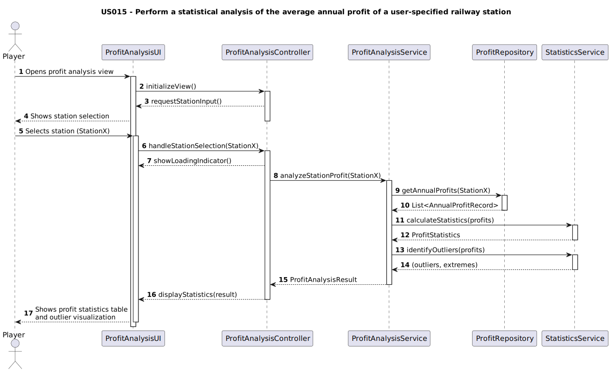

# US015 - As a Player, I want to perform a statistical analysis of the average annual profit of a user-specified railway station. In order to achieve this, a table with key descriptive measures: mean, standard deviation, median, and mode will be generated. Additionally, the analysis aims to identify outlier profits as well as to determine the most and least profitable years.

## 3. Design

> Doesn't apply to MATCP

## 3.2. Sequence Diagram (SD)

