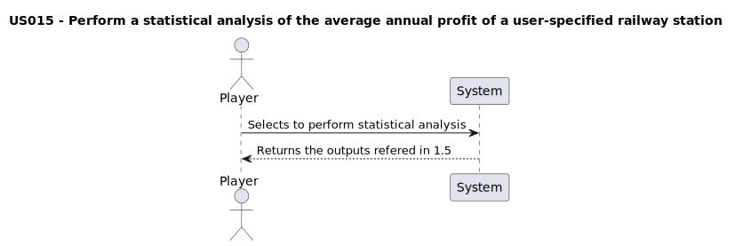

# US015 - As a Player, I want to perform a statistical analysis of the average annual profit of a user-specified railway station. In order to achieve this, a table with key descriptive measures: mean, standard deviation, median, and mode will be generated. Additionally, the analysis aims to identify outlier profits as well as to determine the most and least profitable years.

## 1. Requirements Engineering

### 1.1. User Story Description

- The player must be able to create a statistical analysis taking into account the average annual profit. This will help to identify the most and least profitable years.

### 1.2. Customer Specifications and Clarifications 

#### From specification document
> No specifications found yet.

#### From the client clarifications
> NOT AVAILABLE YET

### 1.3. Acceptance Criteria

**AC1:** Assure that the statistical analysis is being done properly: Identifying the most and least profitable year and generating relevant descriptive measures such has mean, standard deviation, median and mode.

### 1.4. Found out Dependencies

- No other dependencies were found.

### 1.5 Input and Output Data

Inputs:
- "Stations_Data.csv" file

Outputs:
- Mean
- Standard deviation
- Median
- Mode

### 1.6. System Sequence Diagram (SSD)

### 1.7 Other Relevant Remarks

&nbsp; &nbsp; Data and/or technology variations;  
- Programming language: Python
