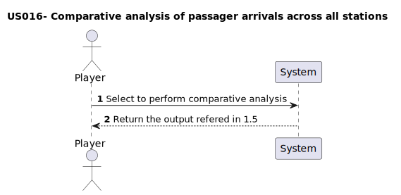

# US016 - As a Player, I want to perform a comparative analysis of passenger arrivals across all stations. To achieve this, a boxplot will be created for each station, displaying the number of arriving passengers using all recorded data. This visualization will facilitate the identification of trends, variations, and anomalies in passenger traffic across different stations.

## 1. Requirements Engineering

### 1.1. User Story Description

US016 - As a Player, I want to perform a comparative analysis of pas-
senger arrivals across all stations. To achieve this, a boxplot will be
created for each station, displaying the number of arriving passengers
using all recorded data. This visualization will facilitate the identifi-
cation of trends, variations, and anomalies in passenger traffic across
different stations.!complete later!

### 1.2. Customer Specifications and Clarifications 

#### From specification document

#### From the client clarifications
> **Q:** 
>
> **A:** 

### 1.3. Acceptance Criteria

- AC1: 
- AC2:

### 1.4. Found out Dependencies

_Identify here any found out dependency to other US and/or requirements._

### 1.5 Input and Output Data

Inputs:
- Stations ID
- Paasagers arrival per day

Outputs:
- Boxplot for each stations

### 1.6. System Sequence Diagram (SSD)

### 1.7 Other Relevant Remarks

_Use this section to capture other relevant information that is related with this US such as:  
&nbsp; &nbsp; (i) special requirements;  
&nbsp; &nbsp; (ii) data and/or technology variations;  
&nbsp; &nbsp; (iii) how often this US is held._
