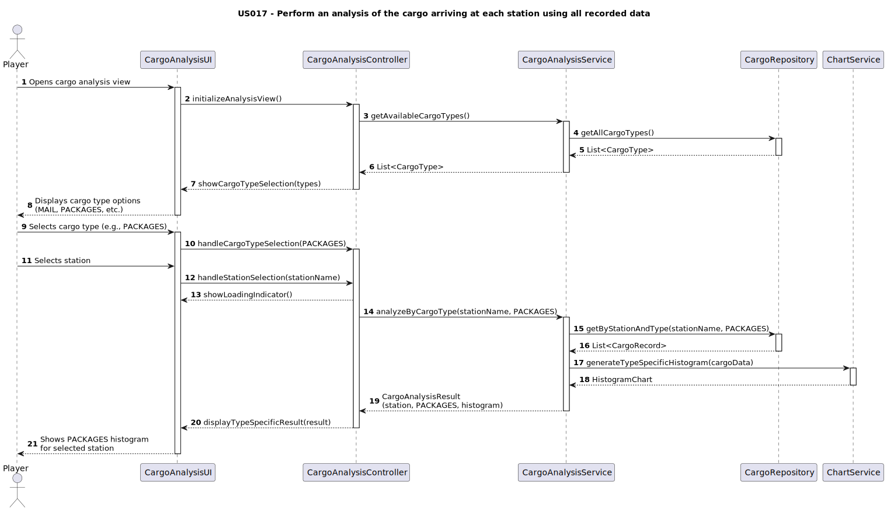

# US017 - As a Player, I want to perform an analysis of the cargo arriving at each station using all recorded data. Given the station’s name and cargo type specified by the user, a histogram will be created to visually represent the distribution of analyzed information, providing insights into cargo patterns.

## 3. Design

> Doesn't apply to MATCP

## 3.2. Sequence Diagram (SD)

