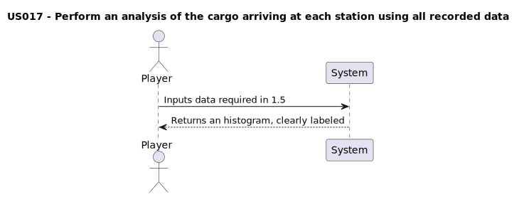

# US017 - As a Player, I want to perform an analysis of the cargo arriving at each station using all recorded data. Given the station’s name and cargo type specified by the user, a histogram will be created to visually represent the distribution of analyzed information, providing insights into cargo patterns.

## 1. Requirements Engineering

### 1.1. User Story Description

- The player must be able to perform an analysis of the cargo arriving at each station. The analysis should provide insights into cargo patterns using a a histogram to provide a visual representation, to represent the information's distribution 

### 1.2. Customer Specifications and Clarifications 

#### From specification document
> No specification found yet.

#### From the client clarifications
> NOT AVAILABLE YET.

### 1.3. Acceptance Criteria

**AC1:** Garantee that the analysis is being done has intended, showing via a histogram the results given.

**AC2:** The histogram must be clearly labeled, including a title, axis labels.

### 1.4. Found out Dependencies

- [US007 - As a players, I want to list all stations to select one and view it's details](../US007/), to collect the information from the stations we must make sure we can list them.

### 1.5 Input and Output Data

#### Inputs:
### Typed inputs: 
- Station's name (String)
- Station cargo (Object)

#### Outputs:
- Histogram

### 1.6. System Sequence Diagram (SSD)

### 1.7 Other Relevant Remarks

&nbsp; &nbsp; Data and/or technology variations;  
- Programming language: Python
