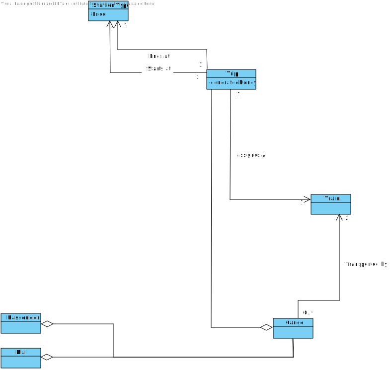

# US018 - As a Player, I want to perform the analysis of train distribution, passengers, and mail across different stations. Using all recorded data, this distribution will be visually represented through three pie charts, providing a clear and comprehensive overview of how these elements are allocated among the stations

## 2. Analysis

### 2.1. Relevant Domain Model Excerpt 

### 2.2. Other Remarks

> No other remarks