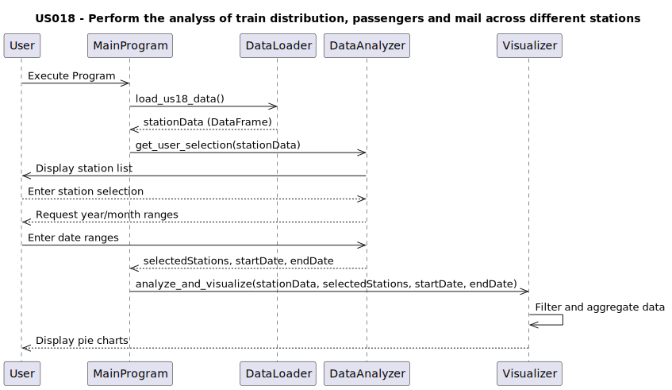
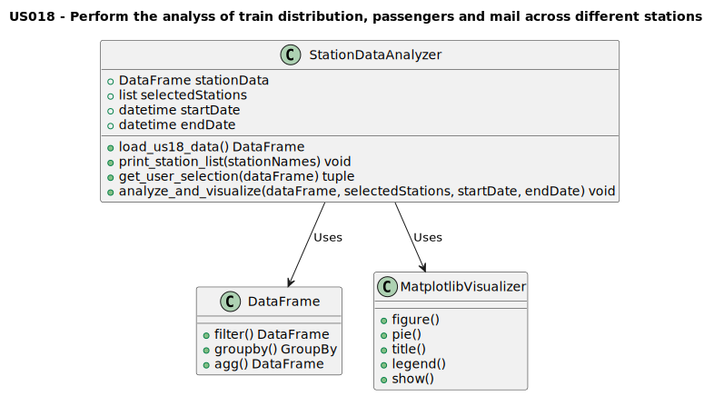

# US018 - As a Player, I want to perform the analysis of train distribution, passengers, and mail across different stations. Using all recorded data, this distribution will be visually represented through three pie charts, providing a clear and comprehensive overview of how these elements are allocated among the stations

## 3. Design

### 3.1. Rationale

> This part doesnt apply to MATCP code.

## 3.2. Sequence Diagram (SD)

## 3.3. Class Diagram (CD)

