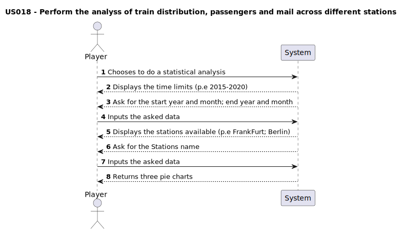

# US018 - As a Player, I want to perform the analysis of train distribution, passengers, and mail across different stations. Using all recorded data, this distribution will be visually represented through three pie charts, providing a clear and comprehensive overview of how these elements are allocated among the stations

## 1. Requirements Engineering

### 1.1. User Story Description

The players must be able to visualize three pie charts with data related to trains distribution; passengers and mail throughout the stations.

### 1.2. Customer Specifications and Clarifications 

#### From specification document
> No specifications found yet

#### From the client clarifications
> No specification found yet

### 1.3. Acceptance Criteria

AC1: The actor must be able to visualize the pie chart with the relevant data. 
AC2: The elements in the pie chart must be correctly named and distinguished.
AC3: The pie charts must be able to be time restricted taking start month and year and end year and month
AC4: There should be an option to choose the exact stations to the analysis

### 1.4. Found out Dependencies

- No other dependencies found 

### 1.5 Input and Output Data

Inputs:
- "Stations_Data.csv" file
- Start year and month
- End year and month
- Stations name

Outputs:
- Three pie charts with: trains distribution; passengers and mail

### 1.6. System Sequence Diagram (SSD)

### 1.7 Other Relevant Remarks

&nbsp; &nbsp; Data and/or technology variations;  
- Programming language: Python 