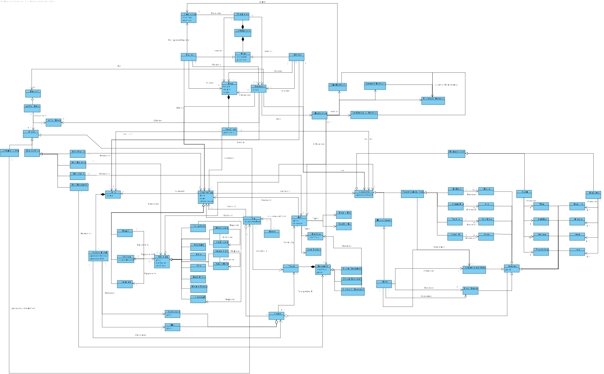

# OO Analysis

The construction process of the domain model is based on the client specifications, especially the nouns (for _concepts_) and verbs (for _relations_) used. 

## Rationale to identify domain conceptual classes
To identify domain conceptual classes, start by making a list of candidate conceptual classes inspired by the list of categories suggested in the book "Applying UML and Patterns: An Introduction to Object-Oriented Analysis and Design and Iterative Development". 

### _Conceptual Class Category List_

**Business Transactions**

* **"Create Map"** : The **editor** is going to enter a name and a size for a bidimensional map.
* **"Add an industry"** : User as the **editor** is going to select which industry he was going to want to build from a list of possibilities, the type of product that it produces and is going to give position in which the industry should be in.
* **"Add a city"** : User as the **editor** is going to ..
* **"Create a scenario"** : User as the **editor** is going to..
* **"Build station"** : User as the **player** is going to..
* **"Upgrade station"** : User as the **player** is going to..
* **"List all stations"** : User as the **player** is going to..
* **"Build railway between stations"** : User as the **player** is going to..
* **"Buy a locomotive"** : User as the **player** is going to..
* **"Sign a train to a route"** : User as the **player** is going to..

---

**Transaction Line Items**

* 

---

**Product/Service related to a Transaction or Transaction Line Item**

* 

---

**Transaction Records**

* 

---  

**Roles of People or Organizations**

* **Editor** -> His role is to create the map and the scenario in which the simulation will take place.
* **Player** -> His role is to choose the scenario and map and play the simulation(manage the rail network, trains and cargoes).

---

**Places**

* **Cities**
* **Industries**
* **Stations**
* **Railroads**

---

**Noteworthy Events**

* **Change of time restrictions**, they will change the availability of some types of locomotives(for trains), type of products produced(industry) and buildings(to stations)
* **Change of historical restrictions**, they will control the variance of the demand for some products, changing also the price of them.
* **Change of behaviour of ports**, they affect the way the port behaves, which product it will export and import.
* **Technological restrictions**, they affect the type of tecnologies that can be implemented by the locomotives and by the industries

---

**Physical Objects**

* **Owned trains**
* **Cities in the map**
* **Stations in the map**
* **Industry in the map**
* **Cargoes**

---

**Descriptions of Things**

* 

---

**Catalogs**

* 

---

**Containers**

* **Carriage**
* **Cargo**
* **Silo**(upgrade building to station)

---

**Elements of Containers**

* **Elements of Carriage**: cargo
* **Elements of Cargo**: produced itens from the industries, passagers and mail
* **Elements of Silo**: Stores wool, vegetables and coffee

---

**(Other) Organizations**

* None

---

**Other (External/Collaborating) Systems**

* None

---

**Records of finance, work, contracts, legal matters**

* None

---

**Financial Instruments**

* None

---

**Documents mentioned/used to perform some work**

* None

---

## Rationale to identify associations between conceptual classes

An association is a relationship between instances of objects that indicates a relevant connection and that is worth of remembering, or it is derivable from the List of Common Associations: 

* **_A_** is physically or logically part of **_B_**
* **_A_** is physically or logically contained in/on **_B_**
* **_A_** is a description for **_B_**
* **_A_** known/logged/recorded/reported/captured in **_B_**
* **_A_** uses or manages or owns **_B_**
* **_A_** is related with a transaction (item) of **_B_**
* etc.

| Concept (A) 		|  Association   	|  Concept (B) |
|----------	   		|:-------------:		|------:       |
| C1  	| verb1    		 	| C2  |
| Simulator      | has a                       | User                |
| Player           | is a                    | User             |
| Player           | pause/play                    | Simulation             |
| Player           | builds                        | StationType             |
| Player           | simulate                      | Scenario             |
| Player           | selects                    | Map             |
| Editor         | is a                      | User             |
| Editor         | creates                        | Map                |
| Editor         | creates                        | Scenario                |
| Editor         | creates                        | Industry                |
| Editor         | creates                        | City                |
| Map            | has                           | location                |
| Actual Budget         | is a                    | Budget                |
| Actual Budget         | extracted of            | Initial Budget                |
| Actual Budget         | extracted of            | Event           |
| Scenario       | influences                     | Map               |
| Scenario       | has a                      | Restriction               |
| Scenario       | defines | Initial Bugdet|
| Restriction       | influences                     | Locomotive               |   
| Restriction       | influences                       | Industry               |   
| Restriction       | influences                       | Rail               |   
| Restriction       | influences                       | Building               |
| TimeRestriction       | is a                       | Restriction               |
| HistoricalRestriction       | is a                       | Restriction               |
| TechnologicalRestriction       | is a                       | Restriction               |
| Buy Rail         | is an       | Event                |
| Buy StationType         | is an       | Event                |
| Buy Locomotive         | is an       | Event                |
| Buy Building         | is an       | Event                |
| Trip         | is an       | Event                |
| Buy Rail         | acquires       | Rail                |
| Buy StationType         | acquires       | Station                |
| Buy Locomotive         | acquires       | Locomotive                |
| Buy Building         | acquires       | Building                |
| City           | has                           | House Blocks           |
| City           | produces                           | Passagers           |
| City           | produces                           | Mail           |
| City           | consumes                           | Cargo           |
| Depot             | is a       | StationType                |
| Station           | is a       | StationType                |
| Terminal           | is a       | StationType                |
| Depot         | upgrade to     | Station               |
| Station       | upgrade to     | Terminal              |
| Depot             | upgraded with       | Building                |
| Station           | upgraded with       | Building                |
| Terminal          | upgraded with       | Building                |
| Telephone          | is a          | Building                |
| Telegraph          | is a         | Building                |
| Café               | is a         | Building                |
| Customs            | is a          | Building                |
| Hotel              | is a         | Building                |
| Silo               | is a         | Building                |
| Post Office        | is a          | Building                |
| Liquid Storage     | is a         | Building                |
| Trip           | start at                           | StationType           |
| Trip           | ends at                           | StationType           |
| Trip           | assignes a                           | Train           |
| Trip           | aggregates                           | Cargo           |
| Train           | has a                           | Locomotive           |
| Train           | travels by                      | Rail           |
| DeiselLocomotive           | is a                           | Locomotive           |
| SteamLocomotive           | is a                           | Locomotive           |
| EletricityLocomotive           | is a                           | Locomotive           |  
| EletricityLocomotive           | requires                           | Eletrical           |
| Single Rail           | is a                      |  Rail          |
| Double Rail           | is a                      |  Rail          |
| Rail           | type                      |  Eletrical          |
| Rail           | type                      |  Non-Eletrical          |
| Cargo                         | is transported by               | Train           |
| Cargo            | aggregates                             |    Product     |
|        Cargo                   | aggregates                             |       Mail     |
|           Cargo           | aggregates                             |      Passagers      |
| Primary Sector                     | is a                             | Industry           |
| Transforming Sector                | is a                             | Industry           |
| Mixed Industry                     | is a                             | Industry           |
| Farm                     | is a                                 | Primary Sector           |
| Mine/ore                     | is a                             | Primary Sector           |
| Steel Mill                     | is a                           | Transforming Sector                           |
| Automobile                     | is a                           | Transforming Sector                           |
| Bakery                     | is a                               | Transforming Sector                           |
| Textile                     | is a                              | Transforming Sector                           |
| Ports                     | is a                                | Mixed Industry |
| Farm                         | produces                                 | Wool            |
| Farm                         | produces                                 | Rubber            |
| Farm                         | produces                                 | Vegetables            |
| Farm                         | produces                                 | Coffe           |
| Mine/ore                     | produces                             | Bauxite           |
| Mine/ore                     | produces                             | Nitrate            |
| Mine/ore                     | produces                             | Coal            |
| Mine/ore                     | produces                             | Iron            |
| Steel Mill                   | produces                           | Steel                           |
| Automobile                   | produces                           | Car                           |
| Bakery                       | produces                               | Bread                           |
| Textile                      | produces                              | Clothing                           |
| Port                         | produces                              | Intermediary  Product           |
| Port                         | produces                              | Final Product           |
| Port                         | consumes                           |  Intermediary Product           |
| Port                         | consumes                              | Final Product           |
| Wool            |  is a                             |  Product           |
| Vegetables            |  is a                             |  Product           |
| Coffe           |  is a                             |  Product           |
| Rubber            |  is a                             |  Product           |
| Bauxite           |  is a                             |  Product           |
| Nitrate            |  is a                             |  Product           |
| Coal            |  is a                             |  Product           |
| Iron            |  is a                             |  Product           |
| Steel            |  is a                             |  Product           |
| Car            |  is a                             |  Product           |
| Bread            |  is a                             |  Product           |
| Clothing            |  is a                             |  Product           |
|  Product     | Delivered to                           | Transforming Sector           |
|  Product     | Delivered to                              | Port            |
| Intermediary Product     | Delivered to                              | Port            |
| Intermediary Product     | Delivered to                              | Port            |

## Domain Model

**Do NOT forget to identify concept atributes too.**

**Insert the Domain Model diagram in SVG format below.**

