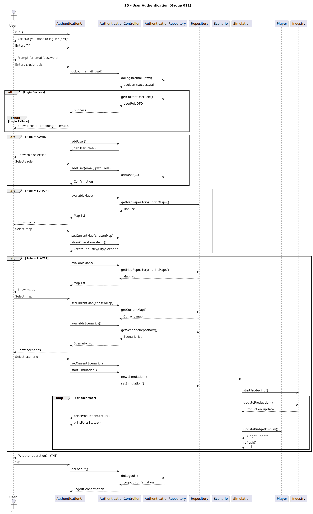
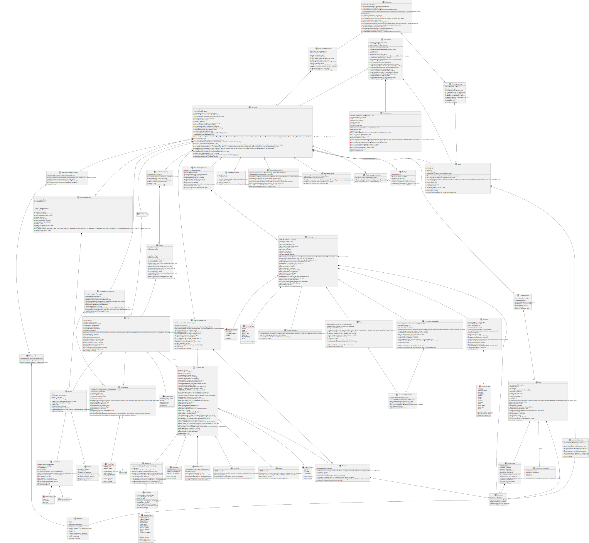

# OO Design

### Application Overview

The train simulation is built with a clear three‐layered architecture (UI, Controllers, Domain) following an MVC‐style pattern. **User Interface (UI)** classes handle all user interactions and rendering (e.g. menu screens, form input). **Controller** classes implement the application logic for each use case, acting as the “brains” between the UI and the domain. They receive UI input, invoke domain operations, and return results. Domain classes model the core business entities (Maps, Scenarios, Cities, Industries, Stations, Lines, Trains, etc.) and encapsulate persistence and validation rules. This separation enforces separation of concerns: the UI never manipulates domain objects directly, but only through controller methods. In other words, controllers decouple the presentation layer from the business logic. For example, when a player requests to **buy a locomotive**, the `BuyLocomotiveUI` will invoke `BuyLocomotiveController`, which in turn creates or updates a `Locomotive` object in the domain (if budget permits). This aligns with standard MVC ideas: “the controller layer contains the application logic … acting as an interface between the view and model layers”. Overall, this layered MVC approach makes the system modular (UI vs. business logic vs. data) and testable, as each component has a well-defined responsibility.

#### OBS:\
- **_{MenuX}UI_ :** represents an instance of a UI class that presents several menu options and/or features to the user
- **_{NameOfUC}UI_ :** represents an instance of a specific UI class for the realization of a given use case / user story
- **_{NameOfUC}Controller_ :** represents an instance of a Controller class responsible for decoupling the UI from the Domain classes
- **_methodX(...)_ :** abstraction representing the invocation a public method of {NameOfUC} Controller
- **_methodY(...)_ :** abstraction representing the invocation a public method of any class belonging to the domain
- In the remaining sequence diagrams, focus only focus on the content of the **_loop_**

The execution of some functionalities by users must be preceded and verified by an authorization mechanism based on users' roles.
This verification can be carried out as follows:

User authentication is enforced throughout the application. Per the specification, “All those who wish to use the application must be authenticated”. An `AuthenticationUI` prompts for login credentials, which are passed to the `AuthenticationController`. The **controller** delegates to an `AuthenticationRepository` that performs the actual login/logout. On successful doLogin(email,password). The `AuthenticationController` then checks UserSession.isLoggedIn() or isLoggedInWithRole(role) to enforce role-based access. For example, only users with the “EDITOR” role (created by addUser) may access map editing features. The repository’s session is queried (e.g. `getCurrentUserSession().getUser().getUserRole()`) to determine the current user’s role. All **controller** methods should first verify the user’s session is active, ensuring that no action can be performed unless `isLoggedIn()` is true. This also decouples authentication from business logic: **controllers** rely on AuthLib-provided interfaces (e.g. existsUser, doLogin, doLogout) and session checks rather than implementing their own security mechanisms.

## Class Diagram

