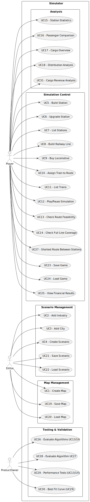

# Use Case Diagram (UCD)

# User Stories

| UC/US | Description                                                   |
|:------|:--------------------------------------------------------------|
| US01  | [Create a Map](../US001/)                                     |
| US02  | [Add Industry](../US002/)                                     |
| US03  | [Add City](../US003/)                                         |
| US04  | [Create a Scenario](../US004/)                                |
| US05  | [Build Station](../US005/)                                    |
| US06  | [Upgrade Station](../US006/)                                  |
| US07  | [List all stations and see details of selected one](../US007/)|
| US08  | [Build railway line](../US008/)                               |
| US09  | [Buy a Train](../US009/)                                      |
| US10  | [Assign a train to a route](../US010/)                        |
| US11  | [List all trains](../US011/)                                  |
| US12  | [Create a Simulator](../US012/)                               |
| US13  | [Verify train connectivity](../US013/)                         |
| US14  | [Plan maintenance route across railway lines](../US014/)      |
| US15  | [Analyze average annual profit of a station](../US015/)       |
| US16  | [Compare passenger arrivals across stations](../US016/)       |
| US17  | [Analyze cargo arriving at a station](../US017/)              |
| US18  | [Visualize train, passenger, and mail distribution](../US018/)|

