# 🚂 RailRoad Simulation — User Manual
**"Build, Manage, and Conquer the Rails!"**  
**By Bernardo Correia, Alexandre Henrique, Eduardo Vasconcelos & Rita Oliveira**

---

## 🌟 Introduction

Welcome to **RailRoad Simulation**, a powerful and immersive experience where you become the architect of a vast rail network.  
In this simulation, you can take on two distinct roles:

- 👷 **Editor** — Design maps, industries, cities, and create gameplay scenarios
- 🎮 **User** — Play through scenarios, build stations, manage trains, and optimize your rail empire

Whether you’re crafting intricate worlds or conquering logistical challenges, this manual will guide your journey.

---

## 📚 Table of Contents

1. [📘 Glossary](#-glossary)
2. [🖥️ System Overview](#️-system-overview)
    - [🎮 User](#user)
    - [👷 Editor](#editor)
3. [🚀 First Immediate Actions](#-first-immediate-actions)
    - [🗺️ Map Creation](#map-creation)
    - [⚡ Scenario Creation](#scenario-creation)
4. [🧰 Features](#features)
5. [⌨️ System Requirements](#️-system--program-requirements)
6. [❓ FAQ](#faq)
7. [🛠️ Troubleshoot](#troubleshoot)
8. [📧 Contact](#contact)

---

## 💾 Glossary
For detailed definitions of key terms, visit our [Glossary](docs/system-documentation/global-artifacts/glossary.md)

---

## 🖥️ System Overview

### 🎮 User

**Outside the Simulation:**
- 🗺️ Choose and launch simulations
  - 💾 Load saved simulations
  - 📂 Import custom scenarios

**Inside the Simulation:**
- 🏗️ Create and upgrade stations
  - 🚂 Purchase and assign locomotives
  - 📊 View and manage routes and trains
  - ⏱️ Run and pause simulations
  - 💾 Save progress anytime

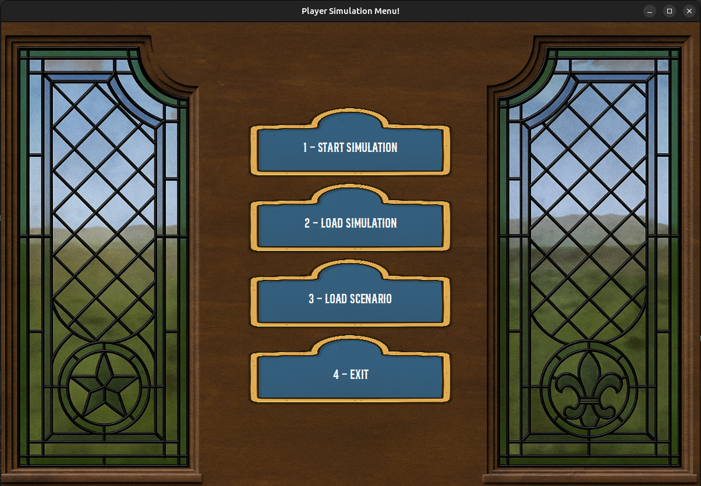

Gameplay begins with selecting a scenario. You’ll receive an initial budget, which grows as trains complete trips. Money enables you to expand operations—buy new trains, upgrade stations, and conquer the rails!

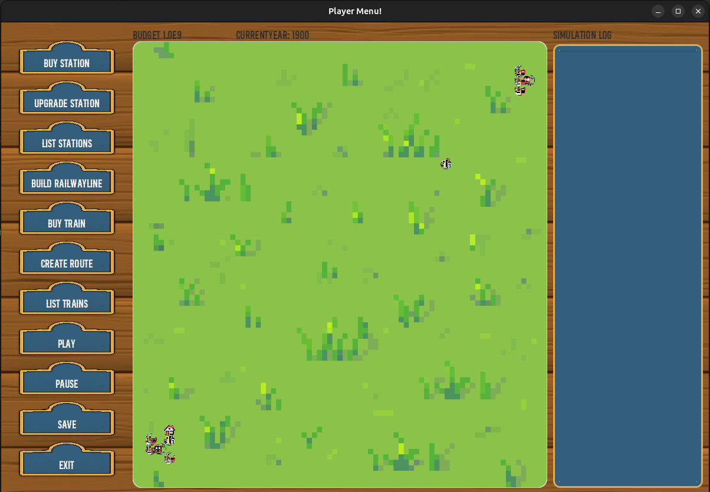
On top you can see your budget and the year you are currently in.

#### 🛒 **Buy Stations**  
Three station types available:  

| Type         | Area of Effect | Upgrade Path |
|--------------|----------------|--------------|
| **Depot**    | 3x3 radius     | → Station    |
| **Station**  | 4x4 radius     | → Terminal   |
| **Terminal** | 5x5 radius     | (Max level)  |

**How to purchase:**  
1. Select station type:  
   - `1` Depot  
   - `2` Station  
   - `3` Terminal  
2. Enter coordinates: `X Y`  
3. Enter name (or accept suggested name) [Can't use numbers here] 
4. `CONFIRM` to place  

📍 *Pro Tip: Place terminals near high-traffic areas for maximum efficiency*

[ALERT] When building stations you shall decide which is the center, since the radius propagates throught the center choice.

---

#### ⬆️ **Upgrade Stations**  
**Available upgrades:**  
- **Buildings**:  
  🏤 Telegraph Office → Telephone Exchange  
  🏛️ Customs House 
  📮 Post Office  
  🏚️ Silo 
  🛢️ Liquid Storage 

**Upgrade process:**  
1. Select station from list  
2. Choose upgrade type. 
3. a. Structure (Depot→Station→Terminal)
3. b. Buildings (Select from menu)

#### 📋 **List Stations**  
View all your stations with detailed information

1. Choose the station you want to upgrade

### 🛤️ Railway Operations  

#### 🔨 **Build Railway Lines** 

  Connect stations to define train paths

  1. Choose two distint stations
  2. Choose the type of railway line and technology

- **Buy a locomotive**
  Choose the train that will deliver your cargo

  1. Choose a train from the available list
  2. Confirm

- **Assign routes**  
  Establish predefined paths for cargo delivery
  1. Choose a train
  2. Choose as many stations in order, as you like
  3. For each station, choose a product, or more and their quantity
  4. Choose cargo mode

- **List trains**  
  View all active locomotives
  1. Choose to the train to view

### ⏯️ Simulation Controls  

| Command  | Action                 | 
|----------|------------------------|
| ▶️ Play  | Start simulation clock | 
| ⏸️ Pause | Freeze simulation      | 
| 💾 Save  | Create restore point   | 
| 📊 Stats | View financial reports | 

---

### 👷 Editor

**Core Capabilities:**
- 🗺️ Create and name custom maps
  - 🏙️ Add cities and industries
  - ⚖️ Define scenario rules and budgets
  - 📦 Set technology, product, and trade restrictions
  - 💾 Load and save maps and scenarios

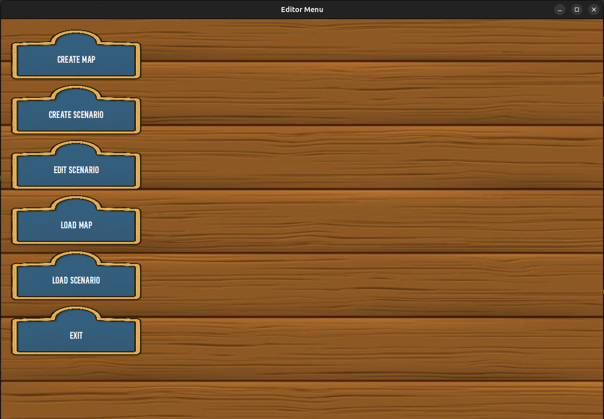

As an Editor, you establish the world and its rules. You must first create a map, then build a scenario using that map. Once saved, scenarios can be played at any time by Users.

---

## 🚀 First Immediate Actions

### 🗺️ Map Creation

To begin, log in as an **Editor**. You will be prompted to provide:

1. **Name your Map**

2. **Set your map dimensions** (length × height)

3. **Choose your map scale** (e.g., kilometers per block)

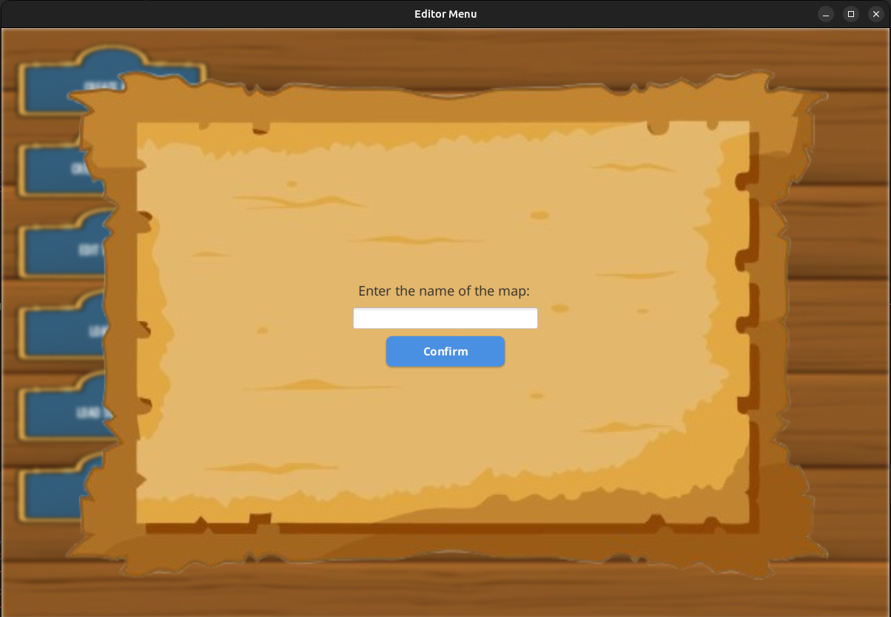  
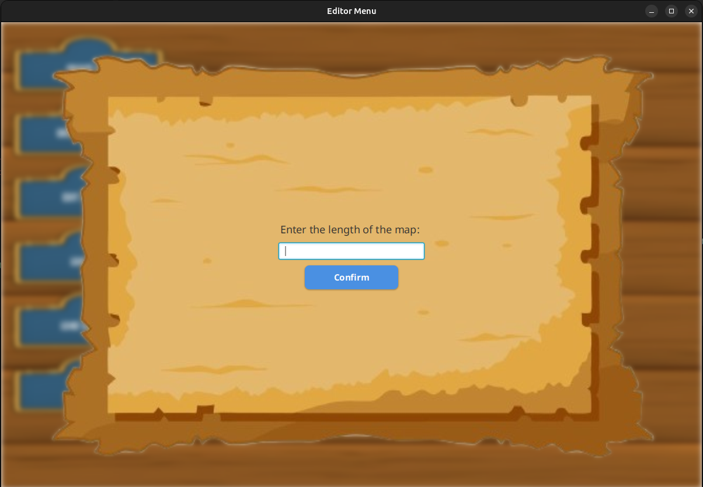  
  

Once saved, this map becomes the foundation for your future scenarios.

---

### ⚡ Scenario Creation

Scenarios act as the "rulebook" for gameplay. Once a map is created, you’ll define:

#### Scenario Creation Steps:

1. 📛 **Name** your scenario

2. 🗺️ **Select a map**

3. 💰 **Set a starting budget**

4. ⛔ **Define restrictions**

Restrictions determine technologies, production behaviors, and trade policies.  
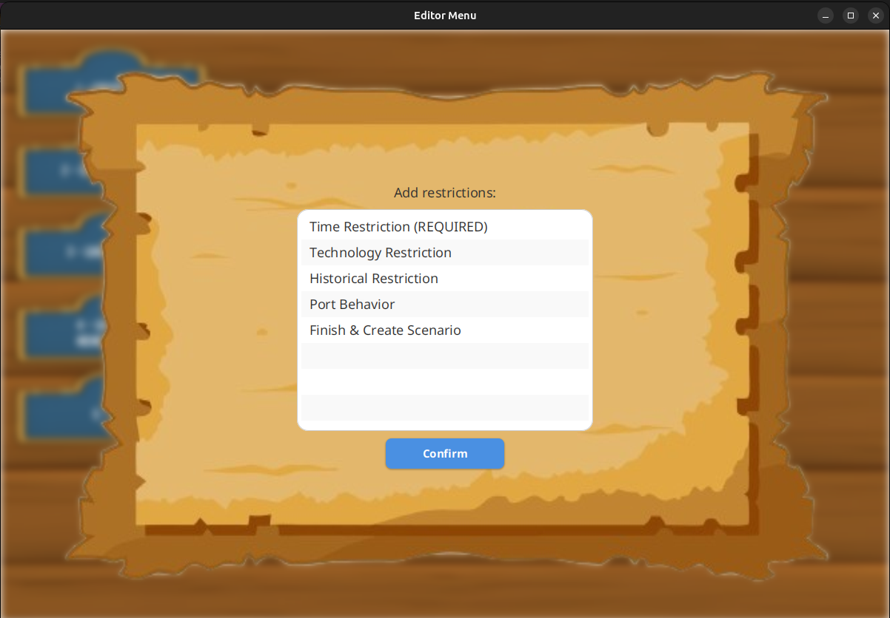

#### Scenario Restrictions

| Type                 | Description                                                                                                       |
|----------------------|-------------------------------------------------------------------------------------------------------------------|
| ⏳ **Temporal**       | Limits technologies to historical timeframes (e.g., 1920–2000) and defines the time simulation will take place in |
| 🔧 **Technology**    | Enables/disables specific technologies and products                                                               |
| 🧪 **Product**       | Modifies product production speeds and prices                                                                     |
| 🚢 **Port Behavior** | Controls import/export behavior                                                                                   |

You may also use pre-defined *historical restrictions*.

##### Scenario UI Samples
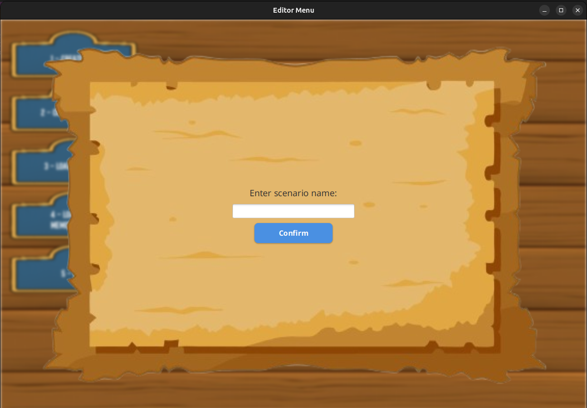  
  
  
  
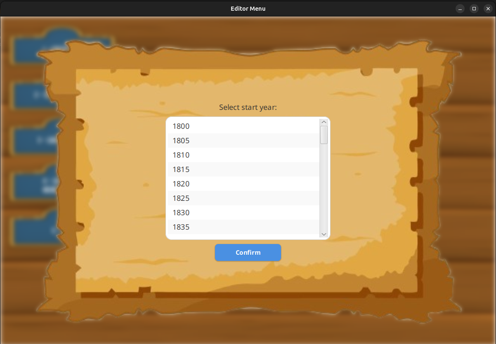  
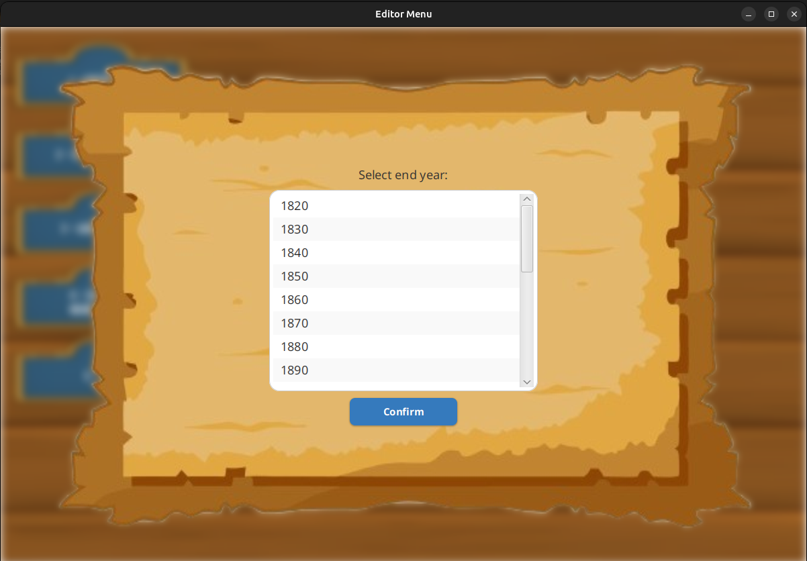  
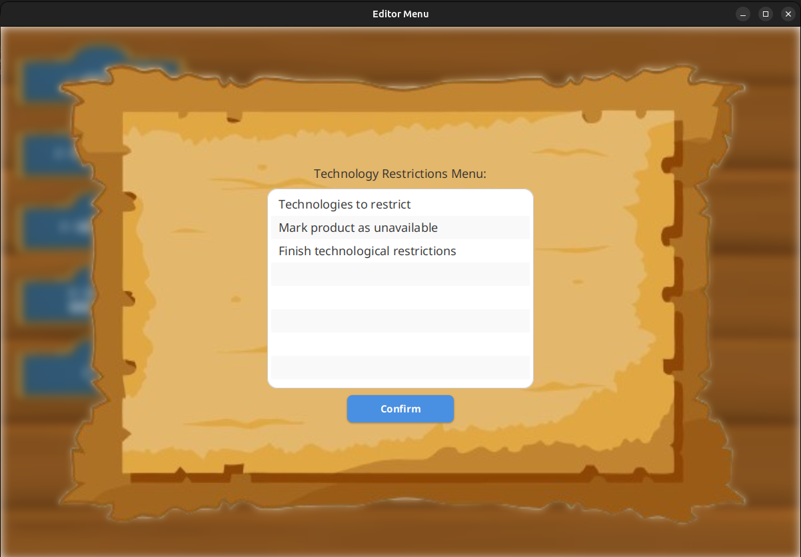  
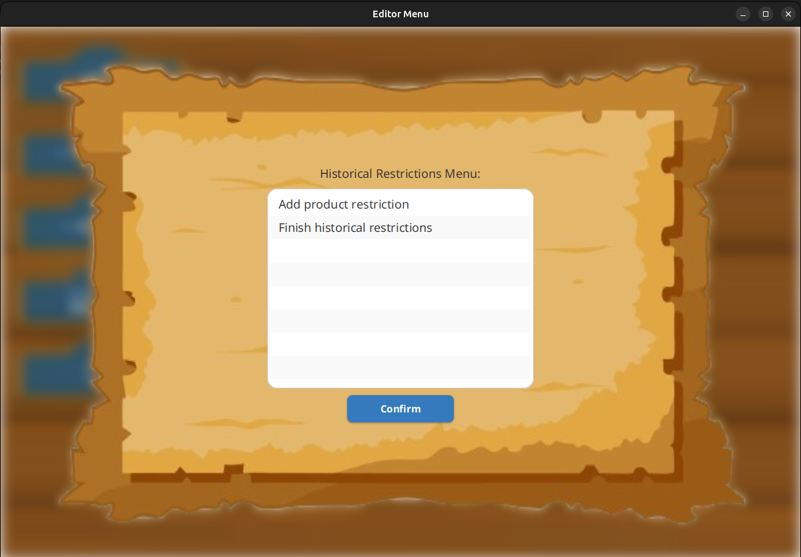  
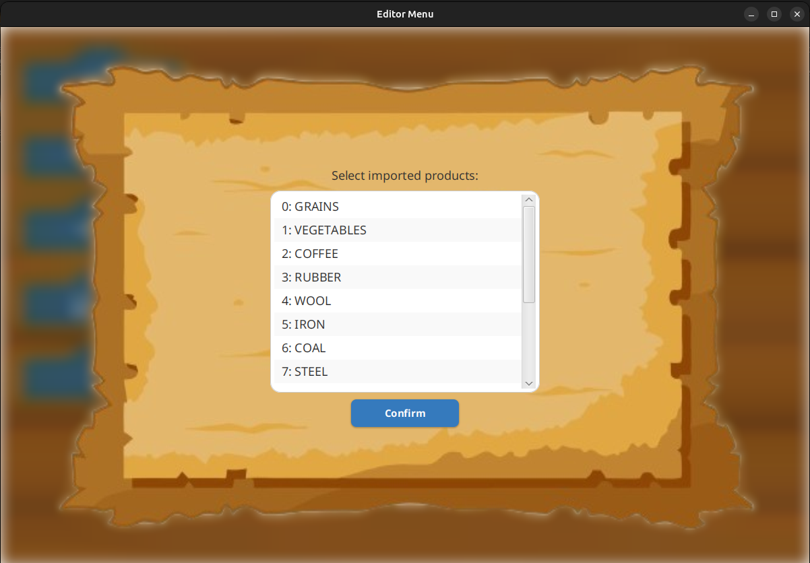  
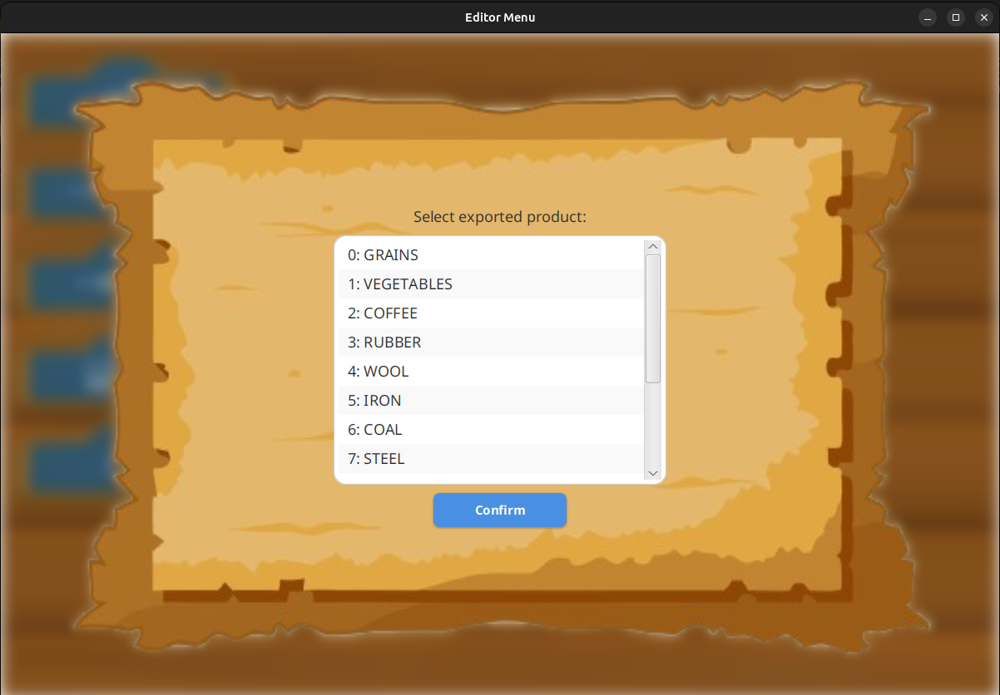

Once your scenario is complete, save it to memory for future gameplay—or skip saving if you prefer.

---

## 🧰 Features

- Realistic simulation of railway logistics
  - Create and customize maps, scenarios, industries, and cities
  - Apply historical and technical restrictions
  - Rich visual interface with progress logs
  - Save/load functionality for maps and simulations
  - Interactive simulation: build stations, assign trains, and track performance
  - Adjustable simulation speed and performance tuning

---

## ⌨️ System / Program Requirements

| Requirement | Minimum                | Recommended |
|-------------|------------------------|-------------|
| Java        | Java 11                | Latest LTS  |
| RAM         | 4 GB                   | 6+ GB       |
| OS          | Windows or Linux (X11) | Windows 10+ |
| Graphics    | JavaFX 11              | JavaFX 11   |
| Tools       | JavaFX 11, GraphViz    | JavaFX 11   |

**⚠️ Note:** Not optimized for HyperLnd or Wayland-based compositors. Use X11, will work, if on Linux. However with X11 you might still feel the program is slow

---

## ❓ FAQ

> **Q: How do I earn money in-game?**  
> A: Run trains between stations.

> **Q: Can I edit a scenario after creating it?**  
> A: No. Scenarios are immutable once saved—plan carefully!

> **Q: How do industries behave?**  
> A: Primary industries take time to generate goods; secondary industries process them instantly on delivery. Ports are the wildcard, allowing imports and exports.

> **Q: How do I create a station/train?**  
> A: Log in as a User. Use the UI to create stations and assign trains to routes.

> **Q: Where do I set the initial budget?**  
> A: During scenario creation, as an Editor.

> **Q: Can I play without internet access?**  
A: Yes, RailRoad Simulation works offline after installation. All assets are stored locally.

> **Q: Can I export or share my custom maps/scenarios?**  
> A: Yes, by manually copying the saved files. File-based export is available via the project folder.

> **Q: Is there an autosave feature?**  
> A: No, saves must be performed manually. Remember to save frequently.

> **Q: How do I delete a map or scenario?**  
> A: Currently, this must be done manually from the save directory on your system.

> **Q: What happens when two trains collide?**  
> A: Nothing. There is no physics engine in this simulation, so trains will pass through each other without collision effects.

> **Q: Is there a tutorial or campaign mode?**  
> A: Not yet. The game is scenario-driven and sandbox-based. However, sample scenarios may be included in future versions.

> **Q: Can I pause and inspect the map while the simulation runs?**  
> A: Yes, the simulation can be paused at any time without affecting progress or your ability to interact with the UI.

---

## 🛠️ Troubleshoot

| Issue                                                  | Solution                                                                                               |
|--------------------------------------------------------|--------------------------------------------------------------------------------------------------------|
| **Crash on startup**                                   | Ensure JavaFX is installed correctly. Reinstall dependencies if needed.                                |
| **Missing assets**                                     | Confirm that all asset files are present in the appropriate folder. Reinstall if missing.              |
| **Performance lag**                                    | Lower the simulation speed or reduce map size. Close other memory-heavy applications.                  |
| **Cannot load saved game**                             | Make sure the save file was not manually renamed or deleted. Use the in-app save menu only.            |
| **Graph does not render properly**                     | Check that GRAPHViz is installed and its binary is added to your system path.                          |
| **Display issues on Linux**                            | Make sure you're using X11, not Wayland. Switch session or use Windows for best experience.            |
| **Train won’t move**                                   | Verify that the station and tracks are correctly connected, and that the train has a valid route.      |
| **Can’t create new scenario or map**                   | Make sure you are logged in as an editor, not a user. Only editors have creation privileges.           |
| **Simulation UI is unresponsive**                      | Restart the application. Avoid creating too large maps on lower-end systems.                           |
| **File fails to save**                                 | Ensure you have write permissions to the install/save directory. Run as administrator if needed.       |
| **Editor-created map not showing in scenario builder** | Ensure the map was saved successfully. Reopen the app to refresh the list.                             |
| **Corrupted save file error**                          | Delete the file manually or replace with a backup. The app does not support repairing corrupted files. |

> 🧯 If all else fails, restart the program—no persistent data is lost.

---

## 📧 Contact

Found a bug? Have a suggestion? Want to contribute?  
📩 Email us: [choochooCoders@railroadsim.com](mailto:1241456@isep.ipp.pt)

---

> *"The railroad is not just transportation – it's civilization."*  
> — *Railroad Tycoon*
